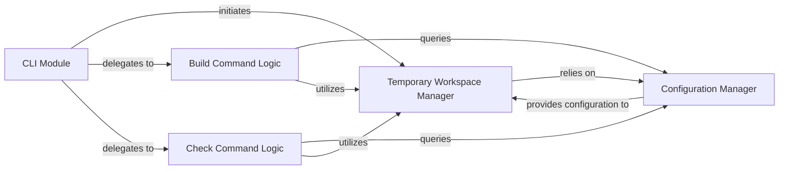

## Details

One paragraph explaining the functionality which is represented by this graph. What the main flow is and what is its purpose.

### Temporary Workspace Manager
This component is responsible for the creation, population (copying necessary project files and packages), and cleanup of isolated temporary directories. It embodies the Temporary Workspace Pattern, ensuring that build or check operations occur in a clean, controlled environment, preventing side effects or conflicts with the main project or other processes. This isolation is fundamental for reproducible and reliable build tool operations.

**Related Classes/Methods**:

- `poetry_multiproject_plugin.file_system` (1:1)

### Configuration Manager [[Expand]](./Configuration_Manager.md)
This component handles all aspects related to the `pyproject.toml` configuration and plugin-specific settings. Its responsibilities include reading, parsing, validating, generating, and manipulating `pyproject.toml` files to correctly define project metadata and dependencies within the temporary context. It centralizes how the plugin interprets and applies project-specific settings, which is crucial for flexibility and correct behavior across different projects or monorepo sub-projects.

**Related Classes/Methods**:

- `poetry_multiproject_plugin.config` (1:1)

### CLI Module
This component serves as the primary interface for user interaction, parsing command-line arguments, and orchestrating the execution of various plugin commands (e.g., build, check). It acts as the entry point for the plugin's functionality, translating user commands into actions performed by other components.

**Related Classes/Methods**: _None_

### Build Command Logic
This component encapsulates the specific business logic required to execute the 'build' command. It coordinates with the `Temporary Workspace Manager` to set up the build environment and interacts with the `Configuration Manager` to retrieve build-specific settings. Its primary responsibility is to ensure that the build process is executed correctly within the isolated workspace.

**Related Classes/Methods**: _None_

### Check Command Logic
This component encapsulates the specific business logic required to execute the 'check' command. Similar to the Build Command Logic, it coordinates with the `Temporary Workspace Manager` for environment setup and queries the `Configuration Manager` for check-specific configurations. Its main role is to perform validation or checking operations within the isolated workspace.

**Related Classes/Methods**: _None_

### [FAQ](https://github.com/CodeBoarding/GeneratedOnBoardings/tree/main?tab=readme-ov-file#faq)