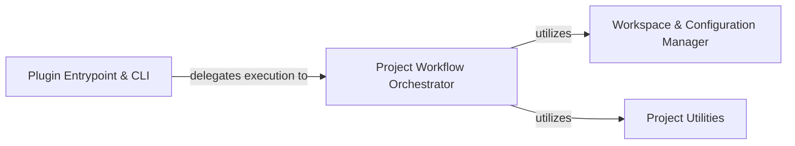

## Details

One paragraph explaining the functionality which is represented by this graph. What the main flow is and what is its purpose.

### Plugin Entrypoint & CLI [[Expand]](./Plugin_Entrypoint_CLI.md)
This component serves as the primary interface for the plugin within the Poetry ecosystem. It is responsible for registering the buildproject and checkproject commands with Poetry, parsing command-line arguments provided by the user, and delegating the execution to the appropriate project workflow.

**Related Classes/Methods**: _None_

### Project Workflow Orchestrator [[Expand]](./Project_Workflow_Orchestrator.md)
This core component defines and manages the high-level execution flow for both building and checking multi-projects. It coordinates the various sub-processes, such as setting up the temporary workspace, preparing dependencies, performing code transformations, and initiating static analysis, by interacting with other specialized components.

**Related Classes/Methods**: _None_

### Workspace & Configuration Manager [[Expand]](./Workspace_Configuration_Manager.md)
This component handles all aspects related to the temporary project workspace and pyproject.toml configuration. Its responsibilities include creating isolated environments, copying necessary project files and packages, and managing the reading, generation, and manipulation of pyproject.toml files to correctly define project metadata and dependencies within the temporary context.

**Related Classes/Methods**: _None_

### Project Utilities [[Expand]](./Project_Utilities.md)
This component provides a suite of specialized functionalities that support the project workflows. It includes an AST-based engine for rewriting Python source code (e.g., adjusting import paths), a module for installing project dependencies within the temporary environment, and an integration layer for external static analysis tools like MyPy to perform code validation.

**Related Classes/Methods**: _None_

### [FAQ](https://github.com/CodeBoarding/GeneratedOnBoardings/tree/main?tab=readme-ov-file#faq)