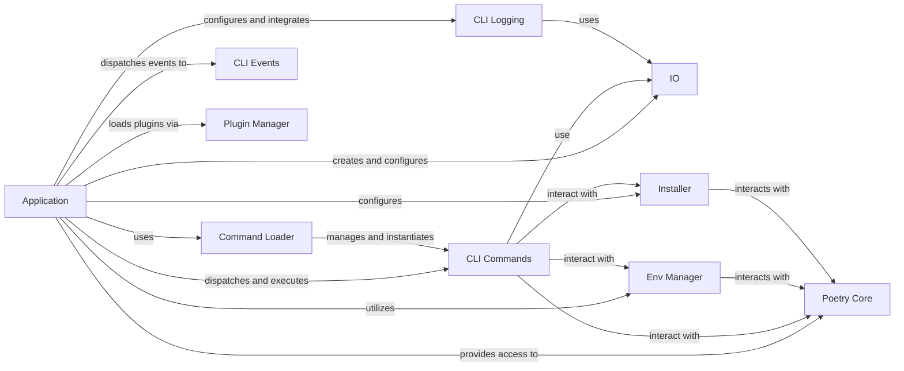

## Component Details

Overview of the CLI Application Core for Poetry, detailing its fundamental components and their interactions.

### Application
The primary entry point and orchestrator of the Poetry CLI. It initializes the application, parses global command-line options (`--no-plugins`, `--no-cache`, `--project`, `--directory`), sets up the I/O environment, loads and dispatches user commands, manages the overall execution flow, handles runtime errors, and integrates plugins. It also provides access to the core Poetry instance.

**Related Classes/Methods**:

- <a href="https://github.com/python-poetry/poetry/blob/master/src/poetry/console/application.py#L123-L636" target="_blank" rel="noopener noreferrer">`poetry.console.application.Application` (123:636)</a>

### Command Loader
Manages the discovery, registration, and instantiation of all available CLI commands. It acts as a factory, providing a structured way for the `Application` to access and execute specific commands.

**Related Classes/Methods**:

- <a href="https://github.com/python-poetry/poetry/blob/master/src/poetry/console/command_loader.py#L14-L21" target="_blank" rel="noopener noreferrer">`poetry.console.command_loader.CommandLoader` (14:21)</a>

### CLI Commands
Represents the specific operations that Poetry can perform (e.g., `add`, `install`, `lock`). The base `Command` class provides common functionalities and properties (like access to the `Poetry Core` instance and the `Application`) that all specific CLI commands inherit. Each command encapsulates the logic for a particular Poetry operation.

**Related Classes/Methods**:

- <a href="https://github.com/python-poetry/poetry/blob/master/src/poetry/console/commands/command.py#L15-L49" target="_blank" rel="noopener noreferrer">`poetry.console.commands.command.Command` (15:49)</a>

### IO
Handles all interactions with the user, including reading input, displaying output, and reporting errors. The `Application` creates and configures the `IO` instance, setting up custom styles and verbosity levels for a consistent user experience.

**Related Classes/Methods**:

- <a href="https://github.com/python-poetry/poetry/blob/master/src/poetry/console/application.py#L1-L1" target="_blank" rel="noopener noreferrer">`poetry.console.application.IO` (1:1)</a>

### CLI Logging
Manages the logging infrastructure for the CLI. It defines custom handlers (`IOHandler`) and formatters (`IOFormatter`) to control how messages are displayed to the user, including styling and verbosity levels, ensuring clear and informative feedback.

**Related Classes/Methods**:

- <a href="https://github.com/python-poetry/poetry/blob/master/src/poetry/console/logging/io_handler.py#L13-L29" target="_blank" rel="noopener noreferrer">`poetry.console.logging.io_handler.IOHandler` (13:29)</a>
- <a href="https://github.com/python-poetry/poetry/blob/master/src/poetry/console/logging/io_formatter.py#L18-L46" target="_blank" rel="noopener noreferrer">`poetry.console.logging.io_formatter.IOFormatter` (18:46)</a>

### CLI Events
Provides an event-driven mechanism for decoupled communication between different parts of the CLI. The `Application` dispatches events (e.g., `COMMAND` events), and various listeners (e.g., for logging, environment configuration, installer setup) react to these events, promoting modularity.

**Related Classes/Methods**:

- `poetry.console.events.console_command_event.ConsoleCommandEvent` (1:1)

### Poetry Core
Represents the main Poetry object, providing access to core functionalities like package management, dependency resolution, configuration, and the package pool. It acts as the central facade for Poetry's business logic.

**Related Classes/Methods**:

- <a href="https://github.com/python-poetry/poetry/blob/master/src/poetry/poetry.py#L25-L93" target="_blank" rel="noopener noreferrer">`poetry.poetry.Poetry` (25:93)</a>

### Env Manager
Responsible for creating, managing, and activating virtual environments. It ensures that Poetry commands operate within the correct isolated Python environment.

**Related Classes/Methods**:

- <a href="https://github.com/python-poetry/poetry/blob/master/src/poetry/utils/env/env_manager.py#L84-L627" target="_blank" rel="noopener noreferrer">`poetry.utils.env.EnvManager` (84:627)</a>

### Plugin Manager
Discovers, loads, and activates application plugins, allowing for dynamic extension of Poetry's functionality without modifying its core codebase.

**Related Classes/Methods**:

- <a href="https://github.com/python-poetry/poetry/blob/master/src/poetry/plugins/plugin_manager.py#L43-L101" target="_blank" rel="noopener noreferrer">`poetry.plugins.plugin_manager.PluginManager` (43:101)</a>

### Installer
Handles the complex process of installing packages and managing dependencies, including resolving conflicts and interacting with package sources.

**Related Classes/Methods**:

- <a href="https://github.com/python-poetry/poetry/blob/master/src/poetry/installation/installer.py#L32-L389" target="_blank" rel="noopener noreferrer">`poetry.installation.installer.Installer` (32:389)</a>

### [FAQ](https://github.com/CodeBoarding/GeneratedOnBoardings/tree/main?tab=readme-ov-file#faq)