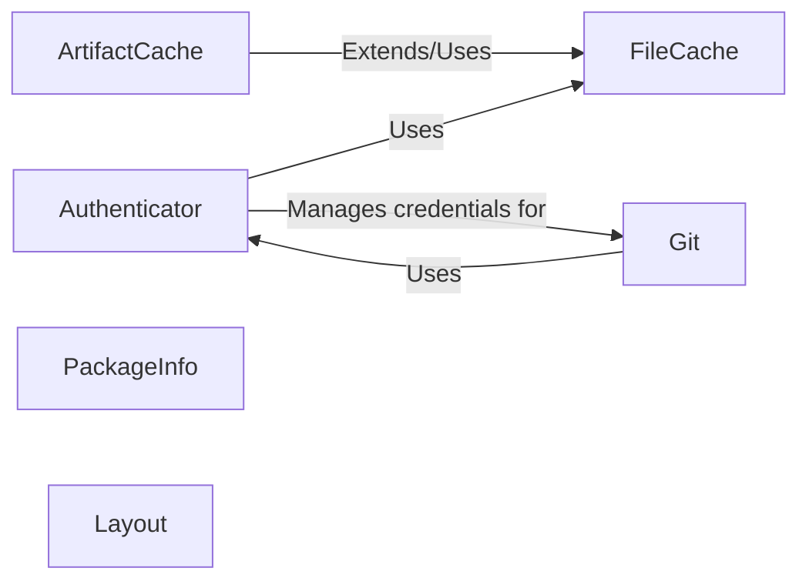

## Component Details

This collection of foundational services and utilities provides essential support across various aspects of Poetry's operations. These components are fundamental because they handle critical cross-cutting concerns such as secure communication, performance optimization through caching, standardized project setup, and robust version control integration. Without these, Poetry would lack the necessary infrastructure to reliably manage dependencies, interact with external repositories, and maintain project integrity.

### Authenticator
Manages network authentication and HTTP sessions for secure interactions with package repositories and Git hosts. It handles credentials, applies certificates, and incorporates retry logic for network resilience.

**Related Classes/Methods**:

- `FileCache` (0:0)
- <a href="https://github.com/python-poetry/poetry/blob/master/src/poetry/utils/password_manager.py#L190-L285" target="_blank" rel="noopener noreferrer">`PasswordManager` (190:285)</a>
- <a href="https://github.com/python-poetry/poetry/blob/master/src/poetry/config/config.py#L143-L431" target="_blank" rel="noopener noreferrer">`Config` (143:431)</a>

### FileCache
A generic, file-system-based caching utility that stores arbitrary Python objects (serialized as JSON) on disk. It provides a foundational and flexible caching layer, supporting optional expiration times.

**Related Classes/Methods**:

- <a href="https://github.com/python-poetry/poetry/blob/master/src/poetry/repositories/link_sources/json.py#L0-L0" target="_blank" rel="noopener noreferrer">`json` (0:0)</a>

### ArtifactCache
Specializes the caching functionality for downloaded package artifacts (e.g., `.whl`, `.sdist` files) and cloned Git repositories. It builds upon `FileCache` to prevent redundant downloads and improve performance during package resolution and installation.

**Related Classes/Methods**:

- `FileCache` (0:0)

### PackageInfo
The central component for extracting and representing Python package metadata. It can parse comprehensive information from various package formats (source distributions, wheels, metadata directories) into a structured format for dependency resolution and package management.

**Related Classes/Methods**:

### Layout
Responsible for generating the foundational structure of new Poetry projects. It creates necessary directories, boilerplate files (like `README`), and the crucial `pyproject.toml` file, ensuring consistency and adherence to Poetry's project standards.

**Related Classes/Methods**:

### Git
Provides a robust interface for performing Git operations, primarily focusing on cloning repositories and retrieving repository information. It intelligently uses either an internal Dulwich-based Git client or the system's installed Git client for flexible VCS integration.

**Related Classes/Methods**:

- <a href="https://github.com/python-poetry/poetry/blob/master/src/poetry/utils/authenticator.py#L99-L456" target="_blank" rel="noopener noreferrer">`Authenticator` (99:456)</a>

### [FAQ](https://github.com/CodeBoarding/GeneratedOnBoardings/tree/main?tab=readme-ov-file#faq)