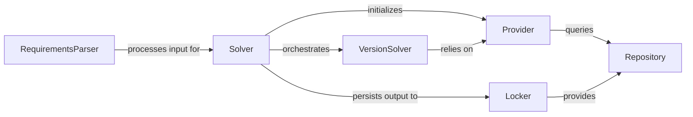

## Component Details

The `Dependency Resolution Engine` in Poetry is a sophisticated subsystem responsible for determining a compatible set of package versions that satisfy all declared constraints. It acts as the intellectual core, abstracting the complexities of fetching and parsing diverse dependency specifications.

### Solver
The high-level orchestrator of the dependency resolution process. It initializes and configures the `Provider` and then invokes the `VersionSolver` to find a compatible set of packages. It also manages the overall flow, handles error conditions like `OverrideNeededError`, and prepares the final `Transaction` of operations (e.g., installing, updating, removing packages).

**Related Classes/Methods**:

- <a href="https://github.com/python-poetry/poetry/blob/master/src/poetry/puzzle/solver.py#L45-L214" target="_blank" rel="noopener noreferrer">`Solver` (45:214)</a>

### VersionSolver
Implements the core dependency resolution algorithm, which is a variant of the PubGrub algorithm. It takes a set of root dependencies and, by interacting with a `Provider`, iteratively selects package versions, identifies conflicts (incompatibilities), and backtracks when necessary until a consistent solution is found or it determines that no solution exists.

**Related Classes/Methods**:

- <a href="https://github.com/python-poetry/poetry/blob/master/src/poetry/mixology/version_solver.py#L149-L655" target="_blank" rel="noopener noreferrer">`VersionSolver` (149:655)</a>

### Provider
Acts as an adapter or interface between the `VersionSolver` and the various sources of package information. It defines how the `VersionSolver` retrieves details about packages, their available versions, and their dependencies. It abstracts the complexities of fetching data from different `Repository` types (e.g., PyPI, Git, local paths) via a `RepositoryPool` and generates incompatibilities based on package constraints.

**Related Classes/Methods**:

- <a href="https://github.com/python-poetry/poetry/blob/master/src/poetry/puzzle/provider.py#L111-L1025" target="_blank" rel="noopener noreferrer">`Provider` (111:1025)</a>

### Repository
Represents a source of packages. This is an abstract base class, with concrete implementations (e.g., `PyPiRepository`, `InstalledRepository`, `LockfileRepository`) providing the actual package data. These repositories offer methods to search for packages based on name and version constraints, providing the universe of available packages that the `Provider` can query.

**Related Classes/Methods**:

- <a href="https://github.com/python-poetry/poetry/blob/master/src/poetry/repositories/repository.py#L23-L110" target="_blank" rel="noopener noreferrer">`Repository` (23:110)</a>

### Locker
Manages the `poetry.lock` file. Its responsibilities include reading existing locked dependencies from the file, checking if the lock file is up-to-date with the `pyproject.toml` (via content hashing), and persisting the newly resolved dependency graph to the lock file. It also provides a `LockfileRepository` for accessing previously locked packages.

**Related Classes/Methods**:

- <a href="https://github.com/python-poetry/poetry/blob/master/src/poetry/packages/locker.py#L52-L617" target="_blank" rel="noopener noreferrer">`Locker` (52:617)</a>

### RequirementsParser
A utility component responsible for parsing various human-readable formats of dependency specifications (e.g., PEP 508 strings, Git URLs, local file paths, simple name-version pairs) into a standardized internal `DependencySpec` representation. This structured information is then used as input for the dependency resolution process.

**Related Classes/Methods**:

- `RequirementsParser` (1:1)

### [FAQ](https://github.com/CodeBoarding/GeneratedOnBoardings/tree/main?tab=readme-ov-file#faq)