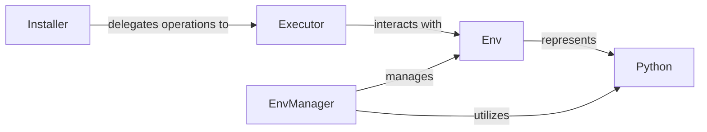

## Component Details

The Package & Environment Management subsystem in Poetry is crucial for handling Python packages and environments. It ensures that projects have the correct dependencies and run in isolated, consistent environments.

### Installer
The Installer class (from src/poetry/installation/installer.py) is the high-level orchestrator for package installation, updates, and uninstallation. It coordinates with other components like the Locker (for poetry.lock file management) and Solver (for dependency resolution) to determine the necessary operations. It then delegates the actual execution of these operations to the Executor.

**Related Classes/Methods**:

- <a href="https://github.com/python-poetry/poetry/blob/master/src/poetry/installation/installer.py#L32-L389" target="_blank" rel="noopener noreferrer">`Installer` (32:389)</a>

### Executor
The Executor class (from src/poetry/installation/executor.py) is responsible for the low-level execution of package management operations. It interacts directly with the Python environment, running pip commands, managing downloads, and preparing packages. It receives a list of operations from the Installer and carries them out.

**Related Classes/Methods**:

- <a href="https://github.com/python-poetry/poetry/blob/master/src/poetry/installation/executor.py#L61-L941" target="_blank" rel="noopener noreferrer">`Executor` (61:941)</a>

### Env
The Env abstract base class (from src/poetry/utils/env/base_env.py) defines the interface for interacting with a Python environment (e.g., a virtual environment or the system Python). It provides methods for finding executables (like python and pip), running commands within the environment, and retrieving environment-specific information such as paths and supported tags. Concrete implementations of Env exist for different types of environments.

**Related Classes/Methods**:

- `Env` (0:0)

### EnvManager
The EnvManager class (from src/poetry/utils/env/env_manager.py) is responsible for managing Python virtual environments. This includes creating, activating, listing, and removing virtual environments. It acts as a central controller for Env instances, determining which environment to use based on project configuration and system state.

**Related Classes/Methods**:

- <a href="https://github.com/python-poetry/poetry/blob/master/src/poetry/utils/env/env_manager.py#L84-L627" target="_blank" rel="noopener noreferrer">`EnvManager` (84:627)</a>

### Python
The Python class (from src/poetry/utils/env/python/manager.py) provides utilities for discovering and managing Python installations on the system. It helps Poetry locate available Python interpreters, which are then used by the EnvManager to create or interact with specific environments. It can find all Python versions, filter them by constraints, and identify the preferred or compatible Python for a project.

**Related Classes/Methods**:

- `Python` (0:0)

### [FAQ](https://github.com/CodeBoarding/GeneratedOnBoardings/tree/main?tab=readme-ov-file#faq)