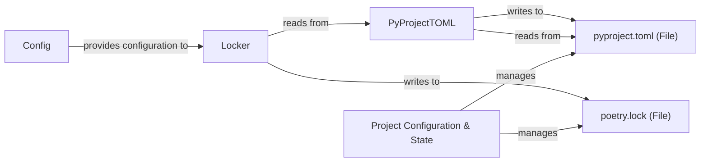

## Component Details

The Project Configuration & State component is fundamental to Poetry as it centralizes the management of all project-related settings and ensures dependency consistency. It acts as the single source of truth for how a project is configured and what its resolved dependencies are.

### Project Configuration & State
The Project Configuration & State component is fundamental to Poetry as it centralizes the management of all project-related settings and ensures dependency consistency. It acts as the single source of truth for how a project is configured and what its resolved dependencies are.

**Related Classes/Methods**: _None_

### Config
This class is responsible for managing Poetry's global and project-specific configuration settings. It loads default settings, merges configurations from `config.toml` and `auth.toml` files, and provides methods to retrieve specific settings, including those overridden by environment variables. It ensures that the application operates with the correct parameters.

**Related Classes/Methods**:

- <a href="https://github.com/python-poetry/poetry/blob/master/src/poetry/config/config.py#L143-L431" target="_blank" rel="noopener noreferrer">`poetry.config.config.Config` (143:431)</a>

### PyProjectTOML
This class represents and interacts with the `pyproject.toml` file, which is central to defining a Python project's metadata, dependencies, and build system. It extends `poetry-core`'s `PyProjectTOML` to enable writing to the file while preserving comments and formatting using `tomlkit`, ensuring that project metadata can be accurately read, modified, and saved.

**Related Classes/Methods**:

- <a href="https://github.com/python-poetry/poetry/blob/master/src/poetry/pyproject/toml.py#L16-L61" target="_blank" rel="noopener noreferrer">`poetry.pyproject.toml.PyProjectTOML` (16:61)</a>

### Locker
This class is responsible for managing the `poetry.lock` file. It verifies the lock file's existence and freshness, reads and writes lock data, and provides methods to retrieve locked packages. Its primary role is to ensure dependency consistency and reproducibility across different environments by maintaining a precise record of all installed packages and their versions.

**Related Classes/Methods**:

- <a href="https://github.com/python-poetry/poetry/blob/master/src/poetry/packages/locker.py#L52-L617" target="_blank" rel="noopener noreferrer">`poetry.packages.locker.Locker` (52:617)</a>

### pyproject.toml (File)
This file serves as the primary configuration file for a Poetry project. It defines project metadata, dependencies, scripts, and other project-specific settings. It's the input for `PyProjectTOML` and influences the content of `poetry.lock`.

**Related Classes/Methods**:

- <a href="https://github.com/python-poetry/poetry/blob/master/src/poetry/pyproject/toml.py#L1-L1" target="_blank" rel="noopener noreferrer">`pyproject.toml` (1:1)</a>

### poetry.lock (File)
This file records the exact versions and hashes of all direct and transitive dependencies resolved for a project. It's generated and managed by the `Locker` component to ensure that subsequent installations use the identical set of dependencies, guaranteeing reproducibility.

**Related Classes/Methods**:

- <a href="https://github.com/python-poetry/poetry/blob/master/src/poetry/poetry.py#L1-L1" target="_blank" rel="noopener noreferrer">`poetry.lock` (1:1)</a>

### [FAQ](https://github.com/CodeBoarding/GeneratedOnBoardings/tree/main?tab=readme-ov-file#faq)