```mermaid
graph LR
    CLI_Application_Core["CLI Application Core"]
    Project_Configuration_State["Project Configuration & State"]
    Dependency_Resolution_Engine["Dependency Resolution Engine"]
    Package_Environment_Management["Package & Environment Management"]
    Package_Building_Publishing["Package Building & Publishing"]
    Core_Utilities_Services["Core Utilities & Services"]
    CLI_Application_Core -- "manages configuration through" --> Project_Configuration_State
    CLI_Application_Core -- "orchestrates operations of" --> Package_Environment_Management
    Project_Configuration_State -- "provides settings to" --> CLI_Application_Core
    Project_Configuration_State -- "informs" --> Dependency_Resolution_Engine
    Dependency_Resolution_Engine -- "consumes" --> Project_Configuration_State
    Dependency_Resolution_Engine -- "provides resolved dependencies to" --> Package_Environment_Management
    Package_Environment_Management -- "receives instructions from" --> CLI_Application_Core
    Package_Environment_Management -- "relies on" --> Dependency_Resolution_Engine
    Package_Building_Publishing -- "invoked by" --> CLI_Application_Core
    Package_Building_Publishing -- "interacts with" --> Core_Utilities_Services
    Core_Utilities_Services -- "provides support to" --> CLI_Application_Core
    Core_Utilities_Services -- "assists" --> Dependency_Resolution_Engine
    click CLI_Application_Core href "https://github.com/CodeBoarding/GeneratedOnBoardings/blob/main//poetry/CLI_Application_Core.md" "Details"
    click Project_Configuration_State href "https://github.com/CodeBoarding/GeneratedOnBoardings/blob/main//poetry/Project_Configuration_State.md" "Details"
    click Dependency_Resolution_Engine href "https://github.com/CodeBoarding/GeneratedOnBoardings/blob/main//poetry/Dependency_Resolution_Engine.md" "Details"
    click Package_Environment_Management href "https://github.com/CodeBoarding/GeneratedOnBoardings/blob/main//poetry/Package_Environment_Management.md" "Details"
    click Core_Utilities_Services href "https://github.com/CodeBoarding/GeneratedOnBoardings/blob/main//poetry/Core_Utilities_Services.md" "Details"
```

## Component Details

The architecture of `poetry` can be effectively understood through six fundamental components, each encapsulating a distinct set of responsibilities critical to the application's functionality. These components were identified by consolidating the granular details from the Control Flow Graph (CFG) analysis with the higher-level abstractions from the Source Analysis, focusing on central modules, their interactions, and their core purpose within the `poetry` ecosystem.

### CLI Application Core
The primary entry point and orchestrator for the Poetry command-line interface. It initializes the application, registers and dispatches user commands, handles global options, and manages the overall execution flow, including error handling and logging. This component is the user's direct interface to Poetry's capabilities.

**Related Classes/Methods**:

- <a href="https://github.com/python-poetry/poetry/blob/master/src/poetry/console/application.py#L123-L636" target="_blank" rel="noopener noreferrer">`src.poetry.console.application.Application` (123:636)</a>
- `src.poetry.console.commands` (0:0)

### Project Configuration & State
Responsible for managing all configuration settings, both global and project-specific, and maintaining the project's state. It handles the reading, parsing, and saving of the `pyproject.toml` file, which defines project metadata and dependencies. Crucially, it also manages the `poetry.lock` file, ensuring dependency consistency and reproducibility across different environments.

**Related Classes/Methods**:

- <a href="https://github.com/python-poetry/poetry/blob/master/src/poetry/config/config.py#L143-L431" target="_blank" rel="noopener noreferrer">`src.poetry.config.config.Config` (143:431)</a>
- <a href="https://github.com/python-poetry/poetry/blob/master/src/poetry/pyproject/toml.py#L16-L61" target="_blank" rel="noopener noreferrer">`src.poetry.pyproject.toml.PyProjectTOML` (16:61)</a>
- <a href="https://github.com/python-poetry/poetry/blob/master/src/poetry/packages/locker.py#L52-L617" target="_blank" rel="noopener noreferrer">`src.poetry.packages.locker.Locker` (52:617)</a>

### Dependency Resolution Engine
The intellectual core of Poetry, responsible for solving the complex problem of dependency resolution. It takes a set of declared dependencies and determines a compatible graph of package versions that satisfy all constraints. This component abstracts the complexities of fetching package information from various sources (e.g., PyPI, Git, local paths) and parsing diverse dependency specification formats.

**Related Classes/Methods**:

- <a href="https://github.com/python-poetry/poetry/blob/master/src/poetry/mixology/version_solver.py#L149-L655" target="_blank" rel="noopener noreferrer">`src.poetry.mixology.version_solver.VersionSolver` (149:655)</a>
- <a href="https://github.com/python-poetry/poetry/blob/master/src/poetry/puzzle/provider.py#L111-L1025" target="_blank" rel="noopener noreferrer">`src.poetry.puzzle.provider.Provider` (111:1025)</a>
- <a href="https://github.com/python-poetry/poetry/blob/master/src/poetry/utils/dependency_specification.py#L59-L231" target="_blank" rel="noopener noreferrer">`src.poetry.utils.dependency_specification.RequirementsParser` (59:231)</a>

### Package & Environment Management
Manages the entire lifecycle of packages and Python environments. This includes orchestrating the installation, update, and uninstallation of packages, delegating low-level operations to interact with the underlying Python environment (e.g., `pip`). It also handles the creation, activation, and removal of virtual environments, and discovers available Python interpreters on the system.

**Related Classes/Methods**:

- <a href="https://github.com/python-poetry/poetry/blob/master/src/poetry/installation/installer.py#L32-L389" target="_blank" rel="noopener noreferrer">`src.poetry.installation.installer.Installer` (32:389)</a>
- <a href="https://github.com/python-poetry/poetry/blob/master/src/poetry/installation/executor.py#L61-L941" target="_blank" rel="noopener noreferrer">`src.poetry.installation.executor.Executor` (61:941)</a>
- <a href="https://github.com/python-poetry/poetry/blob/master/src/poetry/utils/env/env_manager.py#L84-L627" target="_blank" rel="noopener noreferrer">`src.poetry.utils.env.env_manager.EnvManager` (84:627)</a>
- <a href="https://github.com/python-poetry/poetry/blob/master/src/poetry/utils/env/base_env.py#L36-L497" target="_blank" rel="noopener noreferrer">`src.poetry.utils.env.base_env.Env` (36:497)</a>
- <a href="https://github.com/python-poetry/poetry/blob/master/src/poetry/utils/env/python/manager.py#L50-L309" target="_blank" rel="noopener noreferrer">`src.poetry.utils.env.python.manager.Python` (50:309)</a>

### Package Building & Publishing
Handles the processes involved in preparing Python packages for distribution and uploading them to package repositories. This includes the functionality to build packages in "editable" mode, which is crucial for development workflows, and managing the secure upload of wheels and source distributions to indexes like PyPI.

**Related Classes/Methods**:

- <a href="https://github.com/python-poetry/poetry/blob/master/src/poetry/masonry/builders/editable.py#L43-L285" target="_blank" rel="noopener noreferrer">`src.poetry.masonry.builders.editable.EditableBuilder` (43:285)</a>
- <a href="https://github.com/python-poetry/poetry/blob/master/src/poetry/publishing/uploader.py#L30-L337" target="_blank" rel="noopener noreferrer">`src.poetry.publishing.uploader.Uploader` (30:337)</a>

### Core Utilities & Services
A collection of foundational services and utilities that provide essential support across various aspects of Poetry's operations. This includes authentication mechanisms for interacting with package repositories, caching for performance optimization, extraction and representation of package metadata, initial project layout generation, and interaction with Git repositories for VCS dependencies.

**Related Classes/Methods**:

- <a href="https://github.com/python-poetry/poetry/blob/master/src/poetry/utils/authenticator.py#L99-L456" target="_blank" rel="noopener noreferrer">`src.poetry.utils.authenticator.Authenticator` (99:456)</a>
- <a href="https://github.com/python-poetry/poetry/blob/master/src/poetry/utils/cache.py#L74-L187" target="_blank" rel="noopener noreferrer">`src.poetry.utils.cache.FileCache` (74:187)</a>
- <a href="https://github.com/python-poetry/poetry/blob/master/src/poetry/utils/cache.py#L190-L339" target="_blank" rel="noopener noreferrer">`src.poetry.utils.cache.ArtifactCache` (190:339)</a>
- <a href="https://github.com/python-poetry/poetry/blob/master/src/poetry/inspection/info.py#L50-L523" target="_blank" rel="noopener noreferrer">`src.poetry.inspection.info.PackageInfo` (50:523)</a>
- <a href="https://github.com/python-poetry/poetry/blob/master/src/poetry/layouts/layout.py#L58-L234" target="_blank" rel="noopener noreferrer">`src.poetry.layouts.layout.Layout` (58:234)</a>
- <a href="https://github.com/python-poetry/poetry/blob/master/src/poetry/vcs/git/backend.py#L186-L527" target="_blank" rel="noopener noreferrer">`src.poetry.vcs.git.backend.Git` (186:527)</a>

### [FAQ](https://github.com/CodeBoarding/GeneratedOnBoardings/tree/main?tab=readme-ov-file#faq)