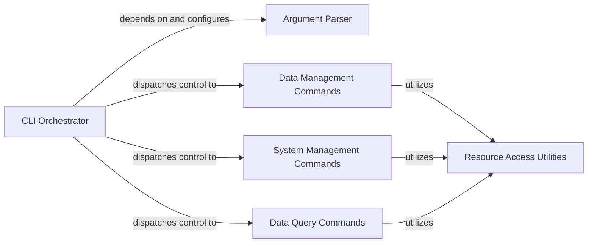

## Details

The `CLI Application Layer` subsystem serves as the primary interface for users to interact with the Pokedex system, managing command parsing, execution, and orchestration of data operations.

### CLI Orchestrator
The central control unit of the CLI, responsible for initiating the application, parsing command-line arguments, and dispatching control to the appropriate command handlers. It manages the overall lifecycle of CLI operations.

**Related Classes/Methods**:

- <a href="https://github.com/veekun/pokedex/blob/master/pokedex/main.py#L16-L24" target="_blank" rel="noopener noreferrer">`pokedex.main.main`:16-24</a>

### Argument Parser
Defines the structure of command-line arguments and options for all available commands (e.g., `load`, `dump`, `lookup`, `reindex`, `setup`, `status`). It processes raw command-line input into a structured, actionable format for the CLI Orchestrator.

**Related Classes/Methods**:

- <a href="https://github.com/veekun/pokedex/blob/master/pokedex/main.py#L31-L137" target="_blank" rel="noopener noreferrer">`pokedex.main.create_parser`:31-137</a>

### Data Management Commands
Encapsulates the logic for commands that handle data import (`load`) and data export (`dump`) operations. These commands interact with underlying data sources and the data storage layer to move data into or out of the system.

**Related Classes/Methods**:

- <a href="https://github.com/veekun/pokedex/blob/master/pokedex/main.py#L206-L221" target="_blank" rel="noopener noreferrer">`pokedex.main.command_dump`:206-221</a>
- <a href="https://github.com/veekun/pokedex/blob/master/pokedex/main.py#L224-L251" target="_blank" rel="noopener noreferrer">`pokedex.main.command_load`:224-251</a>

### System Management Commands
Manages operational aspects of the Pokedex system, including re-indexing the lookup system, performing initial setup, and reporting system status. These commands ensure the system's health and readiness.

**Related Classes/Methods**:

- <a href="https://github.com/veekun/pokedex/blob/master/pokedex/main.py#L254-L257" target="_blank" rel="noopener noreferrer">`pokedex.main.command_reindex`:254-257</a>
- <a href="https://github.com/veekun/pokedex/blob/master/pokedex/main.py#L260-L270" target="_blank" rel="noopener noreferrer">`pokedex.main.command_setup`:260-270</a>
- <a href="https://github.com/veekun/pokedex/blob/master/pokedex/main.py#L273-L308" target="_blank" rel="noopener noreferrer">`pokedex.main.command_status`:273-308</a>

### Data Query Commands
Executes operations to query and retrieve data from the Pokedex system based on user input, primarily focusing on lookup functionalities. It acts as the interface for users to access stored data.

**Related Classes/Methods**:

- <a href="https://github.com/veekun/pokedex/blob/master/pokedex/main.py#L313-L337" target="_blank" rel="noopener noreferrer">`pokedex.main.command_lookup`:313-337</a>
- <a href="https://github.com/veekun/pokedex/blob/master/pokedex/cli/search.py" target="_blank" rel="noopener noreferrer">`pokedex.cli.search`</a>

### Resource Access Utilities
Provides abstracted and centralized access to common Pokedex resources required by various commands, such as database sessions, the CSV data directory, and the Pokedex lookup index. It ensures consistent resource acquisition.

**Related Classes/Methods**:

- <a href="https://github.com/veekun/pokedex/blob/master/pokedex/main.py#L140-L157" target="_blank" rel="noopener noreferrer">`pokedex.main.get_session`:140-157</a>
- <a href="https://github.com/veekun/pokedex/blob/master/pokedex/main.py#L186-L201" target="_blank" rel="noopener noreferrer">`pokedex.main.get_csv_directory`:186-201</a>
- <a href="https://github.com/veekun/pokedex/blob/master/pokedex/main.py#L160-L183" target="_blank" rel="noopener noreferrer">`pokedex.main.get_lookup`:160-183</a>

### [FAQ](https://github.com/CodeBoarding/GeneratedOnBoardings/tree/main?tab=readme-ov-file#faq)