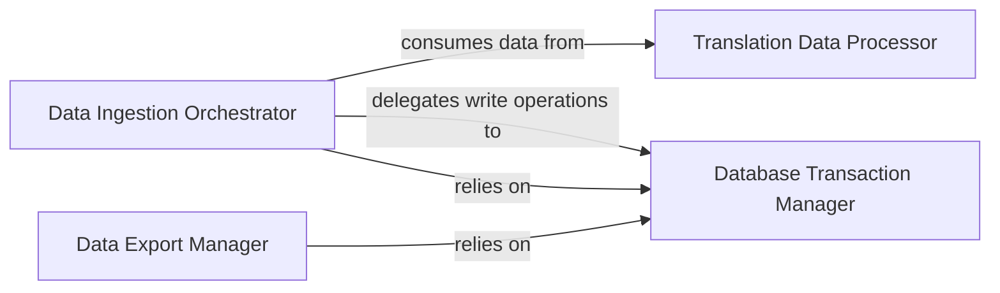

## Details

The Data Ingestion & Export Layer subsystem is central to the pokedex project's data management, embodying the ETL (Extract, Transform, Load) patterns. It is responsible for both importing raw data into the SQLite database and exporting processed data back into raw formats, particularly focusing on translation data.

### Data Ingestion Orchestrator
This component orchestrates the overall data ingestion process. It coordinates the loading of various data types into the database, acting as the primary entry point for the 'Load' phase of the ETL pipeline. It ensures that data, including transformed translation content, is correctly inserted.

**Related Classes/Methods**:

- <a href="https://github.com/veekun/pokedex/blob/master/pokedex/db/load.py#L106-L413" target="_blank" rel="noopener noreferrer">`pokedex.db.load.load`:106-413</a>

### Data Export Manager
Responsible for managing the comprehensive process of exporting data from the database back into raw, external formats. This component handles the 'Extract' phase from the database for external consumption, ensuring data consistency during the export process.

**Related Classes/Methods**:

- <a href="https://github.com/veekun/pokedex/blob/master/pokedex/db/load.py#L416-L518" target="_blank" rel="noopener noreferrer">`pokedex.db.load.dump`:416-518</a>

### Database Transaction Manager
This component provides core functionalities for direct interaction with the database. It handles atomic data insertion with transaction commits to ensure data integrity and provides utilities for retrieving database metadata, such as table names, which are crucial for both ingestion and export operations.

**Related Classes/Methods**:

- <a href="https://github.com/veekun/pokedex/blob/master/pokedex/db/load.py#L296-L304" target="_blank" rel="noopener noreferrer">`pokedex.db.load.insert_and_commit`:296-304</a>
- <a href="https://github.com/veekun/pokedex/blob/master/pokedex/db/load.py#L24-L41" target="_blank" rel="noopener noreferrer">`pokedex.db.load._get_table_names`:24-41</a>

### Translation Data Processor
This component manages the entire lifecycle of translation data, embodying a significant 'Transform' aspect of the ETL process for localization. It handles extracting raw messages from source, merging them with existing translations, and preparing the final, structured translation data for either database loading or writing to external files.

**Related Classes/Methods**:

- <a href="https://github.com/veekun/pokedex/blob/master/pokedex/db/translations.py#L221-L260" target="_blank" rel="noopener noreferrer">`pokedex.db.translations.write_translations`:221-260</a>
- <a href="https://github.com/veekun/pokedex/blob/master/pokedex/db/translations.py#L673-L686" target="_blank" rel="noopener noreferrer">`pokedex.db.translations.merge_translations`:673-686</a>
- <a href="https://github.com/veekun/pokedex/blob/master/pokedex/db/translations.py#L275-L307" target="_blank" rel="noopener noreferrer">`pokedex.db.translations.yield_source_messages`:275-307</a>
- <a href="https://github.com/veekun/pokedex/blob/master/pokedex/db/translations.py#L309-L320" target="_blank" rel="noopener noreferrer">`pokedex.db.translations.yield_target_messages`:309-320</a>
- <a href="https://github.com/veekun/pokedex/blob/master/pokedex/db/translations.py#L328-L372" target="_blank" rel="noopener noreferrer">`pokedex.db.translations.get_load_data`:328-372</a>
- <a href="https://github.com/veekun/pokedex/blob/master/pokedex/db/translations.py#L496-L499" target="_blank" rel="noopener noreferrer">`pokedex.db.translations.synchronize`:496-499</a>

### [FAQ](https://github.com/CodeBoarding/GeneratedOnBoardings/tree/main?tab=readme-ov-file#faq)