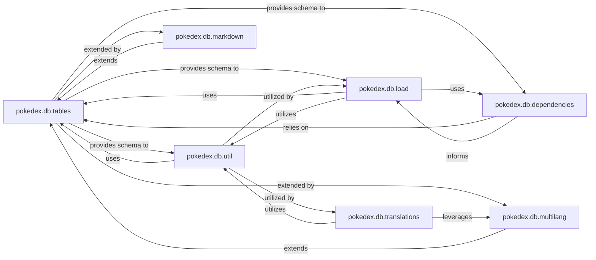

## Details

The `Database Core Layer` is the central component for data persistence, schema definition, and database session management using SQLAlchemy. It serves as the authoritative source for all Pokedex data, acting as the primary interface for data storage and retrieval, and supporting the ETL process.

### pokedex.db.tables
The foundational component defining the entire database schema (tables, columns, relationships) using SQLAlchemy ORM models. It is the blueprint for all Pokedex data, ensuring data structure and integrity.

**Related Classes/Methods**:

- <a href="https://github.com/veekun/pokedex/blob/master/pokedex/db/tables.py" target="_blank" rel="noopener noreferrer">`pokedex.db.tables`</a>

### pokedex.db.util
Provides essential generic utility functions for common database operations, including session management, querying, filtering, and data retrieval. It acts as the primary operational interface to the database, abstracting direct SQLAlchemy interactions.

**Related Classes/Methods**:

- <a href="https://github.com/veekun/pokedex/blob/master/pokedex/db/util.py" target="_blank" rel="noopener noreferrer">`pokedex.db.util`</a>

### pokedex.db.dependencies
Manages and resolves dependencies between database tables. This is crucial for maintaining schema integrity and ensuring the correct data loading order, especially vital for complex ETL processes where data must be inserted in a specific sequence.

**Related Classes/Methods**:

- <a href="https://github.com/veekun/pokedex/blob/master/pokedex/db/dependencies.py" target="_blank" rel="noopener noreferrer">`pokedex.db.dependencies`</a>

### pokedex.db.load
Responsible for orchestrating and executing data loading operations into the Pokedex database. It utilizes the defined schema and dependency information to correctly populate the database.

**Related Classes/Methods**:

- <a href="https://github.com/veekun/pokedex/blob/master/pokedex/db/load.py" target="_blank" rel="noopener noreferrer">`pokedex.db.load`</a>

### pokedex.db.multilang
Extends the core database schema defined in `pokedex.db.tables` to incorporate multi-language support for various data fields. This component enables the storage and retrieval of localized content.

**Related Classes/Methods**:

- <a href="https://github.com/veekun/pokedex/blob/master/pokedex/db/multilang.py" target="_blank" rel="noopener noreferrer">`pokedex.db.multilang`</a>

### pokedex.db.markdown
Extends the core database schema defined in `pokedex.db.tables` to support markdown field types. This allows for the storage of rich text content that can be rendered as markdown.

**Related Classes/Methods**:

- <a href="https://github.com/veekun/pokedex/blob/master/pokedex/db/markdown.py" target="_blank" rel="noopener noreferrer">`pokedex.db.markdown`</a>

### pokedex.db.translations
Manages the specific data related to translations within the Pokedex database, leveraging the multi-language schema extensions. It handles the storage and retrieval of translated text.

**Related Classes/Methods**:

- <a href="https://github.com/veekun/pokedex/blob/master/pokedex/db/translations.py" target="_blank" rel="noopener noreferrer">`pokedex.db.translations`</a>

### [FAQ](https://github.com/CodeBoarding/GeneratedOnBoardings/tree/main?tab=readme-ov-file#faq)