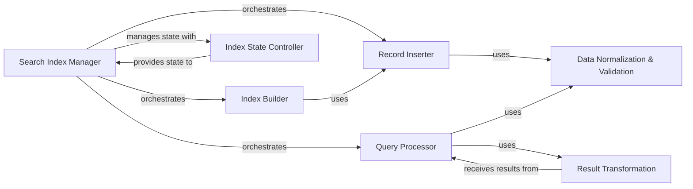

## Details

Analysis of the Search & Indexing Layer subsystem in pokedex.lookup module.

### Search Index Manager
The primary facade for all search and indexing operations. It manages the lifecycle of the Whoosh search index, including initialization, adding records, rebuilding the index, and executing various types of queries. It acts as the main entry point for the subsystem.

**Related Classes/Methods**:

- <a href="https://github.com/veekun/pokedex/blob/master/pokedex/lookup.py" target="_blank" rel="noopener noreferrer">`pokedex.lookup`</a>

### Index Builder
Orchestrates the complete reconstruction of the search index, typically by iterating through data sources and adding records.

**Related Classes/Methods**:

- <a href="https://github.com/veekun/pokedex/blob/master/pokedex/lookup.py" target="_blank" rel="noopener noreferrer">`pokedex.lookup:rebuild_index`</a>

### Record Inserter
Adds individual data records to the Whoosh search index, ensuring data is properly prepared before insertion.

**Related Classes/Methods**:

- <a href="https://github.com/veekun/pokedex/blob/master/pokedex/lookup.py" target="_blank" rel="noopener noreferrer">`pokedex.lookup:add`</a>

### Query Processor
Encapsulates the logic for executing general and prefix-based search queries against the Whoosh index, handling various search parameters and returning formatted results.

**Related Classes/Methods**:

- <a href="https://github.com/veekun/pokedex/blob/master/pokedex/lookup.py" target="_blank" rel="noopener noreferrer">`pokedex.lookup:lookup`</a>
- <a href="https://github.com/veekun/pokedex/blob/master/pokedex/lookup.py" target="_blank" rel="noopener noreferrer">`pokedex.lookup:prefix_lookup`</a>

### Data Normalization & Validation
A utility component responsible for standardizing input names for consistent indexing and querying, and for filtering/processing data types to ensure only valid and relevant data is used.

**Related Classes/Methods**:

- <a href="https://github.com/veekun/pokedex/blob/master/pokedex/lookup.py" target="_blank" rel="noopener noreferrer">`pokedex.lookup:normalize_name`</a>
- <a href="https://github.com/veekun/pokedex/blob/master/pokedex/lookup.py" target="_blank" rel="noopener noreferrer">`pokedex.lookup:_apply_valid_types`</a>

### Result Transformation
Transforms raw search results from the Whoosh engine into a more consumable and application-specific format.

**Related Classes/Methods**:

- <a href="https://github.com/veekun/pokedex/blob/master/pokedex/lookup.py" target="_blank" rel="noopener noreferrer">`pokedex.lookup:_whoosh_records_to_results`</a>

### Index State Controller
Handles the state of the search index, indicating whether it has been properly initialized and raising errors if operations are attempted on an uninitialized index.

**Related Classes/Methods**:

- <a href="https://github.com/veekun/pokedex/blob/master/pokedex/lookup.py" target="_blank" rel="noopener noreferrer">`pokedex.lookup:UninitializedIndex`</a>
- <a href="https://github.com/veekun/pokedex/blob/master/pokedex/lookup.py" target="_blank" rel="noopener noreferrer">`pokedex.lookup:UninitializedIndexError`</a>

### [FAQ](https://github.com/CodeBoarding/GeneratedOnBoardings/tree/main?tab=readme-ov-file#faq)