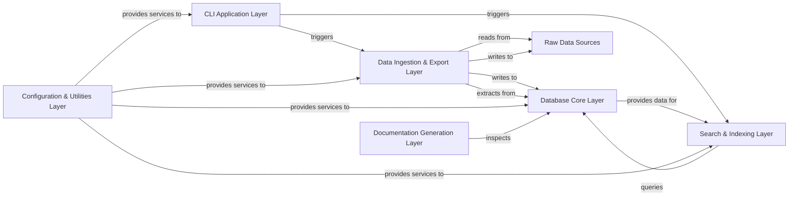

## Details

The Pokedex application is designed with a layered architecture, centralizing data management and providing a clear interface for user interaction. The CLI Application Layer serves as the primary entry point, enabling users to initiate data operations. It interacts with the Data Ingestion & Export Layer for managing the flow of data between Raw Data Sources (primarily CSV files) and the Database Core Layer. The Database Core Layer, built on SQLAlchemy, acts as the authoritative data repository, defining the schema and handling persistence. For efficient data retrieval, the Search & Indexing Layer maintains and queries a Whoosh-based index, drawing data from the Database Core. A foundational Configuration & Utilities Layer provides essential services, including application settings and common helper functions, supporting all other components. Finally, the Documentation Generation Layer automates the creation of documentation, specifically for the database schema, by inspecting the Database Core Layer. This structure ensures modularity, maintainability, and a clear data flow for both documentation and diagrammatic representation.

### CLI Application Layer [[Expand]](./CLI_Application_Layer.md)
The primary user interface for interacting with the Pokedex system, handling command parsing and execution. It orchestrates data loading, dumping, and lookup operations.

**Related Classes/Methods**:

- <a href="https://github.com/veekun/pokedex/blob/master/pokedex/__main__.py" target="_blank" rel="noopener noreferrer">`pokedex.__main__`</a>
- <a href="https://github.com/veekun/pokedex/blob/master/pokedex/main.py" target="_blank" rel="noopener noreferrer">`pokedex.main`</a>
- <a href="https://github.com/veekun/pokedex/blob/master/pokedex/cli/search.py" target="_blank" rel="noopener noreferrer">`pokedex.cli.search`</a>

### Data Ingestion & Export Layer [[Expand]](./Data_Ingestion_Export_Layer.md)
Manages the ETL (Extract, Transform, Load) processes, responsible for importing raw data into the database and exporting database content to raw formats.

**Related Classes/Methods**:

- <a href="https://github.com/veekun/pokedex/blob/master/pokedex/db/load.py" target="_blank" rel="noopener noreferrer">`pokedex.db.load`</a>
- <a href="https://github.com/veekun/pokedex/blob/master/pokedex/db/translations.py" target="_blank" rel="noopener noreferrer">`pokedex.db.translations`</a>

### Database Core Layer [[Expand]](./Database_Core_Layer.md)
The central component for data persistence, schema definition, and database session management using SQLAlchemy. It is the authoritative source for all Pokedex data.

**Related Classes/Methods**:

- <a href="https://github.com/veekun/pokedex/blob/master/pokedex/db/tables.py" target="_blank" rel="noopener noreferrer">`pokedex.db.tables`</a>
- <a href="https://github.com/veekun/pokedex/blob/master/pokedex/db/util.py" target="_blank" rel="noopener noreferrer">`pokedex.db.util`</a>
- <a href="https://github.com/veekun/pokedex/blob/master/pokedex/db/dependencies.py" target="_blank" rel="noopener noreferrer">`pokedex.db.dependencies`</a>

### Search & Indexing Layer [[Expand]](./Search_Indexing_Layer.md)
Provides fast lookup capabilities by maintaining and querying a Whoosh-based search index, enabling efficient data retrieval for the CLI.

**Related Classes/Methods**:

- <a href="https://github.com/veekun/pokedex/blob/master/pokedex/lookup.py" target="_blank" rel="noopener noreferrer">`pokedex.lookup`</a>

### Raw Data Sources
External CSV files containing the raw Pokedex data, serving as the primary data input for ingestion and output for export.

**Related Classes/Methods**:

- <a href="https://github.com/veekun/pokedex/blob/master/pokedex/data/csv" target="_blank" rel="noopener noreferrer">`pokedex.data.csv`</a>

### Configuration & Utilities Layer
A foundational layer providing application-wide configuration settings, common helper functions, and shared utilities that support various other components, including media asset paths and text processing.

**Related Classes/Methods**:

- <a href="https://github.com/veekun/pokedex/blob/master/pokedex/defaults.py" target="_blank" rel="noopener noreferrer">`pokedex.defaults`</a>
- <a href="https://github.com/veekun/pokedex/blob/master/pokedex/util/media.py" target="_blank" rel="noopener noreferrer">`pokedex.util.media`</a>
- <a href="https://github.com/veekun/pokedex/blob/master/pokedex/roomaji.py" target="_blank" rel="noopener noreferrer">`pokedex.roomaji`</a>

### Documentation Generation Layer
Automates the creation of project documentation, specifically focusing on generating documentation for the database schema and table structures.

**Related Classes/Methods**:

- <a href="https://github.com/veekun/pokedex/blob/master/pokedex/doc/tabledoc.py" target="_blank" rel="noopener noreferrer">`pokedex.doc.tabledoc`</a>
- <a href="https://github.com/veekun/pokedex/blob/master/doc/conf.py" target="_blank" rel="noopener noreferrer">`doc`</a>

### [FAQ](https://github.com/CodeBoarding/GeneratedOnBoardings/tree/main?tab=readme-ov-file#faq)