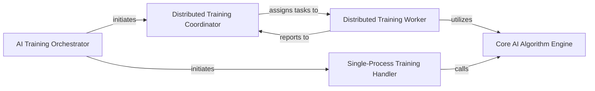

## Details

The AI Core & Training Module subsystem, encapsulated within the `poker_ai.ai` package, manages the AI training lifecycle, including core algorithms, distributed training, and single-process training.

### AI Training Orchestrator
Serves as the primary interface for the AI training lifecycle, responsible for initiating and resuming training processes. It dispatches training requests to either single-process or distributed handlers based on configuration.

**Related Classes/Methods**:

- <a href="https://github.com/fedden/poker_ai/blob/develop/poker_ai/ai/runner.py" target="_blank" rel="noopener noreferrer">`poker_ai.ai.runner`</a>

### Core AI Algorithm Engine
Implements the fundamental AI algorithms, specifically Counterfactual Regret Minimization (CFR) and CFR+. This component is responsible for the iterative calculation and updating of the AI's strategy, forming the computational core of the learning process.

**Related Classes/Methods**:

- <a href="https://github.com/fedden/poker_ai/blob/develop/poker_ai/ai/ai.py" target="_blank" rel="noopener noreferrer">`poker_ai.ai.ai`</a>

### Distributed Training Coordinator
Orchestrates and manages distributed AI training. Its responsibilities include starting worker processes, distributing training jobs, and synchronizing their progress and results across multiple nodes or processes.

**Related Classes/Methods**:

- <a href="https://github.com/fedden/poker_ai/blob/develop/poker_ai/ai/multiprocess/server.py" target="_blank" rel="noopener noreferrer">`poker_ai.ai.multiprocess.server`</a>

### Distributed Training Worker
Executes individual AI training tasks within a distributed setup. Each worker performs iterations of the core AI algorithms and updates its local strategy, communicating with the Distributed Training Coordinator for task assignment and result reporting.

**Related Classes/Methods**:

- <a href="https://github.com/fedden/poker_ai/blob/develop/poker_ai/ai/multiprocess/worker.py" target="_blank" rel="noopener noreferrer">`poker_ai.ai.multiprocess.worker`</a>

### Single-Process Training Handler
Manages the AI training process when executed in a single-threaded, non-distributed environment. It directly invokes the Core AI Algorithm Engine to perform training iterations without the overhead of distributed coordination.

**Related Classes/Methods**:

- <a href="https://github.com/fedden/poker_ai/blob/develop/poker_ai/ai/singleprocess/train.py" target="_blank" rel="noopener noreferrer">`poker_ai.ai.singleprocess.train`</a>

### [FAQ](https://github.com/CodeBoarding/GeneratedOnBoardings/tree/main?tab=readme-ov-file#faq)