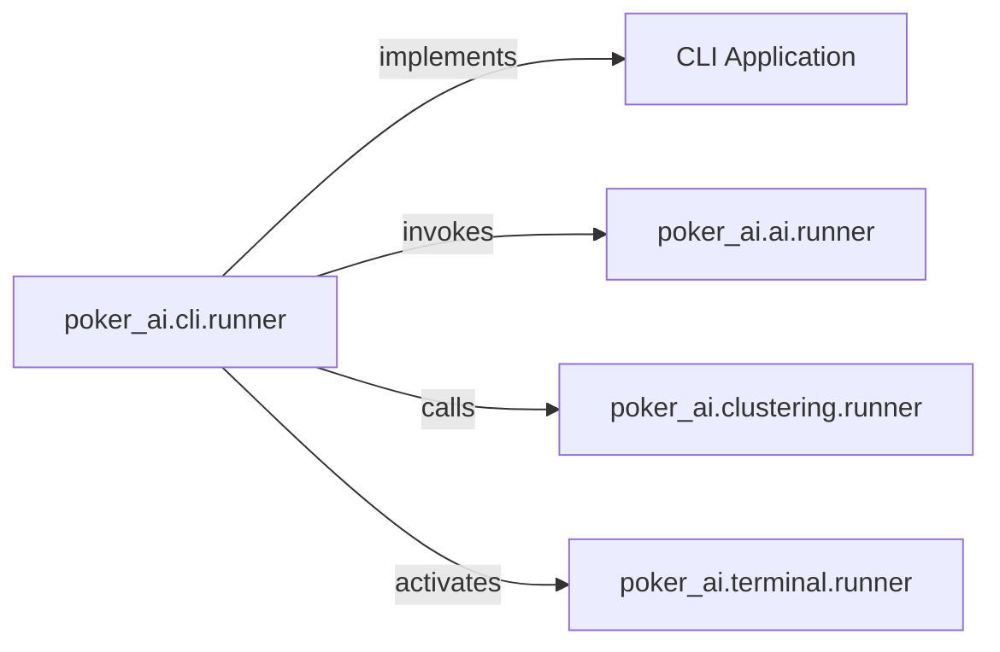

## Details

The `CLI Application` subsystem serves as the primary user interface for the poker AI system, enabling users to initiate and control various AI-related tasks.

### CLI Application [[Expand]](./CLI_Application.md)
The overarching command-line interface that provides users with the ability to initiate, control, and interact with the poker AI system. It acts as the orchestrator for various AI tasks (training, clustering, playing) and provides direct user feedback.

**Related Classes/Methods**:

- <a href="https://github.com/fedden/poker_ai/blob/develop/poker_ai/cli/runner.py#L8-L18" target="_blank" rel="noopener noreferrer">`poker_ai.cli.runner`:8-18</a>

### poker_ai.cli.runner
The main entry point for user interaction via the command line. It parses user commands and dispatches them to the appropriate backend AI functionalities.

**Related Classes/Methods**:

- <a href="https://github.com/fedden/poker_ai/blob/develop/poker_ai/cli/runner.py#L8-L18" target="_blank" rel="noopener noreferrer">`poker_ai.cli.runner`:8-18</a>

### poker_ai.ai.runner
Responsible for executing AI model training processes, including Counterfactual Regret Minimization (CFR) or Monte Carlo CFR (MCCFR) algorithms.

**Related Classes/Methods**:

- <a href="https://github.com/fedden/poker_ai/blob/develop/poker_ai/ai/runner.py" target="_blank" rel="noopener noreferrer">`poker_ai.ai.runner`</a>

### poker_ai.clustering.runner
Manages data abstraction and clustering operations, which are crucial for simplifying the game state for AI processing.

**Related Classes/Methods**:

- <a href="https://github.com/fedden/poker_ai/blob/develop/poker_ai/clustering/runner.py" target="_blank" rel="noopener noreferrer">`poker_ai.clustering.runner`</a>

### poker_ai.terminal.runner
Handles the interactive terminal application, allowing users to play against the AI or observe AI vs. AI gameplay.

**Related Classes/Methods**:

- <a href="https://github.com/fedden/poker_ai/blob/develop/poker_ai/terminal/runner.py" target="_blank" rel="noopener noreferrer">`poker_ai.terminal.runner`</a>

### [FAQ](https://github.com/CodeBoarding/GeneratedOnBoardings/tree/main?tab=readme-ov-file#faq)