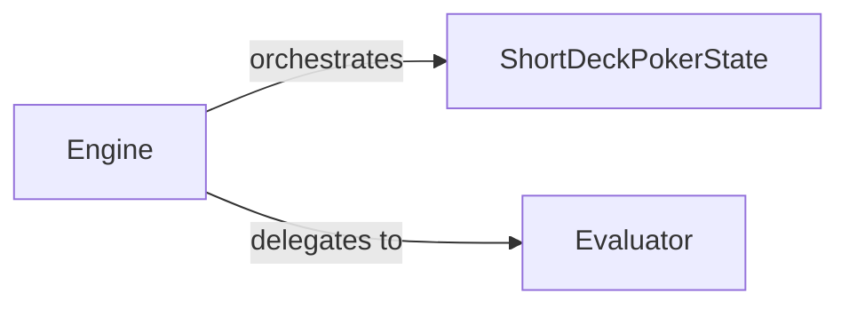

## Details

The `Game Logic & State Management` subsystem forms the core of the poker simulation, defining and enforcing the rules and state transitions of the game.

### ShortDeckPokerState
Manages the complete state of a Short Deck Poker game at any given moment. This includes tracking players, their hands, chip counts, the current betting round, community cards, and available legal actions. It is responsible for applying player actions and ensuring the game rules are correctly enforced during state transitions. Crucially, it exposes interfaces (`info_set`, `initial_regret`, `initial_strategy`) that are vital for the AI algorithms to interact with the game state.

**Related Classes/Methods**:

- <a href="https://github.com/fedden/poker_ai/blob/develop/poker_ai/games/short_deck/state.py" target="_blank" rel="noopener noreferrer">`poker_ai.games.short_deck.state`</a>

### Engine
Acts as the central orchestrator for the poker game flow. It drives the progression of a game round by managing the sequence of dealing cards, conducting betting rounds, and ultimately determining the winners of each hand. It ensures the game adheres to its rules from start to finish. This component embodies the "Core Poker Engine" aspect of the project.

**Related Classes/Methods**:

- <a href="https://github.com/fedden/poker_ai/blob/develop/poker_ai/poker/engine.py" target="_blank" rel="noopener noreferrer">`poker_ai.poker.engine`</a>

### Evaluator
Provides the fundamental capability for evaluating poker hands. Its primary responsibility is to determine the strength and type of a given set of cards (player's hand combined with community cards), which is a critical step in identifying the winner(s) of a poker hand. This component is a specialized utility within the game logic.

**Related Classes/Methods**:

- <a href="https://github.com/fedden/poker_ai/blob/develop/poker_ai/poker/evaluation/evaluator.py" target="_blank" rel="noopener noreferrer">`poker_ai.poker.evaluation.evaluator`</a>

### [FAQ](https://github.com/CodeBoarding/GeneratedOnBoardings/tree/main?tab=readme-ov-file#faq)