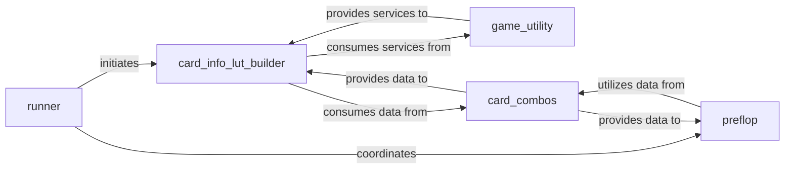

## Details

The `Hand Abstraction & Clustering` subsystem is a critical part of the `poker_ai` project, focusing on optimizing poker hand representations for AI algorithms. It aligns with the "Data Clustering/Preprocessing Module" and "AI/ML Pipeline" patterns identified in the project context.

### runner
Orchestrates the overall hand pre-processing, abstraction, and lookup table generation. It acts as the primary entry point for initiating the clustering workflow, coordinating the execution of other components within the subsystem.

**Related Classes/Methods**:

- <a href="https://github.com/fedden/poker_ai/blob/develop/poker_ai/clustering/runner.py" target="_blank" rel="noopener noreferrer">`poker_ai.clustering.runner`</a>

### card_info_lut_builder
Core computational component for generating and managing lookup tables (LUTs) for card information across different poker stages (flop, turn, river). It processes Expected Hand Strength (EHS) distributions to cluster hands, which is fundamental to the abstraction process.

**Related Classes/Methods**:

- <a href="https://github.com/fedden/poker_ai/blob/develop/poker_ai/clustering/card_info_lut_builder.py" target="_blank" rel="noopener noreferrer">`poker_ai.clustering.card_info_lut_builder`</a>

### preflop
Specializes in computing lossless abstractions specifically for pre-flop starting hands, optimizing the representation for the initial game stage. This is a distinct and crucial abstraction step due to the unique nature of pre-flop hand evaluation.

**Related Classes/Methods**:

- <a href="https://github.com/fedden/poker_ai/blob/develop/poker_ai/clustering/preflop.py" target="_blank" rel="noopener noreferrer">`poker_ai.clustering.preflop`</a>

### game_utility
Provides fundamental game-related utility functions, specifically `get_winner` and `evaluate_hand`, which are vital for determining the strength and outcome of poker hands during the abstraction process (e.g., for EHS calculations).

**Related Classes/Methods**:

- <a href="https://github.com/fedden/poker_ai/blob/develop/poker_ai/clustering/game_utility.py" target="_blank" rel="noopener noreferrer">`poker_ai.clustering.game_utility`</a>

### card_combos
Manages the creation and retrieval of various card combinations. This forms the foundational data for defining the possible hand states that need to be abstracted and is used across different abstraction stages.

**Related Classes/Methods**:

- <a href="https://github.com/fedden/poker_ai/blob/develop/poker_ai/clustering/card_combos.py" target="_blank" rel="noopener noreferrer">`poker_ai.clustering.card_combos`</a>

### [FAQ](https://github.com/CodeBoarding/GeneratedOnBoardings/tree/main?tab=readme-ov-file#faq)