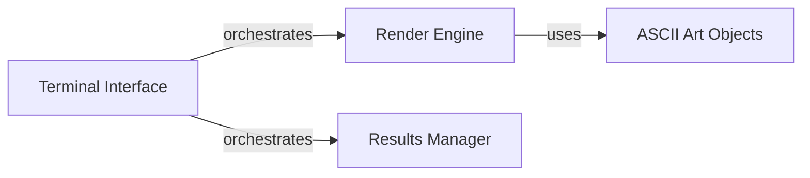

## Details

The `Terminal Interface` subsystem is a crucial part of the `poker_ai` project, aligning with its CLI Application architectural pattern. It provides a text-based user interface for real-time game progress, AI training status, and results display directly within the terminal.

### Terminal Interface [[Expand]](./Terminal_Interface.md)
The overarching component responsible for managing all terminal-based user interactions and displays. It orchestrates the rendering of game states, AI training progress, and final results to the command line.

**Related Classes/Methods**:

- <a href="https://github.com/fedden/poker_ai/blob/develop/poker_ai/terminal/__init__.py" target="_blank" rel="noopener noreferrer">`poker_ai.terminal`</a>

### Render Engine
The core rendering engine. It translates internal game state information (from `poker_ai.poker`) and AI training progress (from `poker_ai.ai`) into a visual, text-based representation suitable for terminal display. It acts as the orchestrator for visual elements.

**Related Classes/Methods**:

- <a href="https://github.com/fedden/poker_ai/blob/develop/poker_ai/terminal/render.py" target="_blank" rel="noopener noreferrer">`poker_ai.terminal.render`</a>

### ASCII Art Objects
This component is responsible for generating and managing ASCII art representations of various game elements, such as playing cards (`card_collection`), chips, or player states. These are the visual primitives consumed by the `Render Engine`.

**Related Classes/Methods**:

- <a href="https://github.com/fedden/poker_ai/blob/develop/poker_ai/terminal/ascii_objects" target="_blank" rel="noopener noreferrer">`poker_ai.terminal.ascii_objects`</a>
- <a href="https://github.com/fedden/poker_ai/blob/develop/poker_ai/terminal/ascii_objects/card_collection.py" target="_blank" rel="noopener noreferrer">`poker_ai.terminal.ascii_objects.card_collection`</a>

### Results Manager
Manages the storage, formatting, and display of final game outcomes or AI training results. It ensures that summaries of games or training sessions are presented clearly and concisely to the user in the terminal.

**Related Classes/Methods**:

- <a href="https://github.com/fedden/poker_ai/blob/develop/poker_ai/terminal/results.py" target="_blank" rel="noopener noreferrer">`poker_ai.terminal.results`</a>

### [FAQ](https://github.com/CodeBoarding/GeneratedOnBoardings/tree/main?tab=readme-ov-file#faq)