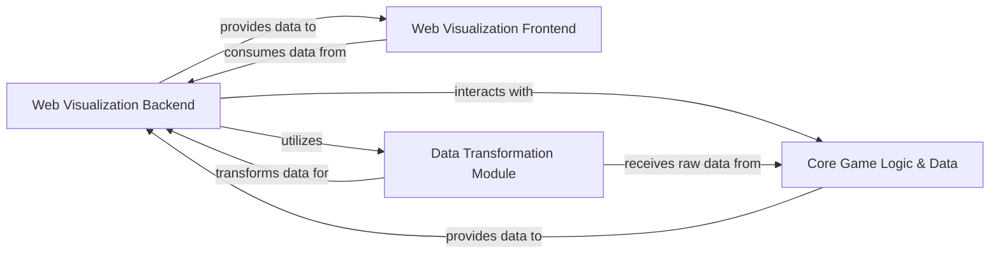

## Details

The applications.visualisation subsystem provides a web-based interface for monitoring and visualizing the poker AI's game states and training progress. It consists of a backend and a frontend component, along with supporting modules for data conversion and interaction with the core game logic.

### Web Visualization Backend [[Expand]](./Web_Visualization_Backend.md)
The central server-side component that exposes APIs to provide real-time game state data and AI training progress to the web-based visualization frontend. It orchestrates data retrieval, processing, and delivery, and also handles the initialization of default or sample game states.

**Related Classes/Methods**:

- <a href="https://github.com/fedden/poker_ai/blob/develop/applications/visualisation/backend/default.py" target="_blank" rel="noopener noreferrer">`applications.visualisation.backend.default`</a>

### Web Visualization Frontend [[Expand]](./Web_Visualization_Frontend.md)
The web-based client-side application responsible for consuming data from the Web Visualization Backend's APIs and rendering interactive visualizations of game states and AI training progress.

**Related Classes/Methods**:

- <a href="https://github.com/fedden/poker_ai/blob/develop/applications/visualisation/frontend/src/main.js" target="_blank" rel="noopener noreferrer">`/mnt/e/StartUp/poker_ai/applications/visualisation/frontend/src/main.js`</a>

### Data Transformation Module
This module is responsible for transforming the internal, raw game state data (from Core Game Logic & Data) into a standardized, web-friendly format (e.g., JSON) suitable for consumption by the Web Visualization Frontend.

**Related Classes/Methods**:

- <a href="https://github.com/fedden/poker_ai/blob/develop/applications/visualisation/backend/convert.py" target="_blank" rel="noopener noreferrer">`applications.visualisation.backend.convert`</a>

### Core Game Logic & Data
This represents the underlying poker_ai system's components, including the game state (poker_ai.games.short_deck.state), player logic (poker_ai.games.short_deck.player), and pot management (poker_ai.poker.pot). It is the authoritative source of game data that the Web Visualization Backend queries and processes.

**Related Classes/Methods**:

- <a href="https://github.com/fedden/poker_ai/blob/develop/poker_ai/games/short_deck/state.py" target="_blank" rel="noopener noreferrer">`poker_ai.games.short_deck.state`</a>
- <a href="https://github.com/fedden/poker_ai/blob/develop/poker_ai/games/short_deck/player.py" target="_blank" rel="noopener noreferrer">`poker_ai.games.short_deck.player`</a>
- <a href="https://github.com/fedden/poker_ai/blob/develop/poker_ai/poker/pot.py" target="_blank" rel="noopener noreferrer">`poker_ai.poker.pot`</a>

### [FAQ](https://github.com/CodeBoarding/GeneratedOnBoardings/tree/main?tab=readme-ov-file#faq)