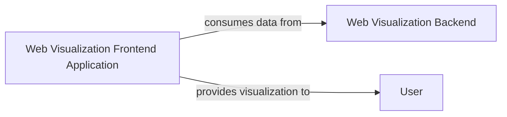

## Details

The visualization subsystem of the `poker_ai` project is composed of three primary high-level components: the `Web Visualization Frontend Application`, the `Web Visualization Backend`, and the `User`. The `Web Visualization Frontend Application` serves as the interactive user interface, responsible for rendering dynamic visualizations of poker game play and AI training data. It establishes a crucial interaction pathway by consuming processed data directly from the `Web Visualization Backend`. In turn, the `Web Visualization Frontend Application` provides these comprehensive visualizations to the `User`, enabling them to monitor and understand the AI's performance and game dynamics. This architecture ensures a clear separation of concerns, with the backend handling data processing and the frontend focusing on user interaction and data presentation.

### Web Visualization Frontend Application
This is the core client-side application responsible for rendering interactive visualizations of poker game play and AI training progress. It acts as the user interface for the visualization aspect of the project, consuming data from the backend and presenting it to the user.

**Related Classes/Methods**:

- <a href="https://github.com/fedden/poker_ai/blob/develop/applications/visualisation/frontend/index.html" target="_blank" rel="noopener noreferrer">`index.html`</a>

### Web Visualization Backend [[Expand]](./Web_Visualization_Backend.md)
This component is responsible for processing and serving data related to poker game play and AI training progress to the `Web Visualization Frontend Application`. It acts as the data provider for the visualization interface.

**Related Classes/Methods**: _None_

### User
This represents the external human actor who interacts with the `Web Visualization Frontend Application` to view and interpret the poker game and AI training visualizations.

**Related Classes/Methods**: _None_

### [FAQ](https://github.com/CodeBoarding/GeneratedOnBoardings/tree/main?tab=readme-ov-file#faq)