```mermaid
graph LR
    CLI_Application["CLI Application"]
    AI_Core_Training_Module["AI Core & Training Module"]
    Game_Logic_State_Management["Game Logic & State Management"]
    Hand_Abstraction_Clustering["Hand Abstraction & Clustering"]
    Terminal_Interface["Terminal Interface"]
    Web_Visualization_Backend["Web Visualization Backend"]
    Web_Visualization_Frontend["Web Visualization Frontend"]
    CLI_Application -- "controls" --> AI_Core_Training_Module
    CLI_Application -- "initiates" --> Hand_Abstraction_Clustering
    CLI_Application -- "outputs to" --> Terminal_Interface
    AI_Core_Training_Module -- "interacts with" --> Game_Logic_State_Management
    AI_Core_Training_Module -- "provides status to" --> Terminal_Interface
    AI_Core_Training_Module -- "provides progress to" --> Web_Visualization_Backend
    Hand_Abstraction_Clustering -- "provides data to" --> AI_Core_Training_Module
    Game_Logic_State_Management -- "provides state to" --> AI_Core_Training_Module
    Game_Logic_State_Management -- "provides state to" --> Terminal_Interface
    Game_Logic_State_Management -- "provides state to" --> Web_Visualization_Backend
    Web_Visualization_Backend -- "provides data to" --> Web_Visualization_Frontend
    click CLI_Application href "https://github.com/CodeBoarding/GeneratedOnBoardings/blob/main/poker_ai/CLI_Application.md" "Details"
    click AI_Core_Training_Module href "https://github.com/CodeBoarding/GeneratedOnBoardings/blob/main/poker_ai/AI_Core_Training_Module.md" "Details"
    click Game_Logic_State_Management href "https://github.com/CodeBoarding/GeneratedOnBoardings/blob/main/poker_ai/Game_Logic_State_Management.md" "Details"
    click Hand_Abstraction_Clustering href "https://github.com/CodeBoarding/GeneratedOnBoardings/blob/main/poker_ai/Hand_Abstraction_Clustering.md" "Details"
    click Terminal_Interface href "https://github.com/CodeBoarding/GeneratedOnBoardings/blob/main/poker_ai/Terminal_Interface.md" "Details"
    click Web_Visualization_Backend href "https://github.com/CodeBoarding/GeneratedOnBoardings/blob/main/poker_ai/Web_Visualization_Backend.md" "Details"
    click Web_Visualization_Frontend href "https://github.com/CodeBoarding/GeneratedOnBoardings/blob/main/poker_ai/Web_Visualization_Frontend.md" "Details"
```

## Details

The poker AI system is structured around a central `CLI Application` that orchestrates various AI functionalities. This application controls the `AI Core & Training Module`, which is responsible for the AI's learning processes, interacting closely with the `Game Logic & State Management` component to simulate poker games. The `Hand Abstraction & Clustering` module pre-processes hand data, providing optimized information to the `AI Core & Training Module`. User interaction and real-time feedback are handled by the `Terminal Interface` for command-line users and a `Web Visualization Frontend` for graphical representation. The `Web Visualization Frontend` receives its data from the `Web Visualization Backend`, which in turn gathers game state and AI progress from the `AI Core & Training Module` and `Game Logic & State Management`. This architecture ensures a clear separation of concerns, facilitating both efficient AI training and intuitive user monitoring.

### CLI Application [[Expand]](./CLI_Application.md)
The primary command-line interface for users to initiate, control, and interact with the poker AI system. It acts as the orchestrator for various AI tasks (training, clustering, playing) and provides direct user feedback.

**Related Classes/Methods**:

- <a href="https://github.com/fedden/poker_ai/blob/develop/poker_ai/cli/runner.py#L8-L18" target="_blank" rel="noopener noreferrer">`poker_ai.cli.runner`:8-18</a>

### AI Core & Training Module [[Expand]](./AI_Core_Training_Module.md)
Encapsulates the core AI algorithms (e.g., CFR, CFR+), manages the entire AI training lifecycle (start, resume), and handles both single-process and distributed training coordination. This module is central to the AI's learning process.

**Related Classes/Methods**:

- <a href="https://github.com/fedden/poker_ai/blob/develop/poker_ai/ai/runner.py" target="_blank" rel="noopener noreferrer">`poker_ai.ai.runner`</a>
- <a href="https://github.com/fedden/poker_ai/blob/develop/poker_ai/ai/ai.py" target="_blank" rel="noopener noreferrer">`poker_ai.ai.ai`</a>
- <a href="https://github.com/fedden/poker_ai/blob/develop/poker_ai/ai/multiprocess/server.py" target="_blank" rel="noopener noreferrer">`poker_ai.ai.multiprocess.server`</a>
- <a href="https://github.com/fedden/poker_ai/blob/develop/poker_ai/ai/multiprocess/worker.py" target="_blank" rel="noopener noreferrer">`poker_ai.ai.multiprocess.worker`</a>
- <a href="https://github.com/fedden/poker_ai/blob/develop/poker_ai/ai/singleprocess/train.py" target="_blank" rel="noopener noreferrer">`poker_ai.ai.singleprocess.train`</a>

### Game Logic & State Management [[Expand]](./Game_Logic_State_Management.md)
Manages the fundamental rules, state transitions, and actions within a poker game (e.g., short deck poker). This includes applying player actions, managing betting rounds, and evaluating poker hands to determine winners.

**Related Classes/Methods**:

- <a href="https://github.com/fedden/poker_ai/blob/develop/poker_ai/games/short_deck/state.py" target="_blank" rel="noopener noreferrer">`poker_ai.games.short_deck.state`</a>
- <a href="https://github.com/fedden/poker_ai/blob/develop/poker_ai/poker/engine.py" target="_blank" rel="noopener noreferrer">`poker_ai.poker.engine`</a>
- <a href="https://github.com/fedden/poker_ai/blob/develop/poker_ai/poker/evaluation/evaluator.py" target="_blank" rel="noopener noreferrer">`poker_ai.poker.evaluation.evaluator`</a>

### Hand Abstraction & Clustering [[Expand]](./Hand_Abstraction_Clustering.md)
Responsible for pre-processing poker hand data, generating abstracted representations of hands, and building efficient lookup tables for card information. This optimizes the computational demands of the AI algorithms.

**Related Classes/Methods**:

- <a href="https://github.com/fedden/poker_ai/blob/develop/poker_ai/clustering/card_info_lut_builder.py" target="_blank" rel="noopener noreferrer">`poker_ai.clustering.card_info_lut_builder`</a>
- <a href="https://github.com/fedden/poker_ai/blob/develop/poker_ai/clustering/runner.py" target="_blank" rel="noopener noreferrer">`poker_ai.clustering.runner`</a>

### Terminal Interface [[Expand]](./Terminal_Interface.md)
Provides a text-based user interface for displaying real-time game progress, AI training status, and results directly within the terminal. It includes rendering game elements and managing result storage for terminal display.

**Related Classes/Methods**:

- <a href="https://github.com/fedden/poker_ai/blob/develop/poker_ai/terminal/render.py" target="_blank" rel="noopener noreferrer">`poker_ai.terminal.render`</a>
- <a href="https://github.com/fedden/poker_ai/blob/develop/poker_ai/terminal/ascii_objects/card_collection.py" target="_blank" rel="noopener noreferrer">`poker_ai.terminal.ascii_objects.card_collection`</a>
- <a href="https://github.com/fedden/poker_ai/blob/develop/poker_ai/terminal/results.py" target="_blank" rel="noopener noreferrer">`poker_ai.terminal.results`</a>

### Web Visualization Backend [[Expand]](./Web_Visualization_Backend.md)
A server-side component that exposes APIs to provide game state data and AI training progress to the web-based visualization frontend. It acts as the data provider for the interactive web application.

**Related Classes/Methods**:

- <a href="https://github.com/fedden/poker_ai/blob/develop/applications/visualisation/backend/default.py" target="_blank" rel="noopener noreferrer">`applications.visualisation.backend.app`</a>

### Web Visualization Frontend [[Expand]](./Web_Visualization_Frontend.md)
The client-side web application responsible for rendering interactive visualizations of poker game play and AI training progress. It consumes data from the Web Visualization Backend.

**Related Classes/Methods**:

- <a href="https://github.com/fedden/poker_ai/blob/develop/applications/visualisation/frontend/index.html" target="_blank" rel="noopener noreferrer">`applications.visualisation.frontend.index`</a>

### [FAQ](https://github.com/CodeBoarding/GeneratedOnBoardings/tree/main?tab=readme-ov-file#faq)