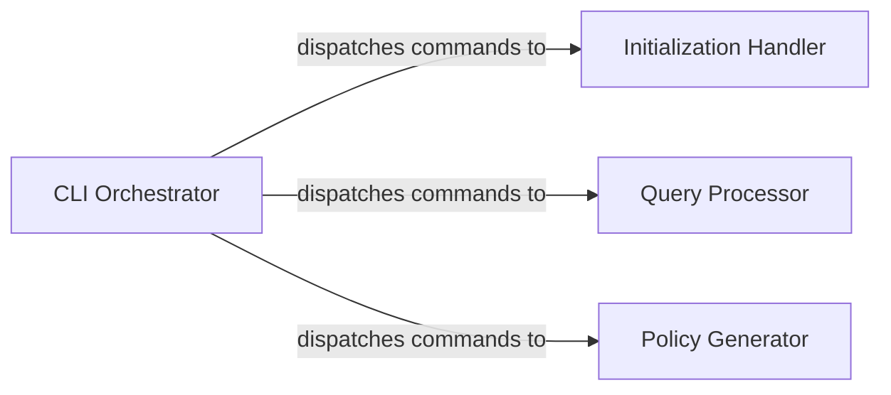

## Details

This subsystem is the user-facing entry point of policy_sentry, responsible for interpreting user commands and orchestrating the execution of core functionalities. It ensures that user input is correctly parsed, validated, and directed to the appropriate backend processing modules.

### CLI Orchestrator
The primary component responsible for parsing command-line arguments, validating user input, and dispatching the execution flow to the appropriate backend command modules. It acts as the central entry point and orchestrator for all user-initiated operations within the policy_sentry CLI tool.

**Related Classes/Methods**:

- <a href="https://github.com/salesforce/policy_sentry/blob/master/policy_sentry/bin/cli.py" target="_blank" rel="noopener noreferrer">`policy_sentry.bin.cli`</a>

### Initialization Handler
Handles the logic for initializing the local database, including schema creation and initial data population. It is invoked by the CLI Orchestrator when the user requests database setup.

**Related Classes/Methods**:

- <a href="https://github.com/salesforce/policy_sentry/blob/master/policy_sentry/command/initialize.py" target="_blank" rel="noopener noreferrer">`policy_sentry.command.initialize`</a>

### Query Processor
Manages the execution of queries against the IAM data store. It processes user-defined query parameters and retrieves relevant AWS IAM data, such as actions, services, or ARNs.

**Related Classes/Methods**:

- <a href="https://github.com/salesforce/policy_sentry/blob/master/policy_sentry/command/query.py" target="_blank" rel="noopener noreferrer">`policy_sentry.command.query`</a>

### Policy Generator
Responsible for constructing and writing AWS IAM policies based on user specifications. It takes input parameters (e.g., actions, ARNs) and generates a valid IAM policy document, often in YAML or JSON format.

**Related Classes/Methods**:

- <a href="https://github.com/salesforce/policy_sentry/blob/master/policy_sentry/command/write_policy.py" target="_blank" rel="noopener noreferrer">`policy_sentry.command.write_policy`</a>

### [FAQ](https://github.com/CodeBoarding/GeneratedOnBoardings/tree/main?tab=readme-ov-file#faq)