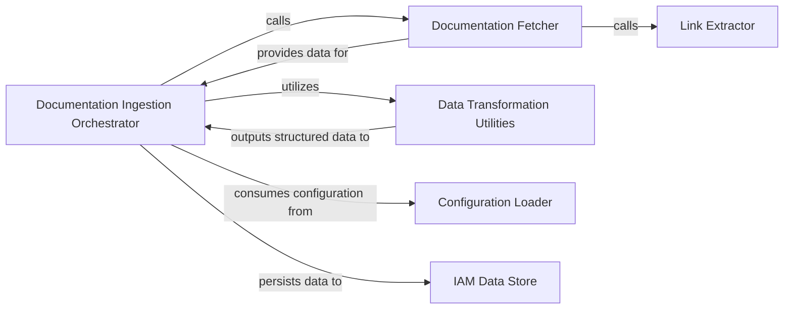

## Details

The `IAM Data Management` subsystem is responsible for the complete lifecycle management of the internal AWS IAM data store. This encompasses the ingestion of raw AWS documentation, its parsing, and the subsequent population and updating of the local database with critical information such as service details, actions, ARNs (Amazon Resource Names), and condition keys. The core functionality of this subsystem is primarily encapsulated within the `policy_sentry.shared.awsdocs` and `policy_sentry.shared.data` modules.

### Documentation Ingestion Orchestrator
The primary entry point and coordinator for the entire data ingestion process. It manages the flow from fetching raw data to persisting processed information into the IAM Data Store.

**Related Classes/Methods**:

- <a href="https://github.com/salesforce/policy_sentry/blob/master/policy_sentry/shared/awsdocs.py#L146-L414" target="_blank" rel="noopener noreferrer">`policy_sentry.shared.awsdocs.create_database`:146-414</a>

### Documentation Fetcher
Manages the acquisition, downloading, and local caching of raw AWS IAM HTML documentation files from AWS sources.

**Related Classes/Methods**:

- <a href="https://github.com/salesforce/policy_sentry/blob/master/policy_sentry/shared/awsdocs.py#L78-L126" target="_blank" rel="noopener noreferrer">`policy_sentry.shared.awsdocs.update_html_docs_directory`:78-126</a>

### Link Extractor
Extracts relevant documentation page links from the base AWS IAM documentation page, guiding the `Documentation Fetcher` to specific service documentation.

**Related Classes/Methods**:

- <a href="https://github.com/salesforce/policy_sentry/blob/master/policy_sentry/shared/awsdocs.py#L48-L56" target="_blank" rel="noopener noreferrer">`policy_sentry.shared.awsdocs.get_links_from_base_actions_resources_conditions_page`:48-56</a>

### Data Transformation Utilities
A collection of helper functions dedicated to cleaning, parsing, and normalizing the raw HTML documentation into structured data, identifying services, actions, ARNs, and condition keys.

**Related Classes/Methods**:

- <a href="https://github.com/salesforce/policy_sentry/blob/master/policy_sentry/shared/awsdocs.py#L131-L133" target="_blank" rel="noopener noreferrer">`policy_sentry.shared.awsdocs.chomp`:131-133</a>
- <a href="https://github.com/salesforce/policy_sentry/blob/master/policy_sentry/shared/awsdocs.py#L136-L138" target="_blank" rel="noopener noreferrer">`policy_sentry.shared.awsdocs.no_white_space`:136-138</a>
- <a href="https://github.com/salesforce/policy_sentry/blob/master/policy_sentry/shared/awsdocs.py#L37-L45" target="_blank" rel="noopener noreferrer">`policy_sentry.shared.awsdocs.header_matches`:37-45</a>
- <a href="https://github.com/salesforce/policy_sentry/blob/master/policy_sentry/shared/awsdocs.py#L141-L143" target="_blank" rel="noopener noreferrer">`policy_sentry.shared.awsdocs.sanitize_service_name`:141-143</a>

### Configuration Loader
Loads custom configuration, such as access level overrides, from YAML files. This configuration influences how the raw documentation is processed and how data is ultimately stored.

**Related Classes/Methods**:

- <a href="https://github.com/salesforce/policy_sentry/blob/master/policy_sentry/shared/awsdocs.py#L59-L75" target="_blank" rel="noopener noreferrer">`policy_sentry.shared.awsdocs.get_action_access_level_overrides_from_yml`:59-75</a>

### IAM Data Store
Defines the schema for the internal IAM data store and provides the interface for storing, retrieving, and managing the processed IAM data. It acts as the persistence layer for the subsystem.

**Related Classes/Methods**:

- <a href="https://github.com/salesforce/policy_sentry/blob/master/policy_sentry/shared/data" target="_blank" rel="noopener noreferrer">`policy_sentry.shared.data`</a>

### [FAQ](https://github.com/CodeBoarding/GeneratedOnBoardings/tree/main?tab=readme-ov-file#faq)