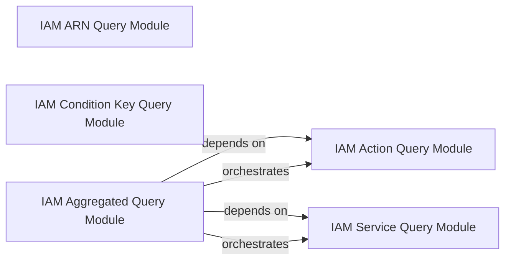

## Details

The IAM Data Query Engine subsystem exhibits a clear hierarchical relationship, with the IAM Aggregated Query Module (policy_sentry.querying.all) acting as a facade or orchestrator for the more granular query modules. It depends on and combines data from the IAM Action Query Module (policy_sentry.querying.actions) and the IAM Service Query Module (policy_sentry.querying.services). The IAM ARN Query Module and IAM Condition Key Query Module operate independently within this subsystem, providing specialized data retrieval capabilities that can be consumed by other parts of the system or directly by external components. This structure aligns with the "Data-Centric" and "Modularity for Policy Logic" architectural biases, ensuring specialized data access while providing aggregated views.

### IAM Action Query Module
Provides a comprehensive interface for querying and filtering AWS IAM actions. This includes retrieving actions based on access level, ARN type, and condition keys, as well as accessing associated API documentation links. It handles detailed, action-specific data retrieval.

**Related Classes/Methods**:

- <a href="https://github.com/salesforce/policy_sentry/blob/master/policy_sentry/querying/actions.py" target="_blank" rel="noopener noreferrer">`policy_sentry.querying.actions`</a>

### IAM ARN Query Module
Focuses on querying and retrieving raw ARN data, specifically for different AWS services, enabling the identification of resource types.

**Related Classes/Methods**:

- <a href="https://github.com/salesforce/policy_sentry/blob/master/policy_sentry/querying/arns.py" target="_blank" rel="noopener noreferrer">`policy_sentry.querying.arns`</a>

### IAM Condition Key Query Module
Manages the querying and retrieval of AWS IAM condition key data, which are essential for constructing fine-grained access control policies.

**Related Classes/Methods**:

- <a href="https://github.com/salesforce/policy_sentry/blob/master/policy_sentry/querying/conditions.py" target="_blank" rel="noopener noreferrer">`policy_sentry.querying.conditions`</a>

### IAM Service Query Module
Handles the querying and retrieval of general AWS service-related information, such as service prefixes and names.

**Related Classes/Methods**:

- <a href="https://github.com/salesforce/policy_sentry/blob/master/policy_sentry/querying/services.py#L11-L19" target="_blank" rel="noopener noreferrer">`policy_sentry.querying.services`:11-19</a>

### IAM Aggregated Query Module
Offers high-level, aggregated query capabilities. It provides comprehensive lists of all actions or service prefixes by combining and orchestrating data retrieval from the more granular querying modules (e.g., actions, services).

**Related Classes/Methods**:

- <a href="https://github.com/salesforce/policy_sentry/blob/master/policy_sentry/querying/all.py" target="_blank" rel="noopener noreferrer">`policy_sentry.querying.all`</a>

### [FAQ](https://github.com/CodeBoarding/GeneratedOnBoardings/tree/main?tab=readme-ov-file#faq)