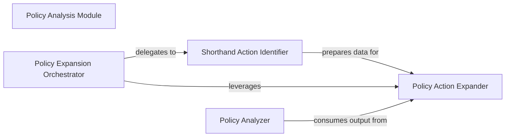

## Details

The `Policy Analysis Module` is a critical subsystem within the project, focusing on the transformation and analysis of AWS IAM policies. It adheres to the project's architectural patterns by providing modular, data-centric processing capabilities.

### Policy Analysis Module [[Expand]](./Policy_Analysis_Module.md)
The overarching subsystem responsible for transforming and analyzing IAM policies. Its core function is to expand shorthand actions (e.g., `s3:*`) into their full, explicit equivalents, and it provides a foundation for other policy-level validations or transformations.

**Related Classes/Methods**:

- <a href="https://github.com/salesforce/policy_sentry/blob/master/policy_sentry/analysis/expand.py" target="_blank" rel="noopener noreferrer">`policy_sentry.analysis.expand`</a>
- <a href="https://github.com/salesforce/policy_sentry/blob/master/policy_sentry/analysis/analyze.py" target="_blank" rel="noopener noreferrer">`policy_sentry.analysis.analyze`</a>

### Policy Expansion Orchestrator
Acts as the primary entry point and orchestrator for the policy expansion process. It initiates the transformation of an IAM policy by delegating the identification and expansion of shorthand actions. This component aligns with the "Library/API" pattern, providing a clear interface for policy expansion.

**Related Classes/Methods**:

- <a href="https://github.com/salesforce/policy_sentry/blob/master/policy_sentry/analysis/expand.py#L78-L126" target="_blank" rel="noopener noreferrer">`policy_sentry.analysis.expand.get_expanded_policy`:78-126</a>

### Shorthand Action Identifier
This component is responsible for parsing input IAM policies to identify and prepare shorthand actions (e.g., `s3:*`) that need to be expanded into their full, explicit forms. It acts as a pre-processing step for the core expansion logic.

**Related Classes/Methods**:

- <a href="https://github.com/salesforce/policy_sentry/blob/master/policy_sentry/analysis/expand.py#L57-L75" target="_blank" rel="noopener noreferrer">`policy_sentry.analysis.expand.determine_actions_to_expand`:57-75</a>

### Policy Action Expander
Contains the core logic for transforming shorthand IAM actions into their explicit, fully qualified equivalents. This component embodies the "Data Processing Tool" pattern, performing a specific, critical data transformation.

**Related Classes/Methods**:

- <a href="https://github.com/salesforce/policy_sentry/blob/master/policy_sentry/analysis/expand.py#L17-L54" target="_blank" rel="noopener noreferrer">`policy_sentry.analysis.expand.expand`:17-54</a>

### Policy Analyzer
This component is responsible for consuming the output of the policy expansion process. It performs subsequent analysis, validation, or reporting on the expanded IAM policies, extending the utility of the `Policy Analysis Module`.

**Related Classes/Methods**:

- <a href="https://github.com/salesforce/policy_sentry/blob/master/policy_sentry/analysis/analyze.py" target="_blank" rel="noopener noreferrer">`policy_sentry.analysis.analyze.analyze_module`</a>

### [FAQ](https://github.com/CodeBoarding/GeneratedOnBoardings/tree/main?tab=readme-ov-file#faq)