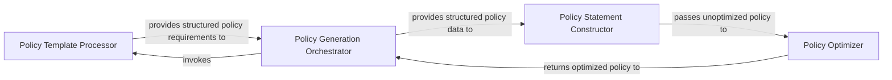

## Details

The `Policy Generation Engine` subsystem is the core logic for constructing AWS IAM policies. It takes user-defined templates, access levels, and resource constraints, then generates minimized and secure IAM policies, handling SID grouping and statement optimization.

### Policy Template Processor
This component is responsible for ingesting, parsing, and validating user-defined policy templates (e.g., YAML or JSON files). It extracts the raw policy requirements, such as desired actions, resource constraints, and access levels, and transforms them into a structured format suitable for policy statement construction.

**Related Classes/Methods**:

- <a href="https://github.com/salesforce/policy_sentry/blob/master/policy_sentry/writing/template.py" target="_blank" rel="noopener noreferrer">`policy_sentry.writing.create_template`</a>

### Policy Statement Constructor
The core logic for building the initial, unoptimized IAM policy statements. It takes structured policy data (from the Template Processor or direct input) and groups actions into Statement IDs (SIDs). This component handles the complexities of combining ARN-based actions, wildcard-only actions, and ensuring the correct structure for the policy's `Statement` array.

**Related Classes/Methods**:

- <a href="https://github.com/salesforce/policy_sentry/blob/master/policy_sentry/writing/sid_group.py" target="_blank" rel="noopener noreferrer">`policy_sentry.writing.sid_group`</a>

### Policy Optimizer
This component focuses on refining and minimizing the generated IAM policy statements. Its primary goal is to reduce the verbosity and improve the security posture of the policy by consolidating action prefixes (e.g., `s3:GetObject`, `s3:PutObject` to `s3:*`) and ensuring adherence to minimum permission lengths, thereby promoting the principle of least privilege.

**Related Classes/Methods**:

- <a href="https://github.com/salesforce/policy_sentry/blob/master/policy_sentry/writing/minimize.py" target="_blank" rel="noopener noreferrer">`policy_sentry.writing.minimize`</a>

### Policy Generation Orchestrator
This component acts as the high-level coordinator for the entire policy generation workflow. It serves as the entry point for user requests (often via a CLI command), orchestrates the calls to the `Policy Template Processor`, `Policy Statement Constructor`, and `Policy Optimizer`, and manages the overall data flow from initial input to the final, generated IAM policy output.

**Related Classes/Methods**:

- <a href="https://github.com/salesforce/policy_sentry/blob/master/policy_sentry/command/write_policy.py#L146-L158" target="_blank" rel="noopener noreferrer">`policy_sentry.command.write_policy.write_policy_with_template`:146-158</a>

### [FAQ](https://github.com/CodeBoarding/GeneratedOnBoardings/tree/main?tab=readme-ov-file#faq)