```mermaid
graph LR
    CLI_Interface["CLI Interface"]
    IAM_Data_Management["IAM Data Management"]
    IAM_Data_Query_Engine["IAM Data Query Engine"]
    Policy_Generation_Engine["Policy Generation Engine"]
    Policy_Analysis_Module["Policy Analysis Module"]
    CLI_Interface -- "Initializes/Updates IAM Data Store" --> IAM_Data_Management
    CLI_Interface -- "Requests IAM Data" --> IAM_Data_Query_Engine
    CLI_Interface -- "Requests Policy Creation" --> Policy_Generation_Engine
    IAM_Data_Management -- "Populates/Provides Data Access" --> IAM_Data_Query_Engine
    IAM_Data_Query_Engine -- "Returns Query Results" --> CLI_Interface
    IAM_Data_Query_Engine -- "Provides IAM Data" --> Policy_Generation_Engine
    IAM_Data_Query_Engine -- "Provides IAM Data" --> Policy_Analysis_Module
    Policy_Generation_Engine -- "Queries IAM Data" --> IAM_Data_Query_Engine
    Policy_Generation_Engine -- "Submits Policy for Analysis/Minimization" --> Policy_Analysis_Module
    Policy_Analysis_Module -- "Queries IAM Data for Expansion" --> IAM_Data_Query_Engine
    Policy_Analysis_Module -- "Returns Analyzed/Minimized Policy" --> Policy_Generation_Engine
    click CLI_Interface href "https://github.com/CodeBoarding/GeneratedOnBoardings/blob/main/policy_sentry/CLI_Interface.md" "Details"
    click IAM_Data_Management href "https://github.com/CodeBoarding/GeneratedOnBoardings/blob/main/policy_sentry/IAM_Data_Management.md" "Details"
    click IAM_Data_Query_Engine href "https://github.com/CodeBoarding/GeneratedOnBoardings/blob/main/policy_sentry/IAM_Data_Query_Engine.md" "Details"
    click Policy_Generation_Engine href "https://github.com/CodeBoarding/GeneratedOnBoardings/blob/main/policy_sentry/Policy_Generation_Engine.md" "Details"
    click Policy_Analysis_Module href "https://github.com/CodeBoarding/GeneratedOnBoardings/blob/main/policy_sentry/Policy_Analysis_Module.md" "Details"
```

## Details

The policy_sentry project is structured around a clear separation of concerns, facilitating robust IAM policy management. The CLI Interface serves as the primary entry point, orchestrating user commands. It interacts with the IAM Data Management component for initial setup and updates of the internal AWS IAM data store. For all data retrieval needs, both the CLI and other internal components rely on the IAM Data Query Engine, which provides an abstracted interface to the stored IAM information. Policy creation is handled by the Policy Generation Engine, which leverages the IAM Data Query Engine for necessary data and then passes generated policies to the Policy Analysis Module for refinement and expansion. The Policy Analysis Module can also query the IAM Data Query Engine for its operations, ensuring a consistent data flow throughout the system. This modular design allows for clear data flow, making it suitable for both detailed documentation and intuitive visual diagram generation.

### CLI Interface [[Expand]](./CLI_Interface.md)
The user-facing component responsible for parsing command-line arguments, validating input, and dispatching commands to the appropriate backend modules. It acts as the orchestrator for all user-initiated operations.

**Related Classes/Methods**:

- <a href="https://github.com/salesforce/policy_sentry/blob/master/policy_sentry/bin/cli.py" target="_blank" rel="noopener noreferrer">`policy_sentry.bin.cli`</a>
- <a href="https://github.com/salesforce/policy_sentry/blob/master/policy_sentry/command/initialize.py" target="_blank" rel="noopener noreferrer">`policy_sentry.command.initialize`</a>
- <a href="https://github.com/salesforce/policy_sentry/blob/master/policy_sentry/command/query.py" target="_blank" rel="noopener noreferrer">`policy_sentry.command.query`</a>
- <a href="https://github.com/salesforce/policy_sentry/blob/master/policy_sentry/command/write_policy.py" target="_blank" rel="noopener noreferrer">`policy_sentry.command.write_policy`</a>

### IAM Data Management [[Expand]](./IAM_Data_Management.md)
Manages the lifecycle of the internal AWS IAM data store. This includes ingesting raw AWS documentation, parsing it, and populating/updating the local database with service, action, ARN, and condition key information.

**Related Classes/Methods**:

- <a href="https://github.com/salesforce/policy_sentry/blob/master/policy_sentry/shared/awsdocs.py" target="_blank" rel="noopener noreferrer">`policy_sentry.shared.awsdocs`</a>
- <a href="https://github.com/salesforce/policy_sentry/blob/master/policy_sentry/shared/data" target="_blank" rel="noopener noreferrer">`policy_sentry.shared.data`</a>

### IAM Data Query Engine [[Expand]](./IAM_Data_Query_Engine.md)
Provides a standardized, abstracted interface for other components to retrieve specific AWS IAM data from the internal data store. It handles queries for actions, ARNs, services, and condition keys, ensuring consistent data access.

**Related Classes/Methods**:

- <a href="https://github.com/salesforce/policy_sentry/blob/master/policy_sentry/querying/actions.py" target="_blank" rel="noopener noreferrer">`policy_sentry.querying.actions`</a>
- <a href="https://github.com/salesforce/policy_sentry/blob/master/policy_sentry/querying/all.py" target="_blank" rel="noopener noreferrer">`policy_sentry.querying.all`</a>
- <a href="https://github.com/salesforce/policy_sentry/blob/master/policy_sentry/querying/arns.py" target="_blank" rel="noopener noreferrer">`policy_sentry.querying.arns`</a>
- <a href="https://github.com/salesforce/policy_sentry/blob/master/policy_sentry/querying/conditions.py" target="_blank" rel="noopener noreferrer">`policy_sentry.querying.conditions`</a>
- <a href="https://github.com/salesforce/policy_sentry/blob/master/policy_sentry/querying/services.py#L11-L19" target="_blank" rel="noopener noreferrer">`policy_sentry.querying.services`:11-19</a>

### Policy Generation Engine [[Expand]](./Policy_Generation_Engine.md)
The core logic for constructing AWS IAM policies. It takes user-defined templates, access levels, and resource constraints, then generates minimized and secure IAM policies, handling SID grouping and statement optimization.

**Related Classes/Methods**:

- <a href="https://github.com/salesforce/policy_sentry/blob/master/policy_sentry/writing/sid_group.py" target="_blank" rel="noopener noreferrer">`policy_sentry.writing.sid_group`</a>
- <a href="https://github.com/salesforce/policy_sentry/blob/master/policy_sentry/writing/minimize.py" target="_blank" rel="noopener noreferrer">`policy_sentry.writing.minimize`</a>
- <a href="https://github.com/salesforce/policy_sentry/blob/master/policy_sentry/writing/template.py" target="_blank" rel="noopener noreferrer">`policy_sentry.writing.create_template`</a>

### Policy Analysis Module [[Expand]](./Policy_Analysis_Module.md)
Focuses on transforming and analyzing IAM policies. Its primary function is to expand shorthand actions (e.g., s3:*) into their full, explicit equivalents, and can be extended for other policy-level validations or transformations.

**Related Classes/Methods**:

- <a href="https://github.com/salesforce/policy_sentry/blob/master/policy_sentry/analysis/expand.py" target="_blank" rel="noopener noreferrer">`policy_sentry.analysis.expand`</a>
- <a href="https://github.com/salesforce/policy_sentry/blob/master/policy_sentry/analysis/analyze.py" target="_blank" rel="noopener noreferrer">`policy_sentry.analysis.analyze`</a>

### [FAQ](https://github.com/CodeBoarding/GeneratedOnBoardings/tree/main?tab=readme-ov-file#faq)