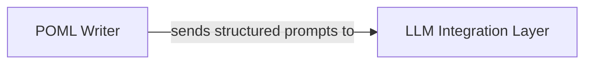

## Details

The LLM Integration Layer and POML Writer components define key boundaries within the POML DSL Toolkit. The POML Writer marks the boundary for the final output generation phase of the POML processing pipeline, transforming the in-memory representation into structured prompts. The LLM Integration Layer establishes the external boundary for communication with various Large Language Model (LLM) providers, abstracting the complexities of external API interactions.

### LLM Integration Layer [[Expand]](./LLM_Integration_Layer.md)
An abstraction layer that standardizes communication with various Large Language Model (LLM) providers, handling API calls, authentication, and response processing. This component is fundamental for an AI/ML DSL toolkit, providing the essential bridge to external LLM services and aligning with the "LLM Connector/API Abstraction Layer" architectural pattern.

**Related Classes/Methods**:

- <a href="https://github.com/microsoft/poml/blob/main/packages/poml/index.ts" target="_blank" rel="noopener noreferrer">`/home/ubuntu/CodeBoarding/repo/poml/packages/poml/index.ts`</a>

### POML Writer
Responsible for generating the final output, specifically structured prompts, from the in-memory representation of a POML document. This component is critical for the "Interpreter Pattern" and "Pipeline/Workflow Pattern" as it acts as the renderer/generator within the POML Language Core.

**Related Classes/Methods**:

- <a href="https://github.com/microsoft/poml/blob/main/packages/poml/writer.ts" target="_blank" rel="noopener noreferrer">`/home/ubuntu/CodeBoarding/repo/poml/packages/poml/writer.ts`</a>

### [FAQ](https://github.com/CodeBoarding/GeneratedOnBoardings/tree/main?tab=readme-ov-file#faq)