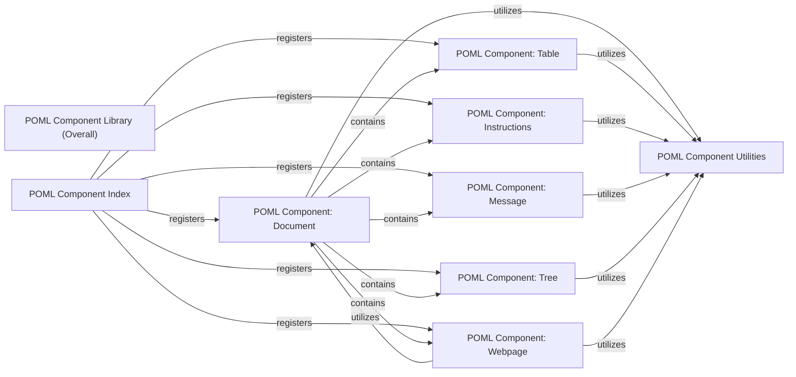

## Details

The `poml/components` subsystem serves as the core library for defining and managing reusable POML (Prompt-Oriented Markup Language) components. This subsystem provides a structured approach to building complex prompts by encapsulating common functionalities into modular, self-contained units.

### POML Component Library (Overall)
A repository of pre-defined, reusable POML components that encapsulate common functionalities and serve as modular building blocks for POML documents.

**Related Classes/Methods**: _None_

### POML Component: Document
Represents the root or a major structural block of a POML document, defining its overall layout and content. It handles parsing various document types (PDF, DOCX, TXT) and converting HTML content into POML elements.

**Related Classes/Methods**: _None_

### POML Component: Table
Encapsulates the structure and rendering logic for tabular data within a POML document, supporting various data sources like CSV, TSV, Excel, and JSON.

**Related Classes/Methods**: _None_

### POML Component: Instructions
Defines blocks of instructions or guidelines within a POML document, often used for LLM prompting, including roles, tasks, output formats, and stepwise instructions.

**Related Classes/Methods**: _None_

### POML Component: Message
Represents a message or a conversational turn, typically used in prompt engineering for LLMs, supporting system, human, and AI messages, and handling rich content including multimedia.

**Related Classes/Methods**: _None_

### POML Component: Tree
Defines a hierarchical data structure, allowing for the representation of nested information, such as file system structures, rendered in various formats.

**Related Classes/Methods**: _None_

### POML Component: Webpage
Allows for the embedding or referencing of web content within a POML document, with capabilities to fetch, parse, and extract text or convert HTML to POML.

**Related Classes/Methods**:

- <a href="https://github.com/microsoft/poml/blob/main/packages/poml/components/document.tsx" target="_blank" rel="noopener noreferrer">`htmlToPoml`</a>

### POML Component Utilities
A module containing common helper functions and utilities used by various POML components, such as parsing Python-style slices and handling captioned paragraphs.

**Related Classes/Methods**: _None_

### POML Component Index
The main aggregation point for the POML Component Library, responsible for exporting and making available all defined POML components.

**Related Classes/Methods**: _None_

### [FAQ](https://github.com/CodeBoarding/GeneratedOnBoardings/tree/main?tab=readme-ov-file#faq)