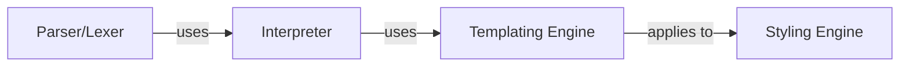

## Details

Analysis of the core components of the `poml` project, focusing on parsing, interpretation, templating, and styling functionalities. The analysis aims to rectify source file reference issues for accurate documentation and diagram generation.

### Parser/Lexer
Parses and lexes input.

**Related Classes/Methods**:

- <a href="https://github.com/microsoft/poml/blob/main/packages/poml/reader" target="_blank" rel="noopener noreferrer">`packages.poml.reader`</a>

### Interpreter
Interprets parsed input.

**Related Classes/Methods**:

- <a href="https://github.com/microsoft/poml/blob/main/packages/poml/reader" target="_blank" rel="noopener noreferrer">`packages.poml.reader`</a>

### Templating Engine
Renders templates.

**Related Classes/Methods**:

- <a href="https://github.com/microsoft/poml/blob/main/packages/poml/writer.ts" target="_blank" rel="noopener noreferrer">`packages.poml.writer`</a>

### Styling Engine
Applies styling.

**Related Classes/Methods**:

- <a href="https://github.com/microsoft/poml/blob/main/packages/poml/index.ts" target="_blank" rel="noopener noreferrer">`packages.poml.index`</a>

### [FAQ](https://github.com/CodeBoarding/GeneratedOnBoardings/tree/main?tab=readme-ov-file#faq)