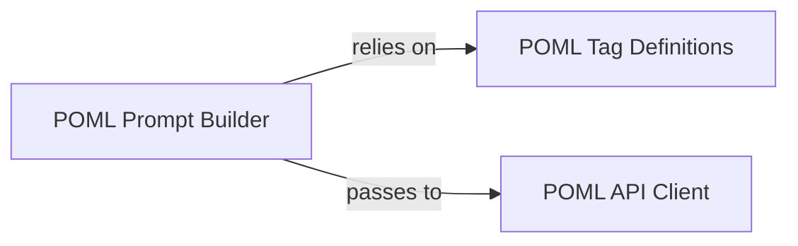

## Details

The `POML Python SDK` subsystem provides a Pythonic interface for developers to programmatically interact with the POML Core Engine, enabling the construction, processing, and integration of POML documents into Python applications.

### POML Tag Definitions
This component defines the Pythonic representation of the core POML language tags and their attributes. It provides the foundational elements for building POML documents programmatically, ensuring adherence to the DSL's syntax and structure. It acts as the vocabulary for the POML DSL within the Python environment.

**Related Classes/Methods**:

- <a href="https://github.com/microsoft/poml/blob/main/python/poml/_tags.py" target="_blank" rel="noopener noreferrer">`poml._tags`</a>

### POML Prompt Builder
This component provides a Pythonic interface for developers to programmatically construct POML documents or directly generate prompts suitable for Large Language Models (LLMs). It encapsulates the logic for defining prompt structures, handling variables, and potentially applying templating within the Python environment, abstracting the underlying POML syntax.

**Related Classes/Methods**:

- <a href="https://github.com/microsoft/poml/blob/main/python/poml/prompt.py" target="_blank" rel="noopener noreferrer">`poml.prompt`</a>

### POML API Client
This component manages the communication with the underlying POML Core Engine or external LLM APIs. It is responsible for sending the constructed POML prompts and receiving, validating (as indicated by `python.poml.api.pydantic_result`), and deserializing the responses into structured Python objects. It acts as the gateway for executing POML documents.

**Related Classes/Methods**:

- <a href="https://github.com/microsoft/poml/blob/main/python/poml/api.py" target="_blank" rel="noopener noreferrer">`poml.api`</a>

### [FAQ](https://github.com/CodeBoarding/GeneratedOnBoardings/tree/main?tab=readme-ov-file#faq)