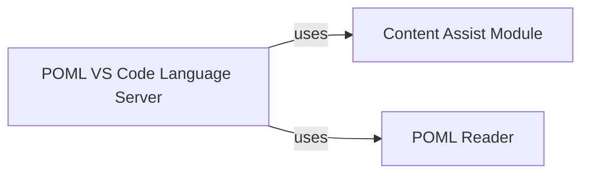

## Details

The POML Language Server for VS Code operates as a central hub, orchestrating interactions between the VS Code editor and specialized language processing modules. It primarily interfaces with the `Content Assist Module` for immediate, context-sensitive auto-completion and basic syntax validation, ensuring a responsive user experience. Concurrently, it leverages the `POML Reader` for in-depth semantic analysis, parsing POML documents into an Abstract Syntax Tree (AST) to enable advanced features like comprehensive diagnostics and refactoring. This architecture ensures a clear separation of concerns, with the Language Server managing the LSP communication and delegating core language processing tasks to dedicated, modular components.

### POML VS Code Language Server [[Expand]](./POML_VS_Code_Language_Server.md)
Implements the Language Server Protocol (LSP) for POML within VS Code, offering rich language features such as real-time syntax highlighting, comprehensive diagnostics (error and warning reporting), intelligent auto-completion, and consistent code formatting. It serves as the primary interface between the VS Code editor and the underlying POML language services.

**Related Classes/Methods**:

- <a href="https://github.com/microsoft/poml/blob/main/packages/poml-vscode/lsp/server.ts" target="_blank" rel="noopener noreferrer">`POML VS Code Language Server`</a>

### Content Assist Module
Provides the core logic for features like auto-completion suggestions, syntax validation, and potentially syntax highlighting rules. It processes the current document context to offer relevant language constructs and identify immediate syntax errors. This module, implemented in `xmlContentAssist.js`, leverages XML parsing utilities to determine the syntactic context for content assistance, such as element names, attribute names, and attribute values.

**Related Classes/Methods**:

- <a href="https://github.com/microsoft/poml/blob/main/packages/poml/util/xmlContentAssist.js" target="_blank" rel="noopener noreferrer">`Content Assist Module`</a>

### POML Reader
Responsible for deeper semantic analysis and validation of POML documents. It parses the POML text into an Abstract Syntax Tree (AST) or another in-memory representation, enabling more complex diagnostics, refactoring capabilities, and context-aware features beyond basic syntax. The `PomlReader` class in `poml.tsx` serves as the entry point for this parsing and reading functionality.

**Related Classes/Methods**:

- <a href="https://github.com/microsoft/poml/blob/main/packages/poml/reader/poml.tsx" target="_blank" rel="noopener noreferrer">`POML Reader`</a>

### [FAQ](https://github.com/CodeBoarding/GeneratedOnBoardings/tree/main?tab=readme-ov-file#faq)