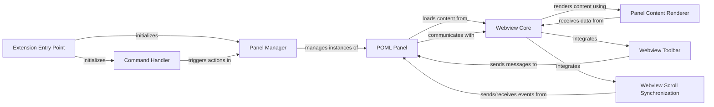

## Details

The POML VS Code UI & Panel Management subsystem encompasses the core components responsible for the Visual Studio Code extension's user interface, command handling, and the management and display of interactive POML preview panels.

### Extension Entry Point
Manages the lifecycle of the VS Code extension (activation and deactivation). It's the initial point where the extension registers its capabilities with VS Code.

**Related Classes/Methods**:

- <a href="https://github.com/microsoft/poml/blob/main/packages/poml-vscode/extension.ts" target="_blank" rel="noopener noreferrer">`Extension Entry Point`</a>

### Command Handler
Defines and registers all VS Code commands exposed by the POML extension (e.g., commands to open, refresh, or manage POML preview panels).

**Related Classes/Methods**:

- <a href="https://github.com/microsoft/poml/blob/main/packages/poml-vscode/command/index.ts" target="_blank" rel="noopener noreferrer">`Command Handler`</a>

### Panel Manager
Orchestrates the creation, retrieval, and destruction of POML preview panels. It ensures proper management of multiple panels (if supported) and their association with POML documents.

**Related Classes/Methods**:

- <a href="https://github.com/microsoft/poml/blob/main/packages/poml-vscode/panel/manager.ts" target="_blank" rel="noopener noreferrer">`Panel Manager`</a>

### POML Panel
Represents a single instance of a POML preview panel within VS Code. It handles the communication bridge between the VS Code extension context and the webview content displayed inside the panel.

**Related Classes/Methods**:

- <a href="https://github.com/microsoft/poml/blob/main/packages/poml-vscode/panel/panel.ts" target="_blank" rel="noopener noreferrer">`POML Panel`</a>

### Webview Core
The main entry point for the JavaScript application running inside the POML preview webview. It initializes the webview environment and sets up communication with the VS Code extension.

**Related Classes/Methods**:

- <a href="https://github.com/microsoft/poml/blob/main/packages/poml-vscode-webview/index.ts" target="_blank" rel="noopener noreferrer">`Webview Core`</a>

### Webview Toolbar
Implements the interactive toolbar elements displayed within the POML preview webview, providing actions like refresh, export, or settings.

**Related Classes/Methods**:

- <a href="https://github.com/microsoft/poml/blob/main/packages/poml-vscode-webview/toolbar.ts" target="_blank" rel="noopener noreferrer">`Webview Toolbar`</a>

### Webview Scroll Synchronization
Manages the synchronization of scroll positions between the active VS Code editor (displaying the POML source) and the POML preview panel.

**Related Classes/Methods**:

- <a href="https://github.com/microsoft/poml/blob/main/packages/poml-vscode-webview/scrollSync.ts" target="_blank" rel="noopener noreferrer">`Webview Scroll Synchronization`</a>

### Panel Content Renderer
This React component is responsible for taking the processed POML data and rendering it into a visual representation within the webview. It acts as the presentation layer for the POML output.

**Related Classes/Methods**:

- <a href="https://github.com/microsoft/poml/blob/main/packages/poml-vscode/panel/content.tsx" target="_blank" rel="noopener noreferrer">`Panel Content Renderer`</a>

### [FAQ](https://github.com/CodeBoarding/GeneratedOnBoardings/tree/main?tab=readme-ov-file#faq)