```mermaid
graph LR
    POML_Core_Engine["POML Core Engine"]
    POML_Component_Library["POML Component Library"]
    LLM_Integration_Layer["LLM Integration Layer"]
    POML_Python_SDK["POML Python SDK"]
    POML_VS_Code_Language_Server["POML VS Code Language Server"]
    POML_VS_Code_UI_Panel_Management["POML VS Code UI & Panel Management"]
    POML_Core_Engine -- "uses/consumes" --> POML_Component_Library
    POML_Core_Engine -- "sends prompts to" --> LLM_Integration_Layer
    LLM_Integration_Layer -- "returns responses to" --> POML_Core_Engine
    POML_Python_SDK -- "invokes/utilizes" --> POML_Core_Engine
    POML_Python_SDK -- "sends prompts to" --> LLM_Integration_Layer
    POML_VS_Code_Language_Server -- "queries/utilizes" --> POML_Core_Engine
    POML_VS_Code_UI_Panel_Management -- "requests content from" --> POML_Core_Engine
    POML_VS_Code_UI_Panel_Management -- "activates/manages" --> POML_VS_Code_Language_Server
    POML_VS_Code_Language_Server -- "provides language data to" --> POML_VS_Code_UI_Panel_Management
    click POML_Core_Engine href "https://github.com/CodeBoarding/GeneratedOnBoardings/blob/main/poml/POML_Core_Engine.md" "Details"
    click POML_Component_Library href "https://github.com/CodeBoarding/GeneratedOnBoardings/blob/main/poml/POML_Component_Library.md" "Details"
    click LLM_Integration_Layer href "https://github.com/CodeBoarding/GeneratedOnBoardings/blob/main/poml/LLM_Integration_Layer.md" "Details"
    click POML_Python_SDK href "https://github.com/CodeBoarding/GeneratedOnBoardings/blob/main/poml/POML_Python_SDK.md" "Details"
    click POML_VS_Code_Language_Server href "https://github.com/CodeBoarding/GeneratedOnBoardings/blob/main/poml/POML_VS_Code_Language_Server.md" "Details"
    click POML_VS_Code_UI_Panel_Management href "https://github.com/CodeBoarding/GeneratedOnBoardings/blob/main/poml/POML_VS_Code_UI_Panel_Management.md" "Details"
```

## Details

The POML project is structured around a core engine that processes a custom Prompt-Oriented Markup Language (POML). This engine interacts with a reusable component library and integrates with Large Language Models (LLMs) for dynamic content generation. A Python SDK provides programmatic access to the core functionalities, while a comprehensive VS Code extension offers an integrated development environment with language server features and UI management for an enhanced user experience. The system's design emphasizes modularity, allowing for clear separation of concerns between language processing, component management, LLM interaction, and IDE integration.

### POML Core Engine [[Expand]](./POML_Core_Engine.md)
The central processing unit for the POML DSL, responsible for parsing, interpreting, rendering, templating, and styling POML documents. It acts as the interpreter for the custom language.

**Related Classes/Methods**:

- <a href="https://github.com/microsoft/poml/blob/main/packages/poml/index.ts" target="_blank" rel="noopener noreferrer">`packages/poml/index.ts`</a>
- <a href="https://github.com/microsoft/poml/blob/main/packages/poml/file.tsx" target="_blank" rel="noopener noreferrer">`packages/poml/file.tsx`</a>
- <a href="https://github.com/microsoft/poml/blob/main/packages/poml/writer.ts#L1413-L1421" target="_blank" rel="noopener noreferrer">`packages.poml.writer.ts`:1413-1421</a>
- <a href="https://github.com/microsoft/poml/blob/main/packages/poml/base.tsx" target="_blank" rel="noopener noreferrer">`packages/poml/base.tsx`</a>

### POML Component Library [[Expand]](./POML_Component_Library.md)
A repository of pre-defined, reusable POML components that encapsulate common functionalities. These components are consumed by the POML Core Engine during document processing.

**Related Classes/Methods**:

- <a href="https://github.com/microsoft/poml/blob/main/packages/poml/components/index.ts" target="_blank" rel="noopener noreferrer">`packages/poml/components/index.ts`</a>

### LLM Integration Layer [[Expand]](./LLM_Integration_Layer.md)
An abstraction layer that standardizes communication with various Large Language Model (LLM) providers, handling API calls, authentication, and response processing.

**Related Classes/Methods**:

- <a href="https://github.com/microsoft/poml/blob/main/packages/poml/index.ts" target="_blank" rel="noopener noreferrer">`packages/poml/index.ts`</a>
- <a href="https://github.com/microsoft/poml/blob/main/packages/poml/writer.ts#L1413-L1421" target="_blank" rel="noopener noreferrer">`packages.poml.writer.ts`:1413-1421</a>

### POML Python SDK [[Expand]](./POML_Python_SDK.md)
Provides a Pythonic interface for developers to programmatically interact with the POML Core Engine, enabling the construction, processing, and integration of POML documents into Python applications.

**Related Classes/Methods**:

- <a href="https://github.com/microsoft/poml/blob/main/python/poml/prompt.py" target="_blank" rel="noopener noreferrer">`python/poml/prompt.py`</a>
- <a href="https://github.com/microsoft/poml/blob/main/python/poml/api.py" target="_blank" rel="noopener noreferrer">`python/poml/api.py`</a>
- <a href="https://github.com/microsoft/poml/blob/main/python/poml/_tags.py" target="_blank" rel="noopener noreferrer">`python/poml/_tags.py`</a>

### POML VS Code Language Server [[Expand]](./POML_VS_Code_Language_Server.md)
Implements the Language Server Protocol (LSP) for POML within VS Code, offering rich language features such as syntax highlighting, diagnostics, auto-completion, and code formatting.

**Related Classes/Methods**:

- <a href="https://github.com/microsoft/poml/blob/main/packages/poml-vscode/lsp/server.ts" target="_blank" rel="noopener noreferrer">`packages/poml-vscode/lsp/server.ts`</a>

### POML VS Code UI & Panel Management [[Expand]](./POML_VS_Code_UI_Panel_Management.md)
Manages the Visual Studio Code extension's lifecycle, commands, and the display of interactive POML preview panels. It orchestrates the user interface within the IDE.

**Related Classes/Methods**:

- <a href="https://github.com/microsoft/poml/blob/main/packages/poml-vscode/extension.ts" target="_blank" rel="noopener noreferrer">`packages/poml-vscode/extension.ts`</a>
- <a href="https://github.com/microsoft/poml/blob/main/packages/poml-vscode/command/index.ts" target="_blank" rel="noopener noreferrer">`packages/poml-vscode/command/index.ts`</a>
- <a href="https://github.com/microsoft/poml/blob/main/packages/poml-vscode/panel/manager.ts" target="_blank" rel="noopener noreferrer">`packages/poml-vscode/panel/manager.ts`</a>
- <a href="https://github.com/microsoft/poml/blob/main/packages/poml-vscode/panel/panel.ts" target="_blank" rel="noopener noreferrer">`packages/poml-vscode/panel/panel.ts`</a>
- <a href="https://github.com/microsoft/poml/blob/main/packages/poml-vscode-webview/index.ts" target="_blank" rel="noopener noreferrer">`packages/poml-vscode-webview/index.ts`</a>
- <a href="https://github.com/microsoft/poml/blob/main/packages/poml-vscode-webview/toolbar.ts" target="_blank" rel="noopener noreferrer">`packages/poml-vscode-webview/toolbar.ts`</a>
- <a href="https://github.com/microsoft/poml/blob/main/packages/poml-vscode-webview/scrollSync.ts" target="_blank" rel="noopener noreferrer">`packages/poml-vscode-webview/scrollSync.ts`</a>
- <a href="https://github.com/microsoft/poml/blob/main/packages/poml-vscode/panel/content.tsx" target="_blank" rel="noopener noreferrer">`packages/poml-vscode/panel/content.tsx`</a>

### [FAQ](https://github.com/CodeBoarding/GeneratedOnBoardings/tree/main?tab=readme-ov-file#faq)