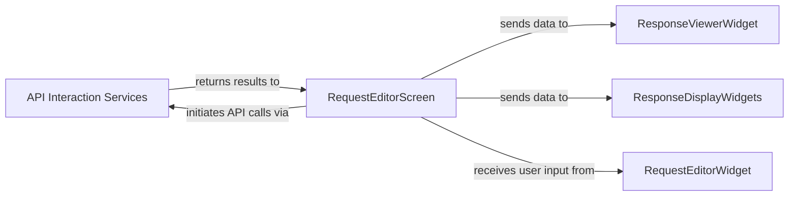

## Details

This subsystem focuses on the core functionality of an API client: preparing and executing API requests, and then processing and displaying the responses. It adheres to the Terminal User Interface (TUI) application patterns by separating UI concerns from business logic and external communication.

### API Interaction Services [[Expand]](./API_Interaction_Services.md)
This is the central service component responsible for all external API communications. It encapsulates the logic for sending HTTP requests, processing responses, and executing pre/post-request scripts, acting as the primary interface with external web services. It ensures that the application's core business logic for API interaction is isolated and reusable.

**Related Classes/Methods**:

- `src.posting.services.http_client.HTTPClient`
- `src.posting.services.request_executor.RequestExecutor`

### RequestEditorScreen
This component represents a top-level screen within the TUI application. Its primary responsibility is to manage the overall request editing workflow, orchestrate the collection of request parameters from UI widgets, initiate API calls through the `API Interaction Services`, and direct the display of responses to appropriate viewer widgets. It acts as a controller/view-model for the request lifecycle.

**Related Classes/Methods**:

- `src.screens.request_editor_screen.RequestEditorScreen`

### RequestEditorWidget
A reusable UI component (widget) specifically designed to collect and allow editing of various request parameters (e.g., URL, headers, body, method). It provides the interactive elements for user input related to an API request.

**Related Classes/Methods**:

- `src.widgets.request_editor_widget.RequestEditorWidget`

### ResponseViewerWidget
A reusable UI component (widget) dedicated to displaying the raw or minimally formatted API response content. Its focus is on presenting the complete response body for detailed inspection.

**Related Classes/Methods**:

- `src.widgets.response_viewer_widget.ResponseViewerWidget`

### ResponseDisplayWidgets
A collection or set of reusable UI components (widgets) responsible for presenting various aspects of the API response in a more user-friendly or structured format (e.g., status code, headers, parsed JSON/XML, timing information). This component enhances the user's understanding of the response beyond just the raw body.

**Related Classes/Methods**:

- `src.widgets.response_status_widget.ResponseStatusWidget`
- `src.widgets.response_headers_widget.ResponseHeadersWidget`

### [FAQ](https://github.com/CodeBoarding/GeneratedOnBoardings/tree/main?tab=readme-ov-file#faq)