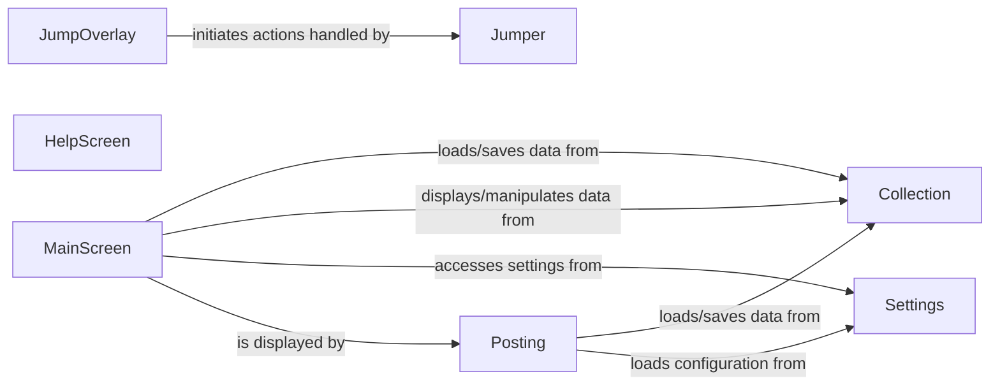

## Details

Abstract Components Overview

### Posting
The root Textual App class, responsible for initializing the application, managing the main event loop, and orchestrating the display of different screens. It serves as the primary controller for the entire application lifecycle.

**Related Classes/Methods**: _None_

### MainScreen
The default and primary screen displayed to the user, containing the main interactive elements and views of the application. It handles user input for core functionalities and delegates to other components or services as needed.

**Related Classes/Methods**: _None_

### HelpScreen
A dedicated screen for presenting help documentation, keybindings, or contextual information to the user. It provides guidance without disrupting the main application flow.

**Related Classes/Methods**:

- <a href="https://github.com/darrenburns/posting/blob/main/src/posting/help_screen.py#L47-L188" target="_blank" rel="noopener noreferrer">`HelpScreen` (47:188)</a>

### JumpOverlay
A transient overlay component that provides quick access or navigation capabilities, allowing users to "jump" to specific sections, commands, or data within the application.

**Related Classes/Methods**:

- <a href="https://github.com/darrenburns/posting/blob/main/src/posting/jump_overlay.py#L15-L117" target="_blank" rel="noopener noreferrer">`JumpOverlay` (15:117)</a>

### Jumper
A service or utility component responsible for the underlying logic of the "jump" functionality, likely managing the targets and execution of quick navigation actions initiated by the JumpOverlay.

**Related Classes/Methods**:

- <a href="https://github.com/darrenburns/posting/blob/main/src/posting/jumper.py#L25-L59" target="_blank" rel="noopener noreferrer">`Jumper` (25:59)</a>

### Collection
Manages the collection of requests, including loading, saving, and organizing them. It acts as a data layer for the application's request data.

**Related Classes/Methods**: _None_

### Settings
Handles application-wide configuration and settings, providing access to user preferences and operational parameters.

**Related Classes/Methods**: _None_

### [FAQ](https://github.com/CodeBoarding/GeneratedOnBoardings/tree/main?tab=readme-ov-file#faq)