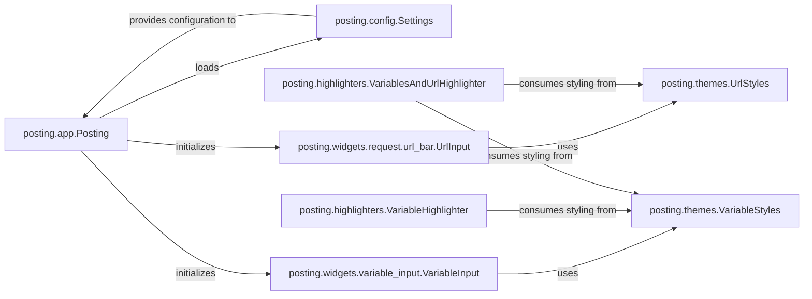

## Details

One paragraph explaining the functionality which is represented by this graph. What the main flow is and what is its purpose.

### posting.app.Posting
The main application entry point and orchestrator for the entire TUI. It initializes and manages the lifecycle of other components, including loading application settings.

**Related Classes/Methods**:

- <a href="https://github.com/darrenburns/posting/blob/main/src/posting/app.py#L1001-L1426" target="_blank" rel="noopener noreferrer">`posting.app.Posting` (1001:1426)</a>

### posting.config.Settings
Manages application-wide settings and user preferences, providing a centralized source for configurable behaviors and paths.

**Related Classes/Methods**:

- <a href="https://github.com/darrenburns/posting/blob/main/src/posting/config.py#L115-L247" target="_blank" rel="noopener noreferrer">`posting.config.Settings` (115:247)</a>

### posting.themes.UrlStyles
Defines specific styling rules and visual attributes for URLs within the application, ensuring consistent URL presentation.

**Related Classes/Methods**:

- <a href="https://github.com/darrenburns/posting/blob/main/src/posting/themes.py#L71-L90" target="_blank" rel="noopener noreferrer">`posting.themes.UrlStyles` (71:90)</a>

### posting.themes.VariableStyles
Defines specific styling rules and visual attributes for variables used throughout the application, ensuring consistent variable presentation.

**Related Classes/Methods**:

- <a href="https://github.com/darrenburns/posting/blob/main/src/posting/themes.py#L53-L68" target="_blank" rel="noopener noreferrer">`posting.themes.VariableStyles` (53:68)</a>

### posting.widgets.request.url_bar.UrlInput
A UI widget responsible for handling user input for URLs, applying relevant styling from the theming system.

**Related Classes/Methods**:

- <a href="https://github.com/darrenburns/posting/blob/main/src/posting/widgets/request/url_bar.py#L39-L108" target="_blank" rel="noopener noreferrer">`posting.widgets.request.url_bar.UrlInput` (39:108)</a>

### posting.widgets.variable_input.VariableInput
A UI widget responsible for handling user input for variables, applying relevant styling from the theming system.

**Related Classes/Methods**:

- <a href="https://github.com/darrenburns/posting/blob/main/src/posting/widgets/variable_input.py#L11-L61" target="_blank" rel="noopener noreferrer">`posting.widgets.variable_input.VariableInput` (11:61)</a>

### posting.highlighters.VariableHighlighter
A component responsible for applying syntax highlighting specifically to variables based on defined styles.

**Related Classes/Methods**:

- <a href="https://github.com/darrenburns/posting/blob/main/src/posting/highlighters.py#L43-L51" target="_blank" rel="noopener noreferrer">`posting.highlighters.VariableHighlighter` (43:51)</a>

### posting.highlighters.VariablesAndUrlHighlighter
A specialized highlighter component that applies styling to both variables and URLs, often used in contexts where both types of elements appear together.

**Related Classes/Methods**:

- <a href="https://github.com/darrenburns/posting/blob/main/src/posting/highlighters.py#L54-L75" target="_blank" rel="noopener noreferrer">`posting.highlighters.VariablesAndUrlHighlighter` (54:75)</a>

### [FAQ](https://github.com/CodeBoarding/GeneratedOnBoardings/tree/main?tab=readme-ov-file#faq)