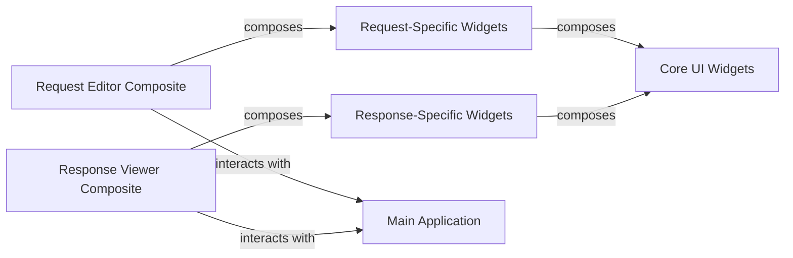

## Details

One paragraph explaining the functionality which is represented by this graph. What the main flow is and what is its purpose.

### Core UI Widgets
This component provides the foundational, generic, and highly reusable Textual widgets. These are the atomic visual elements designed for broad applicability across various parts of the TUI, ensuring consistency and reusability.

**Related Classes/Methods**:

- <a href="https://github.com/darrenburns/posting/blob/main/src/posting/widgets/datatable.py#L18-L272" target="_blank" rel="noopener noreferrer">`src.posting.widgets.datatable.PostingDataTable` (18:272)</a>
- <a href="https://github.com/darrenburns/posting/blob/main/src/posting/widgets/input.py#L8-L28" target="_blank" rel="noopener noreferrer">`src.posting.widgets.input.PostingInput` (8:28)</a>
- <a href="https://github.com/darrenburns/posting/blob/main/src/posting/widgets/key_value.py#L126-L329" target="_blank" rel="noopener noreferrer">`src.posting.widgets.key_value.KeyValueEditor` (126:329)</a>
- <a href="https://github.com/darrenburns/posting/blob/main/src/posting/widgets/collection/browser.py#L39-L553" target="_blank" rel="noopener noreferrer">`src.posting.widgets.collection.browser.CollectionTree` (39:553)</a>
- <a href="https://github.com/darrenburns/posting/blob/main/src/posting/widgets/tabbed_content.py#L4-L20" target="_blank" rel="noopener noreferrer">`src.posting.widgets.tabbed_content.PostingTabbedContent` (4:20)</a>
- <a href="https://github.com/darrenburns/posting/blob/main/src/posting/widgets/text_area.py#L136-L359" target="_blank" rel="noopener noreferrer">`src.posting.widgets.text_area.PostingTextArea` (136:359)</a>

### Request-Specific Widgets
This component comprises specialized widgets tailored for capturing and editing various aspects of an HTTP request, such as the URL, headers, and body. It leverages and composes widgets from the Core UI Widgets component.

**Related Classes/Methods**:

- <a href="https://github.com/darrenburns/posting/blob/main/src/posting/widgets/request/url_bar.py#L117-L325" target="_blank" rel="noopener noreferrer">`src.posting.widgets.request.url_bar.UrlBar` (117:325)</a>
- <a href="https://github.com/darrenburns/posting/blob/main/src/posting/widgets/request/form_editor.py#L11-L36" target="_blank" rel="noopener noreferrer">`src.posting.widgets.request.form_editor.FormTable` (11:36)</a>
- <a href="https://github.com/darrenburns/posting/blob/main/src/posting/widgets/request/header_editor.py#L183-L194" target="_blank" rel="noopener noreferrer">`src.posting.widgets.request.header_editor.HeaderInput` (183:194)</a>
- <a href="https://github.com/darrenburns/posting/blob/main/src/posting/widgets/request/header_editor.py#L247-L300" target="_blank" rel="noopener noreferrer">`src.posting.widgets.request.header_editor.HeadersTable` (247:300)</a>
- <a href="https://github.com/darrenburns/posting/blob/main/src/posting/widgets/request/query_editor.py#L12-L45" target="_blank" rel="noopener noreferrer">`src.posting.widgets.request.query_editor.ParamsTable` (12:45)</a>
- <a href="https://github.com/darrenburns/posting/blob/main/src/posting/widgets/request/request_body.py#L49-L68" target="_blank" rel="noopener noreferrer">`src.posting.widgets.request.request_body.RequestBodyTextArea` (49:68)</a>

### Response-Specific Widgets
This component includes specialized widgets dedicated to rendering and presenting different parts of an HTTP response, such as the response body, headers, and status. It also composes widgets from the Core UI Widgets component for display purposes.

**Related Classes/Methods**:

- <a href="https://github.com/darrenburns/posting/blob/main/src/posting/widgets/response/response_area.py#L24-L140" target="_blank" rel="noopener noreferrer">`src.posting.widgets.response.response_area.ResponseArea` (24:140)</a>
- <a href="https://github.com/darrenburns/posting/blob/main/src/posting/widgets/text_area.py#L365-L598" target="_blank" rel="noopener noreferrer">`src.posting.widgets.text_area.ReadOnlyTextArea` (365:598)</a>

### Request Editor Composite
A higher-level composite widget responsible for orchestrating the overall user interface for constructing and editing HTTP requests. It integrates and manages various Request-Specific Widgets to provide a cohesive request editing experience.

**Related Classes/Methods**:

- <a href="https://github.com/darrenburns/posting/blob/main/src/posting/widgets/request/request_editor.py#L24-L25" target="_blank" rel="noopener noreferrer">`src.posting.widgets.request.request_editor.RequestEditorTabbedContent` (24:25)</a>

### Response Viewer Composite
A higher-level composite widget responsible for displaying the complete HTTP response to the user. It integrates and manages various Response-Specific Widgets to present a comprehensive view of the received data.

**Related Classes/Methods**:

- <a href="https://github.com/darrenburns/posting/blob/main/src/posting/widgets/response/response_area.py#L24-L140" target="_blank" rel="noopener noreferrer">`src.posting.widgets.response.response_area.ResponseArea` (24:140)</a>

### Main Application
The central application component responsible for overall application flow, managing top-level UI elements, and coordinating interactions between major composite widgets like the Request Editor and Response Viewer.

**Related Classes/Methods**:

- <a href="https://github.com/darrenburns/posting/blob/main/src/posting/app.py#L1001-L1426" target="_blank" rel="noopener noreferrer">`src.posting.app.Posting` (1001:1426)</a>

### [FAQ](https://github.com/CodeBoarding/GeneratedOnBoardings/tree/main?tab=readme-ov-file#faq)