```mermaid
graph LR
    Application_Core_Navigation["Application Core & Navigation"]
    UI_Component_Library["UI Component Library"]
    Data_Models["Data Models"]
    Data_Management_Persistence["Data Management & Persistence"]
    API_Interaction_Services["API Interaction Services"]
    Configuration_Theming["Configuration & Theming"]
    Application_Core_Navigation -- "orchestrates" --> UI_Component_Library
    Application_Core_Navigation -- "manages" --> Data_Models
    Application_Core_Navigation -- "initiates" --> API_Interaction_Services
    Application_Core_Navigation -- "coordinates" --> Data_Management_Persistence
    UI_Component_Library -- "renders" --> Data_Models
    UI_Component_Library -- "receives input from" --> Application_Core_Navigation
    UI_Component_Library -- "is styled by" --> Configuration_Theming
    Data_Models -- "represent state for" --> Application_Core_Navigation
    Data_Models -- "are managed by" --> Data_Management_Persistence
    Data_Models -- "are displayed by" --> UI_Component_Library
    Data_Management_Persistence -- "loads/saves" --> Data_Models
    Data_Management_Persistence -- "is controlled by" --> Application_Core_Navigation
    API_Interaction_Services -- "operates on" --> Data_Models
    API_Interaction_Services -- "updates" --> Data_Models
    API_Interaction_Services -- "is invoked by" --> Application_Core_Navigation
    Configuration_Theming -- "configures" --> Application_Core_Navigation
    Configuration_Theming -- "styles" --> UI_Component_Library
    Configuration_Theming -- "influences" --> API_Interaction_Services
    click Application_Core_Navigation href "https://github.com/CodeBoarding/GeneratedOnBoardings/blob/main/posting/Application_Core_Navigation.md" "Details"
    click UI_Component_Library href "https://github.com/CodeBoarding/GeneratedOnBoardings/blob/main/posting/UI_Component_Library.md" "Details"
    click API_Interaction_Services href "https://github.com/CodeBoarding/GeneratedOnBoardings/blob/main/posting/API_Interaction_Services.md" "Details"
    click Configuration_Theming href "https://github.com/CodeBoarding/GeneratedOnBoardings/blob/main/posting/Configuration_Theming.md" "Details"
```

## Details

Abstract Components Overview

### Application Core & Navigation [[Expand]](./Application_Core_Navigation.md)
The central orchestrator of the TUI application, managing the overall lifecycle, screen transitions, and coordinating interactions between UI components and underlying services. It acts as the primary controller, directing the user experience flow.

**Related Classes/Methods**:

- <a href="https://github.com/darrenburns/posting/blob/main/src/posting/app.py#L1001-L1426" target="_blank" rel="noopener noreferrer">`src.posting.app.Posting` (1001:1426)</a>
- <a href="https://github.com/darrenburns/posting/blob/main/src/posting/app.py#L104-L998" target="_blank" rel="noopener noreferrer">`src.posting.app.MainScreen` (104:998)</a>
- <a href="https://github.com/darrenburns/posting/blob/main/src/posting/help_screen.py#L47-L188" target="_blank" rel="noopener noreferrer">`src.posting.help_screen.HelpScreen` (47:188)</a>
- <a href="https://github.com/darrenburns/posting/blob/main/src/posting/jump_overlay.py#L15-L117" target="_blank" rel="noopener noreferrer">`src.posting.jump_overlay.JumpOverlay` (15:117)</a>

### UI Component Library [[Expand]](./UI_Component_Library.md)
Provides a comprehensive set of reusable Textual widgets that form the visual building blocks of the TUI. These widgets are responsible for rendering data, capturing user input, and presenting information in an interactive manner, embodying the "View" aspect.

**Related Classes/Methods**:

- <a href="https://github.com/darrenburns/posting/blob/main/src/posting/widgets/datatable.py#L18-L272" target="_blank" rel="noopener noreferrer">`src.posting.widgets.datatable.PostingDataTable` (18:272)</a>
- <a href="https://github.com/darrenburns/posting/blob/main/src/posting/widgets/input.py#L8-L28" target="_blank" rel="noopener noreferrer">`src.posting.widgets.input.PostingInput` (8:28)</a>
- <a href="https://github.com/darrenburns/posting/blob/main/src/posting/widgets/key_value.py#L126-L329" target="_blank" rel="noopener noreferrer">`src.posting.widgets.key_value.KeyValueEditor` (126:329)</a>
- <a href="https://github.com/darrenburns/posting/blob/main/src/posting/widgets/collection/browser.py#L39-L553" target="_blank" rel="noopener noreferrer">`src.posting.widgets.collection.browser.CollectionTree` (39:553)</a>
- <a href="https://github.com/darrenburns/posting/blob/main/src/posting/widgets/request/url_bar.py#L117-L325" target="_blank" rel="noopener noreferrer">`src.posting.widgets.request.url_bar.UrlBar` (117:325)</a>
- <a href="https://github.com/darrenburns/posting/blob/main/src/posting/widgets/response/response_area.py#L24-L140" target="_blank" rel="noopener noreferrer">`src.posting.widgets.response.response_area.ResponseArea` (24:140)</a>

### Data Models
Defines the core data structures and schemas that represent the application's state and the information it operates on. This includes models for API requests, responses, collections, authentication details, and cookies, forming the "Model" layer.

**Related Classes/Methods**:

- <a href="https://github.com/darrenburns/posting/blob/main/src/posting/collection.py#L149-L375" target="_blank" rel="noopener noreferrer">`src.posting.collection.RequestModel` (149:375)</a>
- <a href="https://github.com/darrenburns/posting/blob/main/src/posting/collection.py#L22-L52" target="_blank" rel="noopener noreferrer">`src.posting.collection.Auth` (22:52)</a>
- <a href="https://github.com/darrenburns/posting/blob/main/src/posting/collection.py#L87-L94" target="_blank" rel="noopener noreferrer">`src.posting.collection.Cookie` (87:94)</a>
- <a href="https://github.com/darrenburns/posting/blob/main/src/posting/collection.py#L404-L527" target="_blank" rel="noopener noreferrer">`src.posting.collection.Collection` (404:527)</a>

### Data Management & Persistence
Manages the serialization, deserialization, and persistence of application data. This includes importing data from various external formats (e.g., cURL, OpenAPI), exporting application data, and managing collections and environments.

**Related Classes/Methods**:

- <a href="https://github.com/darrenburns/posting/blob/main/src/posting/importing/curl.py#L21-L311" target="_blank" rel="noopener noreferrer">`src.posting.importing.curl.CurlImport` (21:311)</a>
- <a href="https://github.com/darrenburns/posting/blob/main/src/posting/importing/open_api.py#L223-L279" target="_blank" rel="noopener noreferrer">`src.posting.importing.open_api.JsonBodyGenerator` (223:279)</a>
- `src.posting.services.collection_manager.CollectionManager` (1:1)
- `src.posting.services.environment_manager.EnvironmentManager` (1:1)

### API Interaction Services [[Expand]](./API_Interaction_Services.md)
Responsible for handling all external API communications. It encapsulates the logic for sending HTTP requests, processing responses, and executing pre/post-request scripts, acting as the primary interface with external web services.

**Related Classes/Methods**:

- `src.posting.services.http_client.HTTPClient` (1:1)
- `src.posting.services.request_executor.RequestExecutor` (1:1)

### Configuration & Theming [[Expand]](./Configuration_Theming.md)
Manages application-wide settings, user preferences, and visual themes. It ensures a consistent look and feel across the TUI and allows for customization of application behavior and appearance.

**Related Classes/Methods**:

- <a href="https://github.com/darrenburns/posting/blob/main/src/posting/themes.py#L105-L301" target="_blank" rel="noopener noreferrer">`src.posting.themes.Theme` (105:301)</a>
- `src.posting.config.Config`

### [FAQ](https://github.com/CodeBoarding/GeneratedOnBoardings/tree/main?tab=readme-ov-file#faq)