```mermaid
graph LR
    prefect_flows_Flow["prefect.flows.Flow"]
    prefect_flow_engine_FlowRunEngine["prefect.flow_engine.FlowRunEngine"]
    prefect_client_get_client["prefect.client.get_client"]
    prefect_server_api_server_create_app["prefect.server.api.server.create_app"]
    prefect_runner_runner_Runner["prefect.runner.runner.Runner"]
    prefect_deployments_runner_RunnerDeployment["prefect.deployments.runner.RunnerDeployment"]
    prefect_flows_Flow -- "Orchestrated by" --> prefect_flow_engine_FlowRunEngine
    prefect_flows_Flow -- "Defined by" --> prefect_deployments_runner_RunnerDeployment
    prefect_flow_engine_FlowRunEngine -- "Orchestrates" --> prefect_flows_Flow
    prefect_flow_engine_FlowRunEngine -- "Communicates via" --> prefect_client_get_client
    prefect_client_get_client -- "Used by" --> prefect_flow_engine_FlowRunEngine
    prefect_client_get_client -- "Sends requests to" --> prefect_server_api_server_create_app
    prefect_client_get_client -- "Used by" --> prefect_runner_runner_Runner
    prefect_server_api_server_create_app -- "Receives requests from" --> prefect_client_get_client
    prefect_server_api_server_create_app -- "Manages" --> prefect_deployments_runner_RunnerDeployment
    prefect_runner_runner_Runner -- "Executes" --> prefect_deployments_runner_RunnerDeployment
    prefect_runner_runner_Runner -- "Communicates via" --> prefect_client_get_client
    prefect_runner_runner_Runner -- "Launches" --> prefect_flows_Flow
    prefect_deployments_runner_RunnerDeployment -- "Defines execution for" --> prefect_flows_Flow
    prefect_deployments_runner_RunnerDeployment -- "Executed by" --> prefect_runner_runner_Runner
    prefect_deployments_runner_RunnerDeployment -- "Managed by" --> prefect_server_api_server_create_app
    click prefect_flows_Flow href "https://github.com/CodeBoarding/GeneratedOnBoardings/blob/main//prefect/prefect_flows_Flow.md" "Details"
    click prefect_flow_engine_FlowRunEngine href "https://github.com/CodeBoarding/GeneratedOnBoardings/blob/main//prefect/prefect_flow_engine_FlowRunEngine.md" "Details"
    click prefect_client_get_client href "https://github.com/CodeBoarding/GeneratedOnBoardings/blob/main//prefect/prefect_client_get_client.md" "Details"
    click prefect_server_api_server_create_app href "https://github.com/CodeBoarding/GeneratedOnBoardings/blob/main//prefect/prefect_server_api_server_create_app.md" "Details"
    click prefect_runner_runner_Runner href "https://github.com/CodeBoarding/GeneratedOnBoardings/blob/main//prefect/prefect_runner_runner_Runner.md" "Details"
    click prefect_deployments_runner_RunnerDeployment href "https://github.com/CodeBoarding/GeneratedOnBoardings/blob/main//prefect/prefect_deployments_runner_RunnerDeployment.md" "Details"
```

## Component Details

Abstract Components Overview

### prefect.flows.Flow
The core abstraction for defining a user's workflow as a directed acyclic graph (DAG) of tasks. It encapsulates the logic, configuration (e.g., retries, timeouts, result storage), and lifecycle hooks for a data pipeline. It represents the "what" of the workflow.

**Related Classes/Methods**:

- <a href="https://github.com/PrefectHQ/prefect/blob/master/src/prefect/flows.py#L0-L0" target="_blank" rel="noopener noreferrer">`prefect.flows.Flow` (0:0)</a>

### prefect.flow_engine.FlowRunEngine
This is the client-side orchestrator class responsible for executing a single flow run. It manages the flow's lifecycle, handles state transitions, resolves parameters, and interacts with the Prefect API to report progress and status. It represents the "how" of client-side execution.

**Related Classes/Methods**:

- <a href="https://github.com/PrefectHQ/prefect/blob/master/src/prefect/flow_engine.py#L229-L783" target="_blank" rel="noopener noreferrer">`prefect.flow_engine.FlowRunEngine` (229:783)</a>

### prefect.client.get_client
A factory function that provides the appropriate Prefect API client (asynchronous or synchronous) for communicating with the Prefect server. It acts as the primary interface for client-side components to interact with the API for operations like creating runs, updating states, fetching data. This is the "communication channel."

**Related Classes/Methods**:

- `prefect.client.get_client` (100:100)

### prefect.server.api.server.create_app
The main entry point for creating the FastAPI application that serves the Prefect API and UI. It is responsible for setting up the server environment, including logging, database connections, and registering all API routes that client components interact with. This is the "central brain" of the Prefect system.

**Related Classes/Methods**:

- <a href="https://github.com/PrefectHQ/prefect/blob/master/src/prefect/server/api/server.py#L585-L585" target="_blank" rel="noopener noreferrer">`prefect.server.api.server.create_app` (585:585)</a>

### prefect.runner.runner.Runner
A local process that acts as an execution environment for flow runs. It polls for scheduled runs from work queues, submits them to the appropriate infrastructure (or executes them directly), and manages their lifecycle. This is the "execution agent" that brings flows to life.

**Related Classes/Methods**:

- <a href="https://github.com/PrefectHQ/prefect/blob/master/src/prefect/runner/runner.py#L147-L147" target="_blank" rel="noopener noreferrer">`prefect.runner.runner.Runner` (147:147)</a>

### prefect.deployments.runner.RunnerDeployment
A declarative specification for how a `Flow` should be run. It includes details about its infrastructure, storage, schedules, parameters, and work pool/queue configurations. Deployments are registered with the Prefect server to enable scheduled or triggered execution of flows. This is the "operationalization layer."

**Related Classes/Methods**:

- <a href="https://github.com/PrefectHQ/prefect/blob/master/src/prefect/deployments/runner.py#L121-L121" target="_blank" rel="noopener noreferrer">`prefect.deployments.runner.RunnerDeployment` (121:121)</a>

### [FAQ](https://github.com/CodeBoarding/GeneratedOnBoardings/tree/main?tab=readme-ov-file#faq)