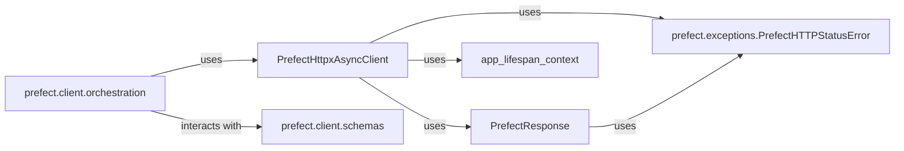

## Component Details

These components are fundamental because they collectively form the backbone of how the Prefect client communicates with the Prefect API. `PrefectHttpxAsyncClient` and `PrefectResponse` handle the low-level network communication and error handling. `app_lifespan_context` ensures proper setup and teardown for embedded server scenarios. The `prefect.client.orchestration` subpackage provides the high-level, organized interface for interacting with various API resources, making it user-friendly. Finally, `prefect.client.schemas` is crucial for data integrity and consistency across all API interactions. Without these components, the client would not be able to reliably and effectively communicate with the Prefect server.

### PrefectHttpxAsyncClient
This is the fundamental asynchronous HTTP client for interacting with the Prefect API. It extends `httpx.AsyncClient` and incorporates Prefect-specific features such as retry mechanisms (supporting `retry-after` headers) and automatic error handling via `raise_for_status`. It also manages CSRF tokens for secure communication. This client is crucial as it directly handles the low-level HTTP communication with the Prefect server.

**Related Classes/Methods**: _None_

### PrefectResponse
A specialized response class that wraps `httpx.Response`. Its primary role is to enhance error reporting by raising `PrefectHTTPStatusError` (a more informative custom exception) instead of the generic `HTTPStatusError` when an HTTP error occurs. This improves the clarity of error messages for client-side operations.

**Related Classes/Methods**: _None_

### app_lifespan_context
This asynchronous context manager is responsible for managing the lifecycle (startup and shutdown) of ASGI applications, particularly relevant for in-memory server interactions. It ensures that application lifespan hooks are correctly invoked and handles concurrent access to the lifespan context using reference counting and locks, preventing redundant startup/shutdown calls. This component is vital for the stability and proper resource management of embedded or ephemeral Prefect server instances used by the client.

**Related Classes/Methods**: _None_

### prefect.client.orchestration
This subpackage provides higher-level client interfaces for interacting with specific Prefect API endpoints related to orchestration, such as managing flows, flow runs, deployments, and tasks. It acts as an organized layer on top of the base HTTP client, offering specialized methods for different API resources. This is fundamental because it abstracts the raw HTTP requests into meaningful Prefect operations.

**Related Classes/Methods**: _None_

### prefect.client.schemas
This subpackage defines the data models (schemas) used for all communication with the Prefect API. These schemas, built with Pydantic, ensure data consistency, validation, and proper serialization/deserialization for both requests sent to and responses received from the Prefect server. This component is critical for maintaining data integrity and facilitating structured communication.

**Related Classes/Methods**: _None_

### prefect.exceptions.PrefectHTTPStatusError
A custom exception class for HTTP status errors within the Prefect client.

**Related Classes/Methods**: _None_

### [FAQ](https://github.com/CodeBoarding/GeneratedOnBoardings/tree/main?tab=readme-ov-file#faq)