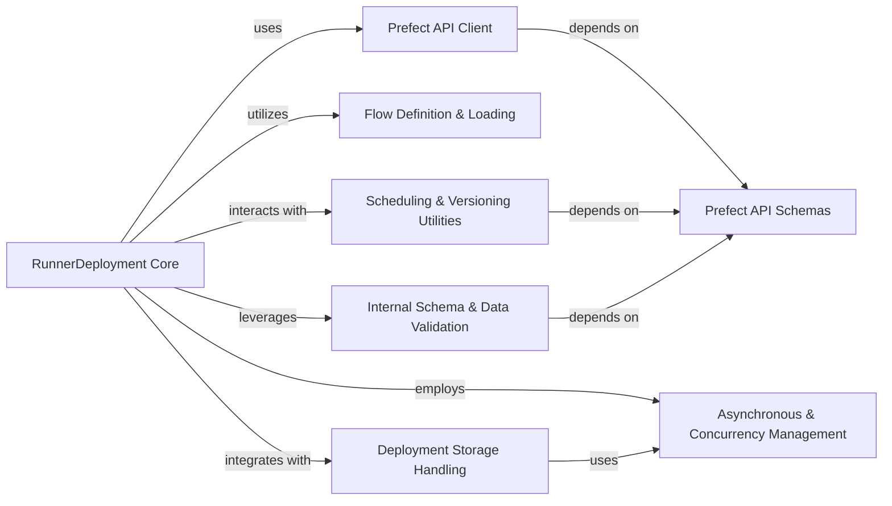

## Component Details

The RunnerDeployment component serves as the declarative specification for operationalizing Prefect Flows. It encapsulates all necessary configurations for a flow's execution, including its definition, scheduling, parameterization, and interaction with the Prefect orchestration server. It acts as the central orchestrator for transforming a raw flow into a deployable and manageable entity within the Prefect ecosystem.

### RunnerDeployment Core
The primary component responsible for defining, managing, and applying Prefect deployment configurations. It orchestrates the interaction with various other components to ensure a Flow can be operationalized, including loading flow definitions, handling parameters, setting up schedules, and communicating with the Prefect API.

**Related Classes/Methods**:

- <a href="https://github.com/PrefectHQ/prefect/blob/master/src/prefect/deployments/runner.py#L1-L1" target="_blank" rel="noopener noreferrer">`prefect.deployments.runner.RunnerDeployment` (1:1)</a>
- <a href="https://github.com/PrefectHQ/prefect/blob/master/src/prefect/deployments/runner.py#L1-L1" target="_blank" rel="noopener noreferrer">`prefect.deployments.runner.RunnerDeployment:apply` (1:1)</a>
- <a href="https://github.com/PrefectHQ/prefect/blob/master/src/prefect/deployments/runner.py#L1-L1" target="_blank" rel="noopener noreferrer">`prefect.deployments.runner.RunnerDeployment:_create` (1:1)</a>
- <a href="https://github.com/PrefectHQ/prefect/blob/master/src/prefect/deployments/runner.py#L1-L1" target="_blank" rel="noopener noreferrer">`prefect.deployments.runner.RunnerDeployment:_update` (1:1)</a>
- <a href="https://github.com/PrefectHQ/prefect/blob/master/src/prefect/deployments/runner.py#L1-L1" target="_blank" rel="noopener noreferrer">`prefect.deployments.runner.RunnerDeployment:from_flow` (1:1)</a>
- <a href="https://github.com/PrefectHQ/prefect/blob/master/src/prefect/deployments/runner.py#L1-L1" target="_blank" rel="noopener noreferrer">`prefect.deployments.runner.RunnerDeployment:from_entrypoint` (1:1)</a>
- <a href="https://github.com/PrefectHQ/prefect/blob/master/src/prefect/deployments/runner.py#L1-L1" target="_blank" rel="noopener noreferrer">`prefect.deployments.runner.RunnerDeployment:from_storage` (1:1)</a>

### Prefect API Client
Provides the interface for RunnerDeployment to communicate with the Prefect orchestration server. It handles all CRUD (Create, Read, Update, Delete) operations for deployments, flows, automations, and SLAs, translating RunnerDeployment's internal state into API requests.

**Related Classes/Methods**:

- `prefect.client.orchestration.get_client` (1:1)
- <a href="https://github.com/PrefectHQ/prefect/blob/master/src/prefect/client/orchestration/_deployments/client.py#L1-L1" target="_blank" rel="noopener noreferrer">`prefect.client.orchestration._deployments.client.create_deployment` (1:1)</a>
- <a href="https://github.com/PrefectHQ/prefect/blob/master/src/prefect/client/orchestration/_deployments/client.py#L1-L1" target="_blank" rel="noopener noreferrer">`prefect.client.orchestration._deployments.client.update_deployment` (1:1)</a>
- <a href="https://github.com/PrefectHQ/prefect/blob/master/src/prefect/client/orchestration/_flows/client.py#L1-L1" target="_blank" rel="noopener noreferrer">`prefect.client.orchestration._flows.client.create_flow_from_name` (1:1)</a>
- <a href="https://github.com/PrefectHQ/prefect/blob/master/src/prefect/client/orchestration/base.py#L1-L1" target="_blank" rel="noopener noreferrer">`prefect.client.orchestration.base.delete_resource_owned_automations` (1:1)</a>
- <a href="https://github.com/PrefectHQ/prefect/blob/master/src/prefect/client/orchestration/base.py#L1-L1" target="_blank" rel="noopener noreferrer">`prefect.client.orchestration.base.create_automation` (1:1)</a>
- <a href="https://github.com/PrefectHQ/prefect/blob/master/src/prefect/client/orchestration/base.py#L1-L1" target="_blank" rel="noopener noreferrer">`prefect.client.orchestration.base.apply_slas_for_deployment` (1:1)</a>

### Flow Definition & Loading
Responsible for locating, loading, and introspecting Python Flow functions from various sources (e.g., file paths, module paths, existing flow objects). It extracts essential metadata like flow name, description, version, and parameter schema, which are then used by RunnerDeployment to configure the deployment.

**Related Classes/Methods**:

- <a href="https://github.com/PrefectHQ/prefect/blob/master/src/prefect/flows.py#L1-L1" target="_blank" rel="noopener noreferrer">`prefect.flows.load_flow_from_entrypoint` (1:1)</a>
- <a href="https://github.com/PrefectHQ/prefect/blob/master/src/prefect/utilities/callables.py#L1-L1" target="_blank" rel="noopener noreferrer">`prefect.utilities.callables.parameter_schema` (1:1)</a>

### Scheduling & Versioning Utilities
Manages the creation and validation of deployment schedules (interval, cron, rrule) and determines the version information for deployments. It ensures that flows can be triggered automatically based on defined schedules and that deployment versions are tracked consistently for reproducibility and management.

**Related Classes/Methods**:

- <a href="https://github.com/PrefectHQ/prefect/blob/master/src/prefect/deployments/runner.py#L1-L1" target="_blank" rel="noopener noreferrer">`prefect.deployments.runner.RunnerDeployment:_construct_deployment_schedules` (1:1)</a>
- <a href="https://github.com/PrefectHQ/prefect/blob/master/src/prefect/deployments/runner.py#L1-L1" target="_blank" rel="noopener noreferrer">`prefect.deployments.runner.RunnerDeployment:_get_deployment_version_info` (1:1)</a>
- <a href="https://github.com/PrefectHQ/prefect/blob/master/src/prefect/deployments/schedules.py#L14-L25" target="_blank" rel="noopener noreferrer">`prefect.deployments.schedules.create_deployment_schedule_create` (14:25)</a>
- <a href="https://github.com/PrefectHQ/prefect/blob/master/src/prefect/client/schemas/schedules.py#L1-L1" target="_blank" rel="noopener noreferrer">`prefect.client.schemas.schedules.construct_schedule` (1:1)</a>
- <a href="https://github.com/PrefectHQ/prefect/blob/master/src/prefect/_versioning.py#L390-L439" target="_blank" rel="noopener noreferrer">`prefect._versioning.get_inferred_version_info` (390:439)</a>

### Internal Schema & Data Validation
Provides internal utilities for validating and reconciling deployment-related data structures, particularly for attributes like paused status and schedule configurations. It ensures data consistency and correctness within the RunnerDeployment object before configurations are processed or sent to the API.

**Related Classes/Methods**:

- <a href="https://github.com/PrefectHQ/prefect/blob/master/src/prefect/_internal/schemas/validators.py#L1-L1" target="_blank" rel="noopener noreferrer">`prefect._internal.schemas.validators.reconcile_paused_deployment` (1:1)</a>
- <a href="https://github.com/PrefectHQ/prefect/blob/master/src/prefect/_internal/schemas/validators.py#L1-L1" target="_blank" rel="noopener noreferrer">`prefect._internal.schemas.validators.reconcile_schedules_runner` (1:1)</a>
- <a href="https://github.com/PrefectHQ/prefect/blob/master/src/prefect/deployments/runner.py#L1-L1" target="_blank" rel="noopener noreferrer">`prefect.deployments.runner.RunnerDeployment:validate_automation_names` (1:1)</a>
- <a href="https://github.com/PrefectHQ/prefect/blob/master/src/prefect/deployments/runner.py#L1-L1" target="_blank" rel="noopener noreferrer">`prefect.deployments.runner.RunnerDeployment:validate_deployment_parameters` (1:1)</a>

### Asynchronous & Concurrency Management
A set of helper functions and primitives that facilitate asynchronous operations and manage concurrency patterns within the Prefect framework. These utilities are essential for RunnerDeployment to handle I/O-bound tasks efficiently (e.g., API calls, storage operations) and to seamlessly integrate synchronous and asynchronous code paths.

**Related Classes/Methods**:

- <a href="https://github.com/PrefectHQ/prefect/blob/master/src/prefect/utilities/asyncutils.py#L1-L1" target="_blank" rel="noopener noreferrer">`prefect.utilities.asyncutils.run_coro_as_sync` (1:1)</a>
- <a href="https://github.com/PrefectHQ/prefect/blob/master/src/prefect/_internal/concurrency/api.py#L1-L1" target="_blank" rel="noopener noreferrer">`prefect._internal.concurrency.api.from_async.wait_for_call_in_new_thread` (1:1)</a>
- <a href="https://github.com/PrefectHQ/prefect/blob/master/src/prefect/_internal/compatibility/async_dispatch.py#L63-L97" target="_blank" rel="noopener noreferrer">`prefect._internal.compatibility.async_dispatch` (63:97)</a>

### Deployment Storage Handling
Manages the interaction with various storage backends to pull flow code for deployments. It abstracts the details of how flow code is retrieved, allowing RunnerDeployment to work with different storage configurations (e.g., local files, remote storage) and ensuring the flow's executable code is available.

**Related Classes/Methods**:

- <a href="https://github.com/PrefectHQ/prefect/blob/master/src/prefect/deployments/runner.py#L1-L1" target="_blank" rel="noopener noreferrer">`prefect.deployments.runner.RunnerDeployment:afrom_storage` (1:1)</a>
- <a href="https://github.com/PrefectHQ/prefect/blob/master/src/prefect/deployments/runner.py#L1-L1" target="_blank" rel="noopener noreferrer">`prefect.deployments.runner.RunnerDeployment:from_storage` (1:1)</a>
- <a href="https://github.com/PrefectHQ/prefect/blob/master/src/prefect/deployments/runner.py#L1-L1" target="_blank" rel="noopener noreferrer">`prefect.deployments.runner.RunnerStorage:to_pull_step` (1:1)</a>
- <a href="https://github.com/PrefectHQ/prefect/blob/master/src/prefect/deployments/runner.py#L1-L1" target="_blank" rel="noopener noreferrer">`prefect.deployments.runner.RunnerStorage:pull_code` (1:1)</a>

### Prefect API Schemas
Defines the Pydantic data models used for structured communication with the Prefect API. These schemas ensure type safety and data integrity for all objects exchanged between the client and the server, including deployments, flows, schedules, and other core entities, providing a consistent data contract.

**Related Classes/Methods**:

- <a href="https://github.com/PrefectHQ/prefect/blob/master/src/prefect/client/schemas/objects.py#L1093-L1095" target="_blank" rel="noopener noreferrer">`prefect.client.schemas.objects.VersionInfo` (1093:1095)</a>
- <a href="https://github.com/PrefectHQ/prefect/blob/master/src/prefect/client/schemas/schedules.py#L1-L1" target="_blank" rel="noopener noreferrer">`prefect.client.schemas.schedules.DeploymentScheduleCreate` (1:1)</a>
- <a href="https://github.com/PrefectHQ/prefect/blob/master/src/prefect/client/schemas/objects.py#L146-L151" target="_blank" rel="noopener noreferrer">`prefect.client.schemas.objects.ConcurrencyOptions` (146:151)</a>
- <a href="https://github.com/PrefectHQ/prefect/blob/master/src/prefect/client/schemas/objects.py#L1-L1" target="_blank" rel="noopener noreferrer">`prefect.client.schemas.objects.ParameterSchema` (1:1)</a>
- <a href="https://github.com/PrefectHQ/prefect/blob/master/src/prefect/client/schemas/objects.py#L1-L1" target="_blank" rel="noopener noreferrer">`prefect.client.schemas.objects.DeploymentUpdate` (1:1)</a>
- <a href="https://github.com/PrefectHQ/prefect/blob/master/src/prefect/client/schemas/objects.py#L1-L1" target="_blank" rel="noopener noreferrer">`prefect.client.schemas.objects.SlaTypes` (1:1)</a>
- <a href="https://github.com/PrefectHQ/prefect/blob/master/src/prefect/client/schemas/objects.py#L1-L1" target="_blank" rel="noopener noreferrer">`prefect.client.schemas.objects.TriggerTypes` (1:1)</a>

### [FAQ](https://github.com/CodeBoarding/GeneratedOnBoardings/tree/main?tab=readme-ov-file#faq)