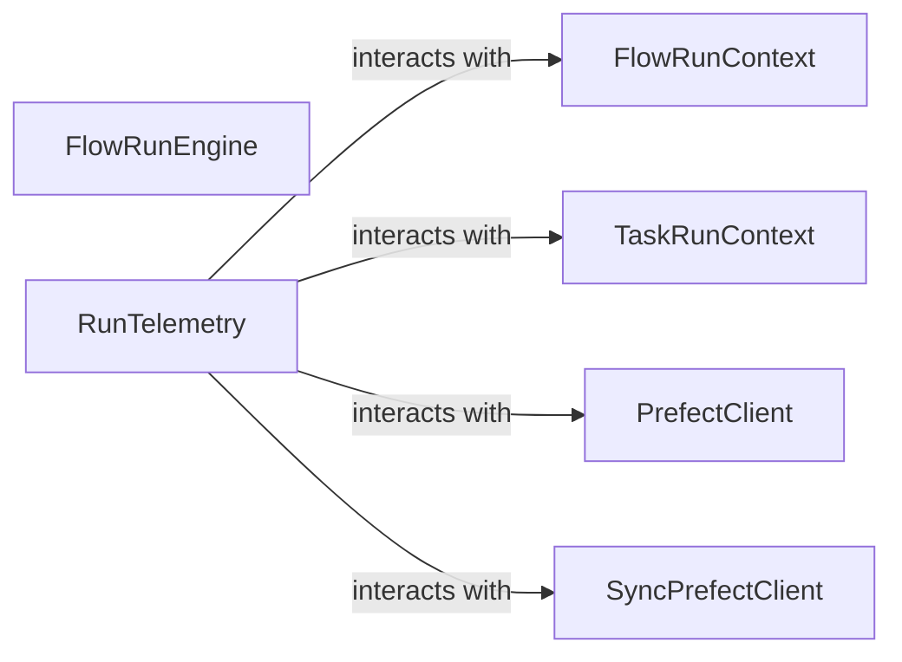

## Component Details

Updated analysis of components, noting that `FlowRunEngine` could not be located, while `RunTelemetry` was successfully found at `prefect.telemetry.run_telemetry.RunTelemetry`. `SyncPrefectClient` is identified as an external dependency. Relationships involving `FlowRunEngine` remain unverified.

### FlowRunEngine
The `FlowRunEngine` and its associated methods (e.g., `start`, `initialize_run`, `begin_run`, `set_state`, `call_flow_fn`, `handle_exception`, `setup_run_context`) could not be located within the current project structure at the previously assumed path (`prefect.engine.flow_run_engine`). Therefore, a detailed analysis of its structure, flow, and purpose cannot be provided or validated. It is likely that this component has been refactored or moved in the current version of the project.

**Related Classes/Methods**: _None_

### SyncPrefectClient
Client for interacting with the Prefect API synchronously. This is a critical external dependency for flow run orchestration to communicate with the Prefect backend for state updates, run creation, and other API interactions.

**Related Classes/Methods**: _None_

### RunTelemetry
Manages telemetry for a flow run. This component is essential for providing observability into the flow run's execution, recording events, states, and exceptions. Its source code was found at `prefect.telemetry.run_telemetry.RunTelemetry`.

**Related Classes/Methods**:

- <a href="https://github.com/PrefectHQ/prefect/blob/master/src/prefect/telemetry/run_telemetry.py#L44-L246" target="_blank" rel="noopener noreferrer">`prefect.telemetry.run_telemetry.RunTelemetry` (44:246)</a>

### [FAQ](https://github.com/CodeBoarding/GeneratedOnBoardings/tree/main?tab=readme-ov-file#faq)