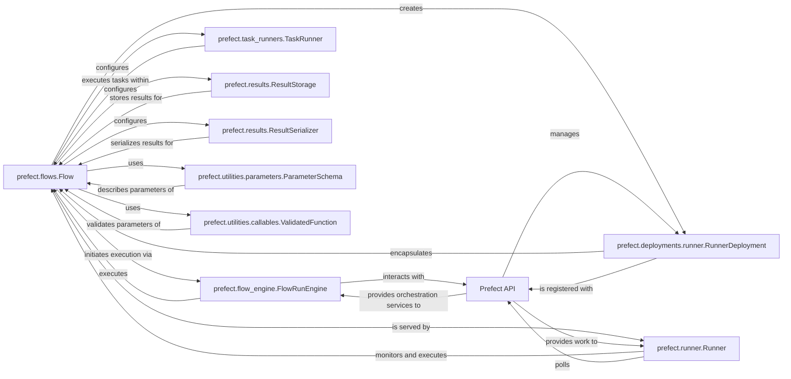

## Component Details

# 📦 Abstract Components Overview

This analysis focuses on the `prefect.flows.Flow` component and its fundamental interactions within the Prefect ecosystem. The selected components are crucial for defining, deploying, and executing workflows, forming the core of Prefect's orchestration capabilities.

## Justification for Component Selection

These components were chosen because they represent the fundamental building blocks and operational aspects of defining, deploying, and executing workflows within Prefect.

*   **`prefect.flows.Flow`**: This is the central component as it defines the user's workflow. Without it, there is no workflow to orchestrate. Its methods for configuration, parameter handling, and deployment creation are critical.
*   **`prefect.flow_engine.FlowRunEngine`**: This is the execution engine. While `Flow` defines *what* to run, `FlowRunEngine` dictates *how* it runs, managing its lifecycle, state, and interactions with the backend.
*   **`prefect.deployments.runner.RunnerDeployment`**: This component bridges the gap between a defined flow and its execution in a managed environment. It's essential for scheduling and running flows on Prefect infrastructure.
*   **`prefect.task_runners.TaskRunner`**: Flows are composed of tasks, and `TaskRunner` determines how these individual tasks are executed, impacting concurrency and resource utilization.
*   **`prefect.results.ResultStorage`** and **`prefect.results.ResultSerializer`**: These are vital for data persistence and integrity. Without them, flow and task outputs cannot be reliably stored or retrieved, which is crucial for data pipelines.
*   **`prefect.utilities.parameters.ParameterSchema`** and **`prefect.utilities.callables.ValidatedFunction`**: These components ensure the correctness and robustness of flow execution by validating input parameters, preventing common errors and ensuring type safety.
*   **`prefect.runner.Runner`**: This component is key for local execution and serving deployments, enabling users to run and monitor their flows without direct interaction with the Prefect API for every execution.
*   **`Prefect API`**: Although an external service, it's a critical dependency for all orchestration and management aspects. It acts as the central brain for scheduling, state tracking, and metadata storage.

Together, these components form a cohesive system that allows users to define, configure, deploy, and execute complex data workflows efficiently and reliably.

### prefect.flows.Flow
The core abstraction for defining a user's workflow as a directed acyclic graph (DAG) of tasks. It encapsulates the logic, configuration (e.g., retries, timeouts, result storage), and lifecycle hooks for a data pipeline. It represents the "what" of the workflow.

**Related Classes/Methods**:

- <a href="https://github.com/PrefectHQ/prefect/blob/master/src/prefect/flows.py#L1-L1" target="_blank" rel="noopener noreferrer">`prefect.flows.Flow` (1:1)</a>

### prefect.flow_engine.FlowRunEngine
The core orchestrator for Prefect flow runs. It manages the execution of a flow, including parameter handling, state transitions, error recovery, and interaction with the Prefect API for state updates and telemetry. It ensures that flows execute correctly and robustly within the Prefect ecosystem.

**Related Classes/Methods**:

- <a href="https://github.com/PrefectHQ/prefect/blob/master/src/prefect/flow_engine.py#L229-L783" target="_blank" rel="noopener noreferrer">`prefect.flow_engine.FlowRunEngine` (229:783)</a>

### prefect.deployments.runner.RunnerDeployment
A deployable package of a Prefect flow, including its code, parameters, and schedule. It allows flows to be run on remote infrastructure and managed by the Prefect API.

**Related Classes/Methods**:

- <a href="https://github.com/PrefectHQ/prefect/blob/master/src/prefect/deployments/runner.py#L1-L1" target="_blank" rel="noopener noreferrer">`prefect.deployments.runner.RunnerDeployment` (1:1)</a>

### prefect.task_runners.TaskRunner
An abstraction for how tasks within a flow are executed. It defines the concurrency and execution environment for tasks. Examples include `ThreadPoolTaskRunner`.

**Related Classes/Methods**:

- <a href="https://github.com/PrefectHQ/prefect/blob/master/src/prefect/task_runners.py#L50-L224" target="_blank" rel="noopener noreferrer">`prefect.task_runners.TaskRunner` (50:224)</a>

### prefect.results.ResultStorage
Defines where and how the results of flow and task runs are stored. This can include local file systems, cloud storage, etc.

**Related Classes/Methods**:

- <a href="https://github.com/PrefectHQ/prefect/blob/master/src/prefect/results.py#L1-L1" target="_blank" rel="noopener noreferrer">`prefect.results.ResultStorage` (1:1)</a>

### prefect.results.ResultSerializer
Defines how the results of flow and task runs are serialized and deserialized for storage.

**Related Classes/Methods**:

- <a href="https://github.com/PrefectHQ/prefect/blob/master/src/prefect/results.py#L1-L1" target="_blank" rel="noopener noreferrer">`prefect.results.ResultSerializer` (1:1)</a>

### prefect.utilities.parameters.ParameterSchema
Represents the schema for flow parameters, used for validation and introspection.

**Related Classes/Methods**:

- `prefect.utilities.parameters.ParameterSchema` (1:1)

### prefect.utilities.callables.ValidatedFunction
A utility class that wraps a function and provides parameter validation using Pydantic.

**Related Classes/Methods**:

- <a href="https://github.com/PrefectHQ/prefect/blob/master/src/prefect/utilities/callables.py#L1-L1" target="_blank" rel="noopener noreferrer">`prefect.utilities.callables.ValidatedFunction` (1:1)</a>

### prefect.runner.Runner
A local agent that monitors for scheduled flow runs from deployments and executes them. It acts as a bridge between the Prefect API and the local execution environment.

**Related Classes/Methods**:

- <a href="https://github.com/PrefectHQ/prefect/blob/master/src/prefect/runner/runner.py#L1-L1" target="_blank" rel="noopener noreferrer">`prefect.runner.Runner` (1:1)</a>

### Prefect API
The central backend service for Prefect, responsible for orchestrating flow runs, managing deployments, storing metadata, and providing a UI.

**Related Classes/Methods**: _None_

### [FAQ](https://github.com/CodeBoarding/GeneratedOnBoardings/tree/main?tab=readme-ov-file#faq)