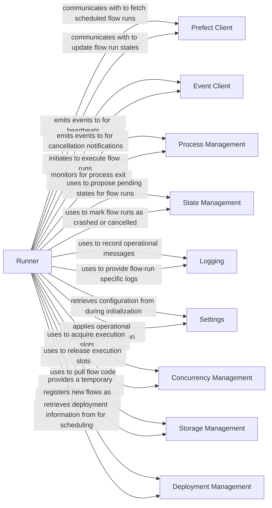

## Component Details

The `prefect.runner.runner.Runner` is the core execution agent within a Prefect environment, responsible for orchestrating the lifecycle of flow runs. It acts as a local process that continuously polls for scheduled flow runs, submits them to the appropriate infrastructure, and manages their execution, monitoring, and state transitions. This component is fundamental because it bridges the gap between scheduled flow runs in the Prefect API and their actual execution in a local environment.

### Runner
The central class responsible for the entire lifecycle management of flow runs. It initializes with various settings and clients, continuously polls for scheduled flow runs, submits them for execution, monitors their status, and handles cancellations or crashes. It also enforces concurrency limits for active flow runs.

**Related Classes/Methods**:

- <a href="https://github.com/PrefectHQ/prefect/blob/master/src/prefect/runner/runner.py#L1-L1" target="_blank" rel="noopener noreferrer">`prefect.runner.runner.Runner` (1:1)</a>

### Prefect Client
Provides the interface for the `Runner` to communicate with the Prefect API. This includes crucial operations such as fetching scheduled flow runs, reading flow and deployment metadata, and updating the state of flow runs (e.g., pending, crashed, cancelled).

**Related Classes/Methods**:

- `prefect.client.orchestration` (1:1)

### Event Client
Enables the `Runner` to emit structured events to the Prefect event bus. These events provide real-time insights into the runner's operations and the lifecycle of flow runs (e.g., heartbeats, cancellation events), crucial for monitoring and automation.

**Related Classes/Methods**:

- <a href="https://github.com/PrefectHQ/prefect/blob/master/src/prefect/events/clients.py#L1-L1" target="_blank" rel="noopener noreferrer">`prefect.events.clients` (1:1)</a>

### Process Management
Handles the low-level execution of flow runs as separate operating system processes. It's responsible for spawning new processes, setting up their environment (including Prefect-specific environment variables), streaming their output, and capturing their exit codes.

**Related Classes/Methods**:

- `prefect.utilities.process` (1:1)

### State Management
Defines the various states a flow run can be in (e.g., Pending, Crashed, AwaitingRetry, Cancelled) and provides utilities for proposing state transitions to the Prefect API. This ensures consistency and proper lifecycle progression of flow runs.

**Related Classes/Methods**:

- <a href="https://github.com/PrefectHQ/prefect/blob/master/src/prefect/states.py#L1-L1" target="_blank" rel="noopener noreferrer">`prefect.states` (1:1)</a>

### Logging
Provides logging functionalities for the `Runner` to record its activities, debug information, and status updates related to flow run execution. It allows for context-specific logging, such as associating logs with a particular flow run.

**Related Classes/Methods**:

- `prefect.logging` (1:1)

### Settings
Allows the `Runner` to access and apply various configuration settings defined within the Prefect environment, such as polling frequencies, heartbeat intervals, and process limits. These settings dictate the `Runner`'s operational parameters.

**Related Classes/Methods**:

- `prefect.settings` (1:1)

### Concurrency Management
Manages the maximum number of concurrent flow runs the `Runner` can execute. It uses a capacity limiter to ensure that the `Runner` does not exceed its configured process limit, preventing resource exhaustion.

**Related Classes/Methods**: _None_

### Storage Management
Handles the retrieval and local storage of flow code for deployments. Before a flow run can be executed, its associated code needs to be pulled to the `Runner`'s working directory.

**Related Classes/Methods**:

- <a href="https://github.com/PrefectHQ/prefect/blob/master/src/prefect/runner/storage.py#L1-L1" target="_blank" rel="noopener noreferrer">`prefect.runner.storage` (1:1)</a>

### Deployment Management
Encapsulates the configuration for deploying a flow, including its schedule, parameters, and entrypoint. The `Runner` registers these deployments and uses their configurations to identify and schedule flow runs.

**Related Classes/Methods**:

- `prefect.runner.schemas` (1:1)
- `prefect.deployments` (1:1)

### [FAQ](https://github.com/CodeBoarding/GeneratedOnBoardings/tree/main?tab=readme-ov-file#faq)