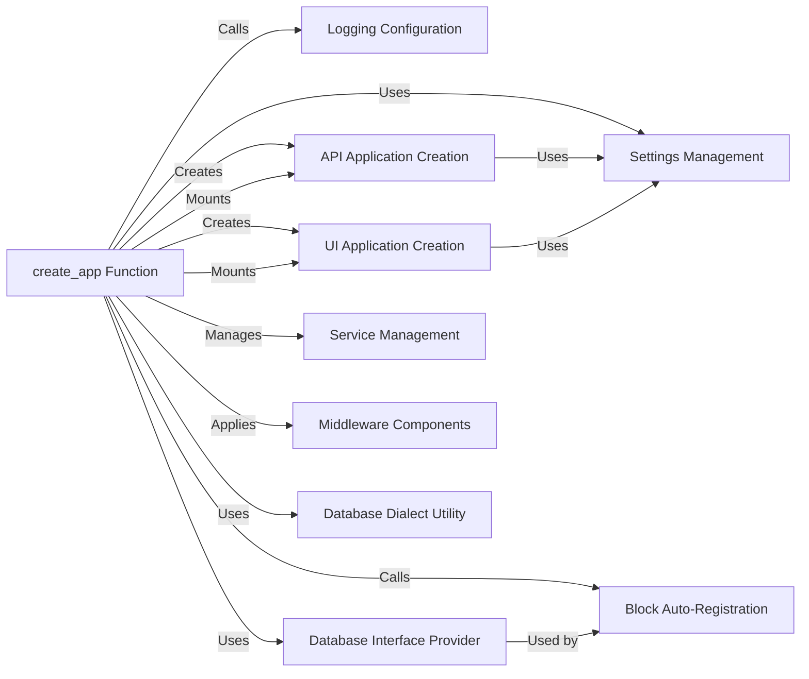

## Component Details

Overview of the `prefect.server.api.server.create_app` subsystem, detailing its structure, flow, and purpose. The `create_app` function serves as the central orchestrator for the Prefect server, bringing together various components to form a fully functional FastAPI application. It's responsible for the server's initialization, configuration, and the integration of its core functionalities, including the API, UI, and background services.

### create_app Function
The primary entry point for initializing the Prefect server's FastAPI application. It coordinates the setup of server settings, logging, database operations (migrations, block registration), API and UI application creation, and the application of global middleware. This function is the "brain" that assembles and configures the entire server.

**Related Classes/Methods**:

- <a href="https://github.com/PrefectHQ/prefect/blob/master/src/prefect/server/api/server.py#L585-L765" target="_blank" rel="noopener noreferrer">`prefect.server.api.server.create_app` (585:765)</a>

### Settings Management
Manages the loading and access to all Prefect server configurations, such as database connection URLs, CORS policies, CSRF protection, and feature flags. These settings are crucial for dictating the server's behavior and capabilities.

**Related Classes/Methods**:

- `prefect.settings` (0:0)

### Logging Configuration
Establishes the logging infrastructure for the Prefect server, ensuring that operational events, errors, and debugging information are properly captured and routed.

**Related Classes/Methods**:

- <a href="https://github.com/PrefectHQ/prefect/blob/master/src/prefect/logging/configuration.py#L67-L109" target="_blank" rel="noopener noreferrer">`prefect.logging.configuration.setup_logging` (67:109)</a>

### Database Interface Provider
Offers an abstract interface for interacting with the underlying database. It handles database creation and session management, decoupling the server's business logic from specific database implementations. It's used for running migrations and managing database sessions.

**Related Classes/Methods**:

- <a href="https://github.com/PrefectHQ/prefect/blob/master/src/prefect/server/database/dependencies.py#L0-L0" target="_blank" rel="noopener noreferrer">`prefect.server.database.dependencies.provide_database_interface` (0:0)</a>

### Block Auto-Registration
Manages the automatic discovery and registration of Prefect Blocks (reusable, configurable components) into the server's database during startup. This ensures that all available blocks are known and usable by the system.

**Related Classes/Methods**:

- <a href="https://github.com/PrefectHQ/prefect/blob/master/src/prefect/server/models/block_registration.py#L212-L222" target="_blank" rel="noopener noreferrer">`prefect.server.models.block_registration.run_block_auto_registration` (212:222)</a>

### API Application Creation
A sub-component responsible for constructing the FastAPI application specifically for the Prefect REST API. It defines API routes, handles exceptions, and applies API-specific middleware (e.g., GZip, authentication).

**Related Classes/Methods**:

- <a href="https://github.com/PrefectHQ/prefect/blob/master/src/prefect/server/api/server.py#L0-L0" target="_blank" rel="noopener noreferrer">`prefect.server.api.server.create_api_app` (0:0)</a>

### UI Application Creation
A sub-component responsible for creating the FastAPI application that serves the Prefect UI. It handles the routing and serving of static UI assets and provides UI-specific settings.

**Related Classes/Methods**:

- <a href="https://github.com/PrefectHQ/prefect/blob/master/src/prefect/server/api/server.py#L0-L0" target="_blank" rel="noopener noreferrer">`prefect.server.api.server.create_ui_app` (0:0)</a>

### Service Management
Manages the lifecycle of various background services that run within the Prefect server (e.g., scheduler, agent). It ensures these services are started and stopped gracefully as part of the application's lifespan.

**Related Classes/Methods**:

- <a href="https://github.com/PrefectHQ/prefect/blob/master/src/prefect/server/services/base.py#L109-L121" target="_blank" rel="noopener noreferrer">`prefect.server.services.base.Service.running` (109:121)</a>

### Middleware Components
A collection of FastAPI middleware classes that enhance the server's functionality by handling cross-cutting concerns such as Cross-Origin Resource Sharing (CORS), limiting concurrent requests (especially for SQLite), and providing CSRF protection.

**Related Classes/Methods**:

- `fastapi.middleware.cors.CORSMiddleware` (0:0)
- <a href="https://github.com/PrefectHQ/prefect/blob/master/src/prefect/server/api/middleware.py#L0-L0" target="_blank" rel="noopener noreferrer">`prefect.server.api.middleware.RequestLimitMiddleware` (0:0)</a>
- <a href="https://github.com/PrefectHQ/prefect/blob/master/src/prefect/server/api/middleware.py#L14-L72" target="_blank" rel="noopener noreferrer">`prefect.server.api.middleware.CsrfMiddleware` (14:72)</a>

### Database Dialect Utility
A utility function that determines the SQL dialect of the configured database. This information is used to apply database-specific configurations, such as concurrency limits for SQLite to prevent errors.

**Related Classes/Methods**:

- <a href="https://github.com/PrefectHQ/prefect/blob/master/src/prefect/server/utilities/database.py#L0-L0" target="_blank" rel="noopener noreferrer">`prefect.server.utilities.database.get_dialect` (0:0)</a>

### [FAQ](https://github.com/CodeBoarding/GeneratedOnBoardings/tree/main?tab=readme-ov-file#faq)