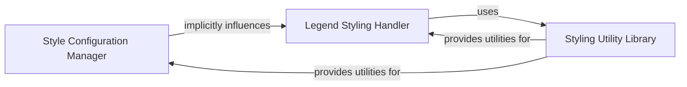

## Details

The `prettyplotlib` styling subsystem orchestrates the visual aesthetics of plots through three primary components. The `Style Configuration Manager`, centered around `prettyplotlib.colors.pretty`, defines and applies the foundational "pretty" style to core plotting functionalities. This manager, along with the specialized `Legend Styling Handler` (`prettyplotlib._legend.legend`), which focuses on legend appearance, both depend on the `Styling Utility Library` (`prettyplotlib.utils`). The utility library provides a collection of reusable functions for common styling operations, ensuring consistency and efficiency across various visual adjustments. This architecture promotes modularity, allowing for focused development on core styling, utility functions, and specific plot elements like legends, all contributing to a cohesive and aesthetically pleasing output.

### Style Configuration Manager
This component serves as the central hub for managing and applying global and plot-specific styling configurations. It sets foundational aesthetics, default settings, and presets, ensuring a consistent visual theme across plots. It is crucial for defining the overall "pretty" look of the plots.

**Related Classes/Methods**:

- `prettyplotlib.colors.pretty`

### Styling Utility Library
This component provides a collection of reusable utility functions essential for various styling operations, such as color mapping, font handling, and general visual adjustments. It acts as a shared dependency, supporting other components in applying consistent and refined visual outputs.

**Related Classes/Methods**:

- `prettyplotlib.utils`

### Legend Styling Handler
This specialized component focuses on the styling and integration of plot legends. It ensures that legends conform to the overall `prettyplotlib` aesthetic, managing their appearance and placement within the refined plot.

**Related Classes/Methods**:

- `prettyplotlib._legend.legend`

### [FAQ](https://github.com/CodeBoarding/GeneratedOnBoardings/tree/main?tab=readme-ov-file#faq)