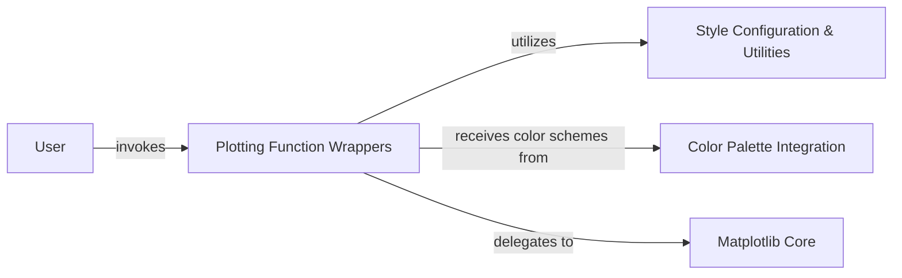

## Details

The `prettyplotlib` library enhances `matplotlib` plots by providing a set of aesthetically pleasing defaults and utility functions. The architecture centers around `Plotting Function Wrappers`, which act as an intermediary between the `User` and the core `Matplotlib Core`. These wrappers intercept standard plotting calls, apply `prettyplotlib`'s styling enhancements (managed by `Style Configuration & Utilities`), and integrate color palettes from `Color Palette Integration` before delegating the final rendering to `Matplotlib Core`. This design ensures a consistent and visually appealing output while leveraging `matplotlib`'s robust plotting capabilities.

### User
Represents the end-user interacting with the `prettyplotlib` library to generate plots. This is an external actor and does not have internal source code references within the project.

**Related Classes/Methods**: _None_

### Plotting Function Wrappers
This core component comprises individual modules that wrap or override standard `matplotlib` plotting functions. Their primary role is to intercept plotting calls, apply `prettyplotlib`'s aesthetic enhancements (e.g., line styles, marker types, axis formatting, chart junk removal), and then delegate the actual drawing to the underlying `matplotlib` functions.

**Related Classes/Methods**:

- `prettyplotlib._plot`
- `prettyplotlib._scatter`
- `prettyplotlib._bar`
- `prettyplotlib._barh`
- `prettyplotlib._hist`
- `prettyplotlib._fill_between`
- `prettyplotlib._fill_betweenx`
- `prettyplotlib._beeswarm`
- `prettyplotlib._boxplot`
- `prettyplotlib._eventplot`
- `prettyplotlib._pcolormesh`
- `prettyplotlib._stackplot`

### Style Configuration & Utilities [[Expand]](./Style_Configuration_Utilities.md)
This component manages global and plot-specific styling configurations, including default settings, user-defined overrides, and general utility functions for applying styles. It provides common functionalities like removing chart junk, managing tick visibility, and handling overall plot appearance, which are leveraged by the `Plotting Function Wrappers`.

**Related Classes/Methods**:

- `prettyplotlib.general`
- `prettyplotlib.utils`
- `prettyplotlib._legend`

### Color Palette Integration
This component is responsible for integrating and providing aesthetically pleasing color palettes, likely leveraging external libraries like `brewer2mpl`. It ensures that `prettyplotlib` plots use consistent and visually effective color schemes, which are then applied during the plotting process.

**Related Classes/Methods**:

- `prettyplotlib.colors`

### Matplotlib Core
Represents the underlying `matplotlib` library, which `prettyplotlib` extends and modifies. This is where the fundamental plotting operations, rendering, and figure management occur after `prettyplotlib` has applied its enhancements. It acts as the final rendering engine.

**Related Classes/Methods**:

- `matplotlib.pyplot`
- `matplotlib.axes._axes`

### [FAQ](https://github.com/CodeBoarding/GeneratedOnBoardings/tree/main?tab=readme-ov-file#faq)