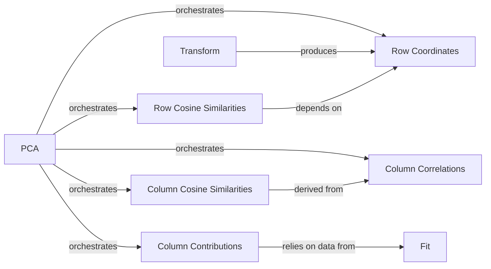

## Details

The `prince.pca` subsystem is centered around the `PCA` class, which serves as the primary orchestrator for all Principal Component Analysis operations. The process begins with the `Fit` component, responsible for executing the core PCA algorithm and computing essential eigenvalues. Following the fitting process, the `Transform` component projects the input data onto the principal components, yielding `Row Coordinates`. These coordinates are then utilized to calculate `Row Cosine Similarities`, indicating the quality of representation for observations. Concurrently, `Column Correlations` are determined, from which `Column Cosine Similarities` are derived to assess variable representation. Finally, `Column Contributions` are computed, relying on the foundational output of the `Fit` process to quantify the influence of original variables. This structured flow ensures a comprehensive analysis, from model fitting to the derivation of various interpretative metrics.

### PCA
The core class that orchestrates the entire PCA process, including fitting the model and providing access points to all derived metric calculation methods. It acts as the primary interface for users to interact with the PCA model and retrieve its analytical outputs.

**Related Classes/Methods**:

- <a href="https://github.com/MaxHalford/prince/blob/master/prince/pca.py#L27-L432" target="_blank" rel="noopener noreferrer">`prince.pca.PCA`:27-432</a>

### Fit
This component is responsible for executing the fundamental PCA algorithm, including singular value decomposition, and computing the eigenvalues. These eigenvalues are crucial foundational data for subsequent derived metric calculations.

**Related Classes/Methods**:

- <a href="https://github.com/MaxHalford/prince/blob/master/prince/pca.py" target="_blank" rel="noopener noreferrer">`prince.pca.PCA:fit`</a>

### Transform
Projects input data onto the principal components, effectively generating the row coordinates. This component is essential for visualizing and interpreting the position of observations in the reduced-dimension space.

**Related Classes/Methods**:

- <a href="https://github.com/MaxHalford/prince/blob/master/prince/pca.py" target="_blank" rel="noopener noreferrer">`prince.pca.PCA:transform`</a>

### Row Coordinates
Computes the coordinates of the observations (rows) in the principal component space. These coordinates are the direct output of the `Transform` operation and are fundamental for biplots and scatter plots.

**Related Classes/Methods**:

- <a href="https://github.com/MaxHalford/prince/blob/master/prince/pca.py" target="_blank" rel="noopener noreferrer">`prince.pca.PCA:row_coordinates`</a>

### Row Cosine Similarities
Calculates the quality of representation for each observation on the principal components. This metric indicates how well an observation is explained by a given component or set of components.

**Related Classes/Methods**:

- <a href="https://github.com/MaxHalford/prince/blob/master/prince/pca.py" target="_blank" rel="noopener noreferrer">`prince.pca.PCA:row_cosine_similarities`</a>

### Column Correlations
Determines the correlation coefficients between the original variables (columns) and the principal components. This helps in understanding which original variables contribute most to the direction of each component.

**Related Classes/Methods**:

- <a href="https://github.com/MaxHalford/prince/blob/master/prince/pca.py" target="_blank" rel="noopener noreferrer">`prince.pca.PCA:column_correlations`</a>

### Column Contributions
Quantifies the absolute contribution of each original variable to the formation (inertia) of each principal component. This metric is vital for identifying the most influential variables for each component.

**Related Classes/Methods**:

- <a href="https://github.com/MaxHalford/prince/blob/master/prince/pca.py" target="_blank" rel="noopener noreferrer">`prince.pca.PCA:column_contributions`</a>

### Column Cosine Similarities
Computes the quality of representation for each variable on the principal components. Often derived from the column correlations, it indicates how well a variable is explained by the components.

**Related Classes/Methods**:

- <a href="https://github.com/MaxHalford/prince/blob/master/prince/pca.py" target="_blank" rel="noopener noreferrer">`prince.pca.PCA:column_cosine_similarities`</a>

### [FAQ](https://github.com/CodeBoarding/GeneratedOnBoardings/tree/main?tab=readme-ov-file#faq)