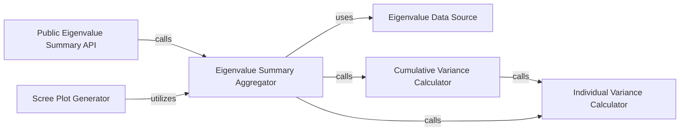

## Details

The `Eigenvalue & Variance Analysis` subsystem is a critical part of the `prince` library, focusing on extracting, summarizing, and visualizing the eigenvalues and their explained variance from statistical models, particularly PCA.

### Eigenvalue Data Source
Represents the raw eigenvalues computed by the PCA model after fitting. This is the fundamental data output from which all other eigenvalue-related metrics are derived.

**Related Classes/Methods**:

- <a href="https://github.com/MaxHalford/prince/blob/master/prince/pca.py#L175-L179" target="_blank" rel="noopener noreferrer">`prince.pca.eigenvalues_`:175-179</a>

### Individual Variance Calculator
A utility function responsible for calculating the individual percentage of variance explained by each eigenvalue.

**Related Classes/Methods**:

- <a href="https://github.com/MaxHalford/prince/blob/master/prince/utils.py" target="_blank" rel="noopener noreferrer">`prince.utils`</a>

### Cumulative Variance Calculator
Computes the cumulative sum of the explained variance percentages, indicating the total variance accounted for by a given number of principal components.

**Related Classes/Methods**:

- <a href="https://github.com/MaxHalford/prince/blob/master/prince/utils.py" target="_blank" rel="noopener noreferrer">`prince.utils`</a>

### Eigenvalue Summary Aggregator
An internal helper function that orchestrates the collection and aggregation of raw eigenvalues, individual variance percentages, and cumulative variance percentages into a structured summary (e.g., a DataFrame).

**Related Classes/Methods**:

- <a href="https://github.com/MaxHalford/prince/blob/master/prince/utils.py#L61-L72" target="_blank" rel="noopener noreferrer">`prince.utils._eigenvalues_summary`:61-72</a>

### Public Eigenvalue Summary API
Provides the public API for users to access the comprehensive summary of eigenvalues and their explained variance. This function serves as the primary interface for users to retrieve insights into dimensionality.

**Related Classes/Methods**:

- <a href="https://github.com/MaxHalford/prince/blob/master/prince/utils.py#L74-L86" target="_blank" rel="noopener noreferrer">`prince.utils.eigenvalues_summary`:74-86</a>

### Scree Plot Generator
Generates a scree plot, a common visualization in PCA, which graphically displays the eigenvalues and their explained variance, aiding in visually determining the optimal number of components to retain.

**Related Classes/Methods**:

- <a href="https://github.com/MaxHalford/prince/blob/master/prince/utils.py#L88-L106" target="_blank" rel="noopener noreferrer">`prince.utils.scree_plot`:88-106</a>

### [FAQ](https://github.com/CodeBoarding/GeneratedOnBoardings/tree/main?tab=readme-ov-file#faq)